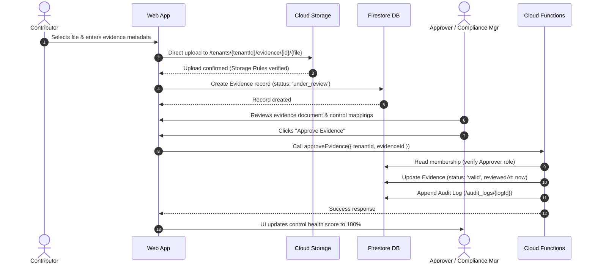
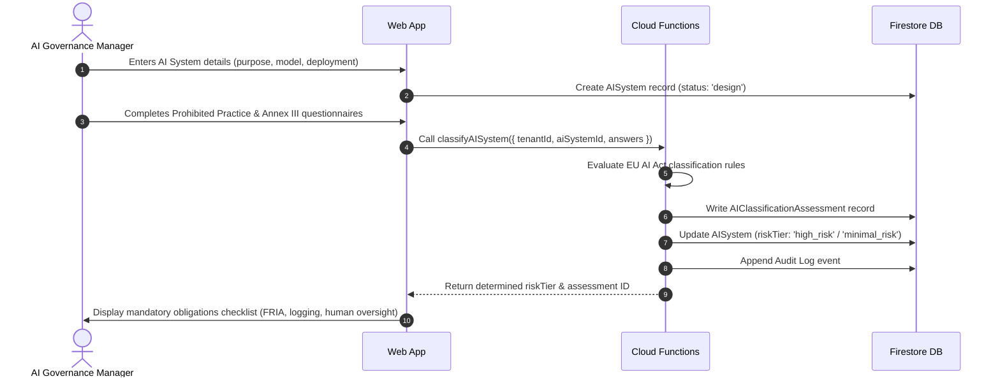
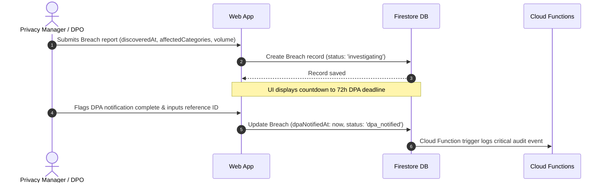

# High-Level Architecture Specification: euroGovernance

**System**: Multi-Tenant B2B GRC SaaS on Firebase  
**Target Coverage**: GDPR, EU AI Act, EU Data Act, ISO 27001:2022, ISO 42001:2023  
**Primary Region**: `europe-west3` (Frankfurt, Germany)  
**Primary Interface**: Web Application (`apps/web` using Next.js, React, TypeScript)

---

## 1. Architecture Overview

euroGovernance is architected as an EU-sovereign, multi-tenant compliance operating system. The system enforces strict tenant boundaries at the database layer using Firestore Security Rules, isolates privileged compliance state machines inside Cloud Functions (v2), and maintains a migration-friendly schema compatible with future PostgreSQL/relational storage.

```mermaid
flowchart TB
    subgraph ClientLayer [Client Layer - Untrusted Boundary]
        WebApp["Next.js Web Client (apps/web)"]
    end

    subgraph EdgeLayer [Edge & Delivery Layer]
        Hosting["Firebase Hosting (europe-west3)"]
        AuthService["Firebase Authentication (EU Region)"]
    end

    subgraph TrustBoundary [Privileged Server Boundary]
        CF_Tenants["Tenant & Membership Service"]
        CF_Workflows["Compliance Workflow Engine"]
        CF_AI["EU AI Act Classification Engine"]
        CF_Audit["Immutable Audit Log Service"]
        CF_Exports["Compliance Pack Export Generator"]
        CF_Scheduler["Daily Expiry & Reminder Cron"]
    end

    subgraph DataLayer [Tenant-Scoped Data Layer (europe-west3)]
        FirestoreDB[("Cloud Firestore\n/tenants/{tenantId}/...")]
        CloudStorage[("Cloud Storage Buckets\n/tenants/{tenantId}/...")]
        BigQueryStore[("BigQuery (Future Analytics)\neurogovernance_eu.tenant_snapshots")]
    end

    WebApp -->|HTTPS / Static Assets| Hosting
    WebApp -->|Sign In / MFA / Token Refresh| AuthService
    WebApp -->|Direct Filtered Queries (Rules Enforced)| FirestoreDB
    WebApp -->|Secure Uploads (Rules Enforced)| CloudStorage
    WebApp -->|Callable Functions (Privileged Actions)| CF_Tenants
    WebApp -->|Callable Functions| CF_Workflows
    WebApp -->|Callable Functions| CF_AI
    WebApp -->|Callable Functions| CF_Exports

    CF_Tenants -->|Admin SDK| FirestoreDB
    CF_Workflows -->|Admin SDK| FirestoreDB
    CF_AI -->|Admin SDK| FirestoreDB
    CF_Audit -->|Admin SDK / Append-Only| FirestoreDB
    CF_Exports -->|Read Records / Write Archive| CloudStorage
    CF_Exports -->|Update Job Status| FirestoreDB
    CF_Scheduler -->|Check Review Dates| FirestoreDB

    FirestoreDB -.->|Scheduled Export / Pipeline| BigQueryStore
```

---

## 2. Trust Boundaries

```mermaid
flowchart TD
    subgraph UntrustedZone [Untrusted Zone: Browser Client]
        Browser["User Browser / Client App"]
    end

    subgraph AuthBoundary [Authentication Boundary]
        Auth["Firebase Auth: JWT Verification & Custom Claims"]
    end

    subgraph DirectPath [Direct Access Path]
        Rules["Firestore Security Rules\n- Enforces /tenants/{tenantId}/...\n- Verifies Active Membership\n- Denies Client Audit Writes"]
    end

    subgraph PrivilegedPath [Privileged Backend Path]
        Functions["Cloud Functions (v2) / Admin SDK\n- Enforces Complex State Machines\n- Deterministic AI Classification\n- Emits Append-Only Audit Logs"]
    end

    subgraph StorageZone [Secure Data Storage Layer (europe-west3)]
        Firestore[("Firestore Database")]
        Storage[("Cloud Storage Buckets")]
    end

    Browser -->|1. Authenticate / Retrieve JWT| Auth
    Browser -->|2. Direct Read / Draft Write| Rules
    Rules -->|Allow Authorized Tenant Data| Firestore
    Rules -->|Allow Authorized File Upload| Storage

    Browser -->|3. Invoke Privileged Function| Functions
    Functions -->|Admin SDK Write / Mutate| Firestore
    Functions -->|Package Export ZIP| Storage

    style UntrustedZone fill:#fef2f2,stroke:#ef4444,color:#000000
    style DirectPath fill:#f0fdf4,stroke:#22c55e,color:#000000
    style PrivilegedPath fill:#eff6ff,stroke:#3b82f6,color:#000000
    style StorageZone fill:#faf5ff,stroke:#a855f7,color:#000000
```

---

## 3. Tenant Isolation Strategy

### 3.1 Path Hierarchy
Every customer document is strictly placed under the organization's unique path:
```
/tenants/{tenantId}/{collectionName}/{documentId}
```
Direct collection access at root (`/controls`, `/evidence`) is prohibited. The only global root collections are:
- `/users/{userId}`: Global user profile, MFA settings, and active tenant pointers.
- `/frameworks/{frameworkId}`: Global master regulatory definitions (GDPR, EU AI Act, EU Data Act, ISO 27001, ISO 42001) marked read-only for authenticated users.
- `/invitations/{invitationId}`: Temporary user invitation records.

### 3.2 Membership Validation Layer
Tenant authorization uses a hybrid security model:
1. **Firestore Security Rules**: Resolves active membership in real time:
   ```javascript
   function isTenantMember(tenantId) {
     return request.auth != null &&
       exists(/databases/$(database)/documents/tenants/$(tenantId)/memberships/$(request.auth.uid)) &&
       get(/databases/$(database)/documents/tenants/$(tenantId)/memberships/$(request.auth.uid)).data.status == 'active';
   }
   ```
2. **Cloud Functions**: Every callable function executes `requireTenantMember(request, tenantId, allowedRoles)` to check document state and role permissions prior to applying database modifications.

---

## 4. Firebase Service-by-Service Responsibilities

| Service | Primary Responsibility | Data Residency | Access Rules / Controls |
| :--- | :--- | :--- | :--- |
| **Firebase Auth** | User identity, email verification, TOTP/SMS Multi-Factor Authentication (MFA), session tokens. | EU (Global Auth with regional handling) | Standard Firebase Auth token lifecycle; custom claims for platform superadmins. |
| **Cloud Firestore** | Primary transactional database. Stores tenant metadata, controls, evidence records, risks, policies, and audit logs. | `europe-west3` | Security Rules enforce tenant path isolation and role-based permissions; deny by default. |
| **Cloud Functions (v2)** | Privileged backend execution, tenant creation, role assignment, deterministic AI classification, export compilation, and scheduled jobs. | `europe-west3` (2nd Gen, Cloud Run backend) | Validated via Firebase Admin SDK with Least Privilege IAM. |
| **Cloud Storage** | Binary evidence storage (PDFs, images, docx), compliance exports (.zip archives), and generated audit reports. | `europe-west3` | Storage Security Rules enforce `tenants/{tenantId}/...` prefix, 50MB file size limits, and allowed MIME types. |
| **Firebase Hosting** | Static asset distribution, Single Page Application routing for Next.js web application. | Global Edge CDN with origin in `europe-west3` | HTTPS with strict CSP headers and cache control. |
| **BigQuery (Optional)** | Aggregated compliance trend analytics, longitudinal audit query engine, and custom BI reporting. | `europe-west3` (EU multi-region) | IAM-secured service accounts; data partitioned by `tenantId` and ingestion timestamp. |

---

## 5. Privileged Workflows (Cloud Functions)

The following 10 workflows **must never be performed directly by the client**:

1. **`createTenant`**: Creates tenant document, sets organization admin membership, and initializes default framework bindings in an atomic batch.
2. **`inviteUserToTenant`**: Validates caller is `tenant_admin`, creates an invitation record with a 7-day expiration, and sends an invite email.
3. **`acceptTenantInvite`**: Verifies invitation status, provisions a membership document in `/tenants/{tenantId}/memberships/{userId}`, and consumes the token.
4. **`assignTenantRole`**: Modifies a member's role; verifies the caller has `tenant_admin` status; logs a `permission_assigned` audit event.
5. **`approveEvidence`**: Transitions evidence status from `under_review` to `valid`; updates review due date; records approver identity and timestamp.
6. **`rejectEvidence`**: Transitions evidence status to `rejected`; stores required remediation reason; logs rejection audit event.
7. **`transitionPolicyStatus` / `transitionDPIAStatus` / `transitionTIAStatus`**: Enforces required signatory roles (`privacy_manager`, `compliance_manager`, `approver`) before moving assessments to `approved`.
8. **`classifyAISystem`**: Applies deterministic EU AI Act classification rules (Prohibited vs High-Risk Annex III vs GPAI vs Minimal Risk) and generates an immutable classification record.
9. **`logAIIncident`**: Creates an incident report; automatically computes regulatory notification deadlines (2 days for severe harm, 15 days standard under Art. 73).
10. **`generateTenantEvidenceExport`**: Asynchronously packages tenant evidence, control mappings, and audit records into a timestamped ZIP archive; generates signed download URL.

---

## 6. Data Flows for Critical Actions

### 6.1 Flow A: Evidence Upload, Review, and Approval


### 6.2 Flow B: EU AI Act System Registration & Classification


### 6.3 Flow C: GDPR 72-Hour Personal Data Breach Tracker


---

## 7. Recommended Environment Separation

| Parameter | Development (`eurogovernance-dev`) | Staging (`eurogovernance-staging`) | Production (`eurogovernance-prod`) |
| :--- | :--- | :--- | :--- |
| **Firebase Project** | `eurogovernance-dev` | `eurogovernance-staging` | `eurogovernance-prod` |
| **Firestore Region** | `europe-west3` | `europe-west3` | `europe-west3` |
| **Functions Region** | `europe-west3` | `europe-west3` | `europe-west3` |
| **Storage Region** | `europe-west3` | `europe-west3` | `europe-west3` (Multi-region EU optional) |
| **Auth Provider** | Firebase Auth (Mocked / Email + Pass) | Firebase Auth (Staging tenant users) | Firebase Auth with Enforced MFA |
| **Data Isolation** | Isolated developer tenant accounts | Pre-populated synthetic audit datasets | Customer production data with automated daily backups |
| **Deployment Trigger** | Feature branches / PR merges to `dev` | Merges to `release/*` | Tagged releases to `main` via manual approval gate |

---

## 8. Key Risks and Mitigations

1. **Risk: Cross-Tenant Data Access via Misconfigured Queries**
   - *Mitigation*: Firestore Security Rules enforce tenant membership on every subcollection path. Any query lacking the explicit `/tenants/{tenantId}/` root path fails evaluation immediately.
2. **Risk: Evaluation Read Cost from Security Rules Membership Lookups**
   - *Mitigation*: Firestore automatically caches document lookups made within the same Security Rules evaluation cycle. Subcollection queries evaluate the parent membership document once per request.
3. **Risk: Client-Side Bypass of Approval State Machines**
   - *Mitigation*: Security Rules disallow client updates on sensitive status fields (e.g. `valid`, `approved`) without server invocation. Critical state transitions must run via Cloud Functions.
4. **Risk: Large Compliance Export Timeouts**
   - *Mitigation*: Compliance exports run via asynchronous Cloud Functions with extended timeouts (up to 9 minutes) writing directly to Cloud Storage. The web client polls the `/export_jobs/{jobId}` document for completion.
5. **Risk: Schema Incompatibility during Future PostgreSQL Migration**
   - *Mitigation*: All Firestore documents adhere to relational principles (scalar values, normalized foreign keys, UTC ISO-8601 strings, no deep nested maps or unbounded arrays).

---

## 9. Acceptance Criteria

- [x] All customer collections reside under `/tenants/{tenantId}/`.
- [x] Global catalogs (`/frameworks/{frameworkId}`) are read-only for tenant members.
- [x] Firestore Security Rules reject all unauthenticated and cross-tenant read/write attempts.
- [x] Critical state changes (`createTenant`, `assignTenantRole`, `approveEvidence`, `classifyAISystem`, `logAIIncident`) execute via Cloud Functions.
- [x] Direct client modification or deletion of `/tenants/{tenantId}/audit_logs` is strictly prohibited.
- [x] Primary deployment region configured to `europe-west3` (Frankfurt).
