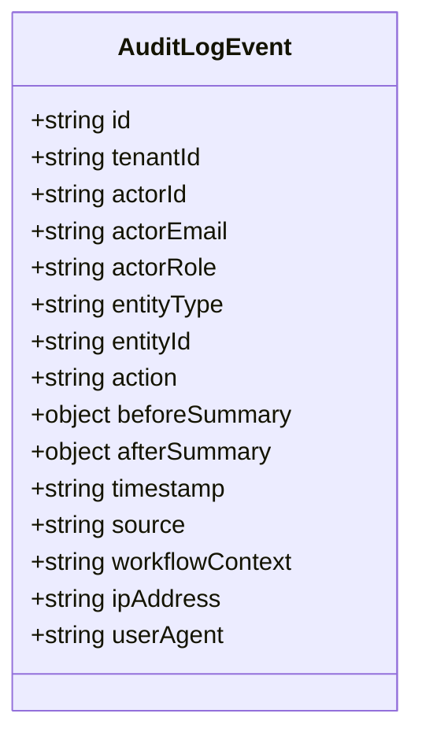

# Immutable Audit Log Subsystem Specification: euroGovernance

**Standard & Regulatory Requirements**: ISO/IEC 27001:2022 A.12.4 (Logging & Monitoring), EU AI Act Art. 12 (Record-Keeping), GDPR Art. 30 & 33  
**Data Residency**: `europe-west3` (Frankfurt)  
**Security Invariant**: **Append-Only Immutability**. Client SDK writes and mutations are strictly prohibited.  

---

## 1. Audit Event Schema



### TypeScript Document Contract (`/tenants/{tenantId}/audit_logs/{logId}`)
```typescript
export type AuditActionType =
  | 'create'
  | 'update'
  | 'delete'
  | 'approve'
  | 'reject'
  | 'status_transition'
  | 'permission_assigned'
  | 'export_generated'
  | 'login'
  | 'mfa_challenge';

export type ActionSource =
  | 'client'
  | 'cloud_function'
  | 'scheduled_job'
  | 'external_system';

export interface AuditLogEventDocument {
  id: string; // Cryptographic unique identifier: 'aud_01HQ9T...'
  tenantId: string; // Tenant boundary
  
  // Actor Attribution (Non-Repudiation)
  actorId: string; // Firebase Auth UID (or 'SYSTEM' for automated cron)
  actorEmail: string; // Verified email snapshot
  actorRole:
    | 'platform_admin'
    | 'tenant_admin'
    | 'compliance_manager'
    | 'privacy_manager'
    | 'ai_governance_manager'
    | 'security_manager'
    | 'auditor'
    | 'contributor'
    | 'viewer'
    | 'approver'
    | 'system';
  
  // Target Entity Coordinates
  entityType:
    | 'tenant'
    | 'tenant_membership'
    | 'invitation'
    | 'control'
    | 'control_review'
    | 'evidence'
    | 'evidence_version'
    | 'policy'
    | 'risk'
    | 'issue'
    | 'task'
    | 'vendor'
    | 'system_asset'
    | 'ropa_entry'
    | 'dpia'
    | 'tia'
    | 'breach'
    | 'dsr_request'
    | 'ai_system'
    | 'ai_assessment'
    | 'ai_incident'
    | 'data_act_asset'
    | 'data_sharing_request'
    | 'iso_scope'
    | 'iso_objective'
    | 'iso_soa'
    | 'iso_audit'
    | 'iso_finding'
    | 'iso_review'
    | 'export_job';
  entityId: string;
  
  // Action & State Difference
  action: AuditActionType;
  beforeSummary?: Record<string, unknown> | null; // Lean snapshot of modified fields before change
  afterSummary?: Record<string, unknown> | null; // Lean snapshot of modified fields after change
  
  // Temporal & Contextual Metadata
  timestamp: string; // ISO 8601 UTC (Server generated, never client-provided)
  source: ActionSource;
  workflowContext?: string | null; // e.g. 'evidence_approval', 'ai_classification', 'invitation_acceptance'
  ipAddress?: string | null;
  userAgent?: string | null;
}
```

---

## 2. Mandatory Audited Events Catalog

| Module | Event Action | Triggering Operation | Captured State Diff Summary |
| :--- | :--- | :--- | :--- |
| **Tenancy & RBAC** | `create` | Organization creation (`createTenant`) | `{ name, slug, tier, dataRegion }` |
| **Tenancy & RBAC** | `create` | User invitation sent | `{ email, role, department }` |
| **Tenancy & RBAC** | `create` | Invitation accepted | `{ userId, email, role }` |
| **Tenancy & RBAC** | `permission_assigned` | Role promotion / demotion | `{ targetUserId, beforeRole, newRole }` |
| **Evidence** | `approve` | Evidence formally approved | `{ evidenceId, reviewedBy, nextReviewDate }` |
| **Evidence** | `reject` | Evidence rejected with notes | `{ evidenceId, rejectionReason }` |
| **Evidence** | `create` | New evidence version uploaded | `{ versionNumber, fileHashSha256, storagePath }` |
| **GDPR** | `create` / `update` | ROPA entry created or updated | `{ activityCode, legalBasis, personalDataCategories }` |
| **GDPR** | `status_transition` | DPIA or TIA approved / rejected | `{ status, dpoApprovalDate, dpoOpinionNotes }` |
| **GDPR** | `create` | Personal Data Breach recorded | `{ incidentReference, severity, dpaDeadline72h }` |
| **EU AI Act** | `create` | Deterministic AI Classification | `{ aiSystemId, riskTier, classificationPayload }` |
| **EU AI Act** | `create` | Serious AI Incident logged | `{ incidentReference, severity, authorityDeadline }` |
| **Management System**| `create` | Internal audit nonconformity raised | `{ findingReference, severity, clauseViolated }` |
| **Exports** | `export_generated` | Compliance ZIP / Report compiled | `{ exportType, requestedBy, fileStoragePath }` |

---

## 3. Function-Only Privilege Boundaries

To guarantee complete audit integrity, all writes to `/tenants/{tenantId}/audit_logs` **must bypass the client entirely**:

```mermaid
flowchart TD
    subgraph ClientSDK [Client SDK (Browser)]
        DirectWrite["Direct Write / Mutation Attempt to /audit_logs"]
    end

    subgraph SecurityRules [Firestore Security Rules]
        RuleDecision{"Rule Evaluation:<br/>allow create, update, delete: false"}
    end

    subgraph CloudFunctions [Cloud Functions (Admin SDK)]
        PrivilegedOp["Privileged Workflow Function (e.g. approveEvidence)"]
        AuditRecorder["recordAuditLog() Helper"]
    end

    subgraph Database [Firestore Database]
        AuditCollection[("/tenants/{tenantId}/audit_logs/{id}")]
    end

    DirectWrite --> RuleDecision
    RuleDecision -->|BLOCKED 100%| Reject["Permission Denied Error"]
    
    PrivilegedOp --> AuditRecorder
    AuditRecorder -->|Admin SDK Privileged Write| AuditCollection
```

---

## 4. Firestore Path Design

```
/tenants/{tenantId}/audit_logs/{logId}
```
- **Path Partitioning**: Logs are strictly partitioned per tenant to guarantee tenant isolation and enable simple indexation.
- **Document ID Strategy**: Uses monotonically sortable timestamp-prefixed UUIDs (e.g. `aud_20260814_01HQ9T...`) to ensure deterministic index ordering and rapid time-range filtering.

---

## 5. Retention, Archival & BigQuery Streaming

```mermaid
flowchart LR
    subgraph HotStorage [Hot Operational Storage: Firestore (europe-west3)]
        ActiveLogs["/tenants/{tenantId}/audit_logs<br/>(Live 365-Day Retention)"]
    end

    subgraph AnalyticsStore [Analytics & Compliance Warehouse: BigQuery EU]
        BQTable[("eurogovernance_audit.tenant_events<br/>(Partitioned by tenantId & Event Date)")]
    end

    subgraph ColdArchive [Immutable Cold Storage: GCS Vault]
        GCSArchive[("gs://eurogovernance-audit-vault-eu/<br/>(10-Year WORM Compliance Lock)")]
    end

    ActiveLogs -->|Daily Scheduled Batch Stream| BQTable
    ActiveLogs -->|Annual Export Archive| GCSArchive
```

1. **Hot Operational Tier (Firestore)**: Live queryable audit logs stored in Firestore for 365 days to power in-app audit history, compliance investigations, and evidence inspection.
2. **Analytics & BigQuery Tier**: Replicated daily into BigQuery (`eurogovernance_audit.tenant_events`) partitioned by `tenantId` and clustered by `entityType` and `timestamp` for high-speed SOC 2, ISO, and regulatory analysis.
3. **Cold WORM Archive (Cloud Storage)**: Encrypted JSONL archives stored in Cloud Storage with Object Retention Lock (WORM - Write Once, Read Many) for statutory 10-year retention compliance.

---

## 6. Security Rules Design Notes (`firestore.rules`)

```javascript
match /tenants/{tenantId}/audit_logs/{logId} {
  // Read allowed exclusively for Tenant Admins, Compliance Managers, Security Managers, and Auditors
  allow read: if hasAnyRole(tenantId, ['tenant_admin', 'compliance_manager', 'auditor', 'security_manager']);
  
  // Mutation and deletion are unconditionally blocked
  allow update, delete: if false;
  
  // Creation is blocked for client SDKs; writes execute solely via Admin SDK inside Cloud Functions
  allow create: if false;
}
```

---

## 7. Acceptance Criteria

- [x] All 15 required audit log attributes (`actorId`, `actorEmail`, `actorRole`, `tenantId`, `entityType`, `entityId`, `action`, `beforeSummary`, `afterSummary`, `timestamp`, `source`, `workflowContext`, `ipAddress`, `userAgent`) are strictly typed.
- [x] Client SDK writes (`create`, `update`, `delete`) to `/audit_logs` are blocked 100% by Firestore Security Rules.
- [x] Privileged Cloud Functions automatically emit structured audit records via the `recordAuditLog` Admin SDK helper.
- [x] Monotonically sortable document IDs support sub-second time-range queries and audit trail exports.
- [x] BigQuery and Cloud Storage WORM export readiness is architecturally integrated into the lifecycle plan.

---

## 🔗 Related Knowledge Graph Documents

- **Hub**: [[INDEX|Knowledge Vault Index]]
- **Security & Authorization**: [[security-model|Security Model]], [[SECURITY_RULES_AND_CLOUD_FUNCTIONS_ARCHITECTURE|Security Rules Architecture]], [[ROLES_AND_PERMISSIONS|Roles & Permissions]]
- **Backend & Workflows**: [[CLOUD_FUNCTIONS_PLAN|Cloud Functions Plan]], [[backend-workflows|Backend Workflows]], [[DASHBOARD_AND_REPORTING_ARCHITECTURE|Reporting & Export Subsystem]]
- **Data & Migration**: [[data-model|Data Model]], [[FIRESTORE_SCHEMA_AND_QUERIES|Firestore Schema]], [[MIGRATION_SAFETY_REVIEW|Migration Safety]]
