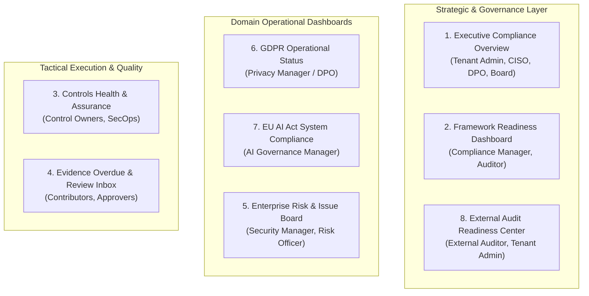
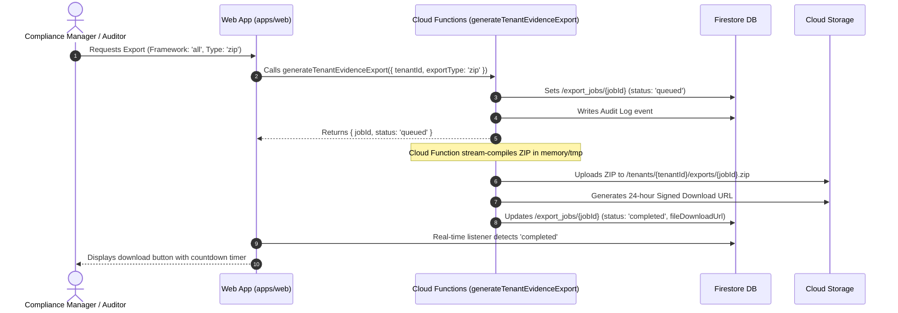

# Dashboard and Reporting Architecture Specification: euroGovernance

**System**: Multi-Tenant B2B GRC SaaS on Firebase  
**Target Viewers**: C-Suite, DPO, AI Ethics Lead, CISO, External Auditors, Operational Contributors  
**Data Residency**: `europe-west3` (Frankfurt)  

---

## 1. Dashboard Catalog & Intended Roles



| Dashboard | Target Roles | Core Questions Answered | Primary Widgets |
| :--- | :--- | :--- | :--- |
| **1. Executive Overview** | `tenant_admin`, `compliance_manager`, `security_manager`, `privacy_manager`, `ai_governance_manager` | *What is our organization's total compliance posture? What are our top regulatory liabilities?* | Overall Health Score, Framework Progress Bars, Critical Risk Heatmap, 72h Breach / 2d AI Incident Alerts, Evidence Expiry Forecast. |
| **2. Framework Readiness** | `compliance_manager`, `auditor`, `tenant_admin` | *What percentage of GDPR, EU AI Act, Data Act, or ISO 27001 requirements are fully implemented?* | Framework Implementation %, Gap Analysis by Domain, Requirement Implementation Burndown. |
| **3. Controls Health** | `security_manager`, `compliance_manager`, `contributor` | *Which controls lack valid evidence or have failing review cycles?* | Control Health Distribution (0-100%), Automated vs Manual Control ratio, Control Review Aging. |
| **4. Evidence Overdue Review** | `approver`, `compliance_manager`, `contributor` | *What evidence is expired or pending review?* | Pending Approval Inbox, Expiring in 30/7 Days Counter, Rejection Rate, Stale Evidence List. |
| **5. Open Risks & Issues** | `security_manager`, `compliance_manager`, `tenant_admin` | *What are our active residual risks and unmitigated audit nonconformities?* | 5x5 Inherent vs Residual Risk Matrix, Open Remediation Issues by Severity, Overdue CAPA Count. |
| **6. GDPR Operational Status** | `privacy_manager` (DPO), `compliance_manager` | *Are we meeting statutory 72h breach and 30d DSR fulfillment deadlines?* | Active ROPA Count, High-Risk DPIAs, Pending DSR Deadlines (Countdown), International Transfers (TIAs). |
| **7. AI System Compliance** | `ai_governance_manager`, `security_manager` | *What is the risk distribution of our AI models? Are FRIA obligations satisfied?* | System Count by Risk Tier, Unclassified Models Alert, High-Risk AI Obligations Checklist, Post-Market Anomaly Trends. |
| **8. Audit Readiness** | `auditor`, `compliance_manager`, `tenant_admin` | *Are we ready for external certification? Is the Statement of Applicability complete?* | SoA Implementation %, Evidence Traceability Completeness, Clean Audit Log Integrity Hash. |

---

## 2. Underlying Data Sources

```mermaid
flowchart LR
    subgraph Collections [Tenant-Scoped Collections]
        C_Ctrl["/controls"]
        C_Evid["/evidence"]
        C_Ropa["/ropa_entries"]
        C_Dpia["/dpia_assessments"]
        C_Breach["/breaches"]
        C_Dsr["/dsr_requests"]
        C_AI["/ai_systems"]
        C_Risk["/risks"]
        C_Soa["/iso_soa_entries"]
    end

    subgraph Pipeline [Rollup Engine]
        Trigger["Firestore Triggers & Hourly Cron"]
    end

    subgraph Summaries [Materialized Summary Documents]
        S_Latest["/summary_metrics/latest"]
        S_Gdpr["/summary_metrics/gdpr"]
        S_AI["/summary_metrics/ai_act"]
    end

    Collections --> Trigger
    Trigger --> Summaries
```



---

## 3. Firestore vs Derived Materialized Records Recommendation

### 3.1 The Architectural Tradeoff
- **Ad Hoc Querying (Bad for Scale)**: Querying 1,000 controls, 3,000 evidence files, and 200 ROPA entries on every dashboard refresh causes **excessive Firestore read costs** (4,200 reads per page load) and introduces 2-5 second UI latency.
- **Materialized Derived Summaries (Recommended Pattern)**: We maintain lightweight **pre-calculated summary documents** updated asynchronously upon document writes or scheduled background cron jobs.

### 3.2 Materialized Rollup Documents

#### Document 1: `/tenants/{tenantId}/summary_metrics/latest` (Executive & Controls Rollup)
```typescript
interface TenantLatestSummaryDocument {
  tenantId: string;
  calculatedAt: string; // ISO 8601 UTC
  overallHealthScore: number; // 0 - 100
  frameworks: {
    [frameworkId: string]: {
      name: string;
      totalControlsCount: number;
      implementedControlsCount: number;
      inProgressControlsCount: number;
      notStartedControlsCount: number;
      notApplicableControlsCount: number;
      readinessPercentage: number;
      averageHealthScore: number;
    };
  };
  evidenceSummary: {
    totalValid: number;
    totalUnderReview: number;
    totalExpired: number;
    totalRejected: number;
    expiringIn30DaysCount: number;
    expiringIn7DaysCount: number;
  };
  riskSummary: {
    totalOpenRisks: number;
    criticalRisksCount: number;
    highRisksCount: number;
    mediumRisksCount: number;
    lowRisksCount: number;
  };
}
```

#### Document 2: `/tenants/{tenantId}/summary_metrics/gdpr` (Privacy Rollup)
```typescript
interface TenantGDPRSummaryDocument {
  tenantId: string;
  calculatedAt: string;
  totalRopaEntries: number;
  activeDpiasCount: number;
  highRiskDpiasPendingReview: number;
  activeTiasCount: number;
  openBreachesCount: number;
  urgentBreachesWithin72hCount: number;
  openDsrRequestsCount: number;
  overdueDsrRequestsCount: number;
}
```

#### Document 3: `/tenants/{tenantId}/summary_metrics/ai_act` (AI Governance Rollup)
```typescript
interface TenantAISummaryDocument {
  tenantId: string;
  calculatedAt: string;
  totalAISystemsCount: number;
  tierCounts: {
    prohibited: number;
    high_risk: number;
    general_purpose_ai: number;
    transparency_only: number;
    minimal_risk: number;
    unclassified: number;
  };
  friaPendingCount: number;
  activeIncidentsCount: number;
  urgentIncidentsWithin2dCount: number;
}
```

---

## 4. On-Demand Reports Generated by Cloud Functions

Heavy compliance reports are compiled server-side to avoid browser memory saturation and provide verifiable compliance packages:

| Report Name | Output Format | Cloud Function Handler | Generation Trigger |
| :--- | :--- | :--- | :--- |
| **Comprehensive Evidence & Audit Dossier** | ZIP Archive | `generateTenantEvidenceExport` | User clicks "Export Audit Package" in Audit Readiness Center. Packages PDF evidence files, control matrices, and audit logs. |
| **Framework Readiness Executive Summary** | PDF | `generateFrameworkReadinessReport` | On-demand compilation from Executive or Framework Dashboard. Includes readiness bar charts and open gaps. |
| **GDPR Article 30 ROPA Official Register** | XLSX / PDF | `exportROPARegister` | Privacy Manager clicks "Export ROPA" in GDPR Workspace. Matches EU DPA inspection tabular format. |
| **EU AI Act Annex IV Technical Documentation** | PDF / ZIP | `exportAITechnicalFile` | AI Governance Manager clicks "Compile Technical File" for a high-risk AI system. |
| **ISO Statement of Applicability (SoA)** | XLSX / PDF | `exportStatementOfApplicability` | Compliance Manager / Auditor clicks "Export SoA" in Management System module. |

---

## 5. Export Formats & Delivery Strategy



---

## 6. Performance, Cost & Scale Architecture

### 6.1 Cost-Reduction Invariants
1. **Single Read Dashboard Load**: When an executive opens the platform, the UI executes **1 document read** (`/tenants/{tenantId}/summary_metrics/latest`) rather than querying thousands of raw records.
2. **Aggregated Count Lookups**: When drilling into list views, client queries use Firestore Server-Side Aggregations (`count()`, `aggregate()`) which cost **1 index read per 1,000 documents** rather than billing for full document reads.
3. **Short-Lived Export Artifacts**: Generated export files in Cloud Storage have a 7-day Lifecycle Management Rule that automatically purges old ZIP archives to minimize storage costs.

---

## 7. Acceptance Criteria

- [x] All 8 required dashboards are mapped to specific user roles and query-efficient data sources.
- [x] Materialized summary documents (`/summary_metrics/latest`, `gdpr`, `ai_act`) eliminate client-side aggregation overhead.
- [x] On-demand report compilation executes asynchronously via Cloud Functions into Cloud Storage with signed download URLs.
- [x] All export jobs are tracked in `/tenants/{tenantId}/export_jobs/{jobId}` and logged in append-only audit trails.
- [x] Dashboard load times maintain sub-second performance ($<500\text{ms}$) regardless of tenant document volume.
