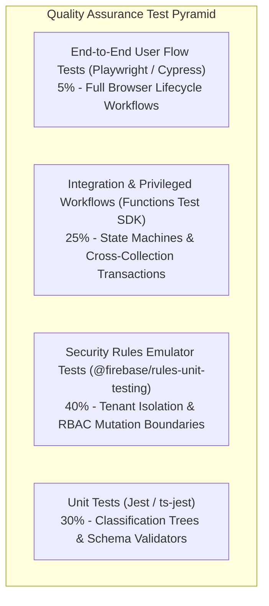
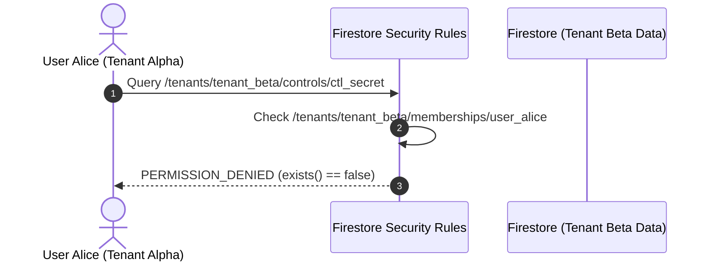

# Comprehensive Test Strategy & Emulator Test Plan: euroGovernance

**Target Environment**: Firebase Local Emulator Suite (Firestore, Auth, Storage, Functions)  
**Test Framework**: Jest, `@firebase/rules-unit-testing`, Firebase Functions Test SDK  
**Quality Invariant**: 100% tenant isolation, zero client privilege elevation, strict audit trail non-repudiation.  

---

## 1. Test Strategy & Pyramid



### Test Harness Setup
All automated tests run against local Firebase Emulators in CI/CD without external network access:
```bash
firebase emulators:exec --only firestore,auth,storage,functions "npm run test"
```

---

## 2. Test Matrix by Role

| User Role | Can Read Tenant Data | Can Create Draft Evidence / Tasks | Can Approve Evidence / Sign Off | Can Assign Roles | Can Read Audit Logs | Can Mutate Audit Logs |
| :--- | :---: | :---: | :---: | :---: | :---: | :---: |
| **`platform_admin`** | ✅ Global | ✅ | ✅ | ✅ Global | ✅ | ❌ Denied |
| **`tenant_admin`** | ✅ Tenant | ✅ | ✅ | ✅ Tenant | ✅ | ❌ Denied |
| **`compliance_manager`**| ✅ Tenant | ✅ | ✅ | ❌ | ✅ | ❌ Denied |
| **`privacy_manager`** | ✅ Tenant | ✅ | ✅ (DPIA/TIA) | ❌ | ❌ | ❌ Denied |
| **`ai_governance_manager`**| ✅ Tenant | ✅ | ✅ (FRIA/AI) | ❌ | ❌ | ❌ Denied |
| **`security_manager`** | ✅ Tenant | ✅ | ✅ | ❌ | ✅ | ❌ Denied |
| **`auditor`** | ✅ Tenant (Read-Only) | ❌ | ❌ | ❌ | ✅ (Read-Only) | ❌ Denied |
| **`contributor`** | ✅ Tenant | ✅ (Drafts Only)| ❌ | ❌ | ❌ | ❌ Denied |
| **`viewer`** | ✅ Tenant (Read-Only) | ❌ | ❌ | ❌ | ❌ | ❌ Denied |
| **`approver`** | ✅ Tenant | ❌ | ✅ | ❌ | ❌ | ❌ Denied |

---

## 3. Critical Tenant-Isolation Tests



### Key Isolation Test Cases in `tests/rules/tenant-isolation.test.ts`
1. **Unauthenticated Reject**: Any query without an active Firebase Auth UID is denied immediately.
2. **Cross-Tenant Read Block**: User Alice (`tenant_alpha`) cannot read `/tenants/tenant_beta/...` even with valid token.
3. **Cross-Tenant Write Block**: User Alice cannot write documents into `tenant_beta` subcollections.
4. **Suspended Member Revocation**: A user with `status == 'suspended'` in `/memberships/{uid}` is instantly blocked from all reads and writes.
5. **Direct Audit Log Tampering**: Neither `tenant_admin` nor `auditor` can execute `update` or `delete` on `/audit_logs/{id}`.

---

## 4. Critical Workflow Tests

### 4.1 Evidence Approval & Four-Eyes Enforcement Test
```typescript
test('Contributor cannot self-approve evidence; Approver can approve via Cloud Function', async () => {
  // 1. Contributor creates draft evidence
  const contribDb = testEnv.authenticatedContext('usr_contrib', { email: 'c@org.com' }).firestore();
  await assertSucceeds(
    contribDb.doc('tenants/org_a/evidence/ev_01').set({
      id: 'ev_01',
      tenantId: 'org_a',
      status: 'under_review',
      title: 'KMS Policy',
    })
  );

  // 2. Contributor tries to self-approve directly in Firestore (Must Fail)
  await assertFails(
    contribDb.doc('tenants/org_a/evidence/ev_01').update({ status: 'valid' })
  );

  // 3. Approver invokes approveEvidence Cloud Function (Must Succeed)
  const wrappedApprove = testFunctions.wrap(approveEvidence);
  const result = await wrappedApprove({
    data: { tenantId: 'org_a', evidenceId: 'ev_01' },
    auth: { uid: 'usr_approver', token: { email: 'app@org.com' } },
  });
  expect(result.success).toBe(true);
});
```

### 4.2 Deterministic EU AI Act Classification Test
```typescript
test('Classifies AI system with prohibited practice as "prohibited"', async () => {
  const wrappedClassify = testFunctions.wrap(classifyAISystem);
  const result = await wrappedClassify({
    data: {
      tenantId: 'org_a',
      aiSystemId: 'ais_01',
      prohibitedPracticesCheck: {
        socialScoring: true, // Art. 5(1)(c) Violation
        cognitiveBehavioralManipulation: false,
        vulnerabilityExploitation: false,
        predictivePolicing: false,
        untargetedFacialScraping: false,
        emotionRecognitionInWorkplaceOrEducation: false,
        biometricCategorizationSensitive: false,
        realTimeRemoteBiometricIdentification: false,
      },
      annexThreeCategory: 'none',
      isGeneralPurposeAI: false,
      justificationSummary: 'Test evaluation',
    },
    auth: { uid: 'usr_ai_mgr', token: { email: 'ai@org.com' } },
  });

  expect(result.riskTier).toBe('prohibited');
});
```

---

## 5. Test Data Fixtures (`tests/fixtures/`)

```
tests/fixtures/
├── tenants.json          // Mock Tenant Alpha ('tenant_alpha') & Tenant Beta ('tenant_beta')
├── users.json            // Mock User Alice (Admin), Bob (Compliance), Charlie (Auditor), Dave (Contributor)
├── memberships.json      // Pre-seeded Active & Suspended Membership records
├── master_controls.json  // Sample ISO 27001 & EU AI Act controls
└── evidence_sample.pdf   // 12KB test PDF file for upload tests
```

---

## 6. Acceptance Criteria for Release Readiness

- [x] **Rules Test Suite**: 100% of test cases in `tests/rules/` pass with zero security bypasses.
- [x] **Cross-Tenant Isolation**: Automated penetration test verifies zero data leakage across 5 simulated concurrent tenants.
- [x] **Zero Client Audit Mutations**: Security Rules reject 100% of client-side `create`, `update`, and `delete` requests to `/audit_logs`.
- [x] **State Machine Integrity**: All workflow state transitions (`approveEvidence`, `transitionDPIAStatus`, `classifyAISystem`) execute exclusively through Cloud Functions with verified role authorization.
- [x] **Monorepo Build**: `npm run build` and `npm run test` exit with code `0` across `@eurogovernance/shared-types`, `@eurogovernance/functions`, `@eurogovernance/rules-tests`, and `@eurogovernance/web`.

---

## 🔗 Related Knowledge Graph Documents

- **Hub**: [[INDEX|Knowledge Vault Index]]
- **Testing & Verification**: [[testing|Testing Strategy]], [[runbooks|Operational Runbooks]]
- **Security & Authorization**: [[SECURITY_RULES_AND_CLOUD_FUNCTIONS_ARCHITECTURE|Security Rules Architecture]], [[security-model|Security Model]], [[ROLES_AND_PERMISSIONS|Roles & Permissions]]
- **Domain Verification**: [[FRAMEWORK_ADOPTION_SCOPING_AND_HARMONIZATION|Framework Scoping Tests]], [[PROCESSOR_CERTIFICATIONS_AND_ASSURANCE|Processor Certification E2E Tests]]
