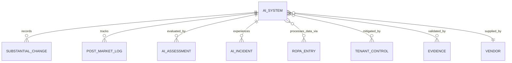
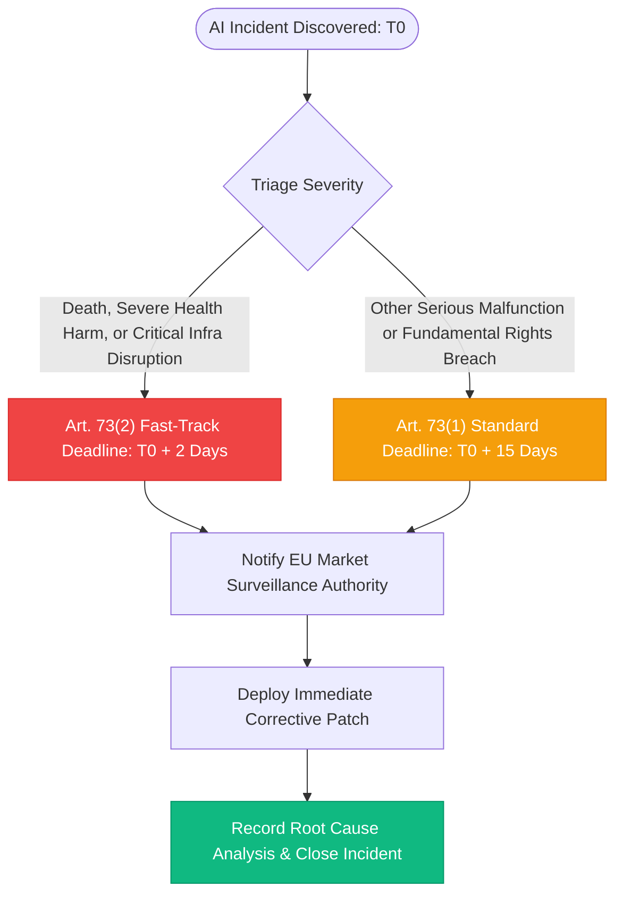
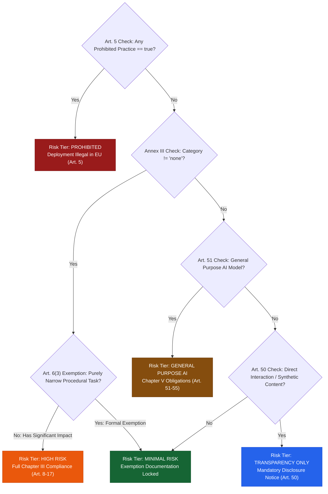

# EU AI Act Module Specification: euroGovernance

**Regulation**: Regulation (EU) 2024/1689 (Artificial Intelligence Act)  
**Primary User Roles**: `ai_governance_manager`, `compliance_manager`, `security_manager`, `approver`, `tenant_admin`  
**Data Residency**: `europe-west3` (Frankfurt)  

---

## 1. Data Model

```
/tenants/{tenantId}
├── /ai_systems/{aiSystemId}
│   ├── /substantial_changes/{changeId}
│   └── /post_market_logs/{logId}
├── /ai_assessments/{assessmentId}
└── /ai_incidents/{incidentId}
```



### 1.1 AI System Register (`/tenants/{tenantId}/ai_systems/{aiSystemId}`)
```typescript
interface AISystemDocument {
  id: string; // e.g. 'ais_01HQ9X...'
  tenantId: string;
  name: string; // e.g. 'Credit Underwriting Neural Network'
  description: string;
  systemCode: string; // e.g. 'AI-SYS-FIN-001'
  
  // Value Chain Role (Art. 3(2)-(7))
  valueChainRole: 'provider' | 'deployer' | 'importer' | 'distributor' | 'product_manufacturer';
  
  // Regulatory Risk Classification (Art. 5, 6, 50, 51)
  /* @serverManaged */ riskTier:
    | 'unclassified'
    | 'prohibited'
    | 'high_risk'
    | 'general_purpose_ai'
    | 'transparency_only'
    | 'minimal_risk';
  
  // Model & Architecture Metadata
  modelType: 'generative_llm' | 'computer_vision' | 'predictive_tabular' | 'biometric_nlp' | 'hybrid';
  foundationModelUsed: string | null; // e.g. 'GPT-4o', 'Claude-3.5-Sonnet', 'Llama-3-70B', 'Custom In-House'
  deploymentStatus: 'development' | 'testing' | 'pilot' | 'production' | 'decommissioned';
  
  // Cross-Domain Linkages
  vendorId: string | null; // Third-party provider from /vendors
  linkedSystemAssetIds: string[]; // Infrastructure links from /system_assets
  linkedRopaIds: string[]; // Linked personal data processing activities from /ropa_entries
  linkedControlIds: string[]; // Linked tenant controls (Art. 9, 14, 15)
  
  // High-Risk Specific Obligation Flags (Chapter III)
  friaRequired: boolean; // Fundamental Rights Impact Assessment (Art. 27)
  euDatabaseRegistrationRequired: boolean; // Art. 49 / Art. 71 EU Database
  euDatabaseRegistrationId: string | null;
  notifiedBodyInvolvementRequired: boolean; // Annex VII conformity assessment
  
  // Transparency Flags (Art. 50)
  involvesDirectHumanInteraction: boolean; // Art. 50(1) chatbot disclosure
  generatesSyntheticContent: boolean; // Art. 50(2) deepfake / AI watermarking
  involvesEmotionRecognitionOrBiometrics: boolean; // Art. 50(3) biometric disclosure
  
  // Responsible Ownership
  ownerId: string; // AI Governance Manager UID
  technicalLeadId: string; // Engineering lead UID
  
  createdAt: string;
  updatedAt: string;
  createdBy: string;
  updatedBy: string;
}
```

### 1.2 AI Assessment Document (`/tenants/{tenantId}/ai_assessments/{assessmentId}`)
```typescript
interface AIAssessmentDocument {
  id: string;
  tenantId: string;
  aiSystemId: string;
  assessmentType: 'classification' | 'risk_management' | 'fria' | 'conformity_evaluation';
  status: 'draft' | 'under_review' | 'approved' | 'rejected';
  
  // Stored Reproducible Questionnaire Payload
  classificationPayload?: {
    prohibitedPracticesCheck: {
      cognitiveBehavioralManipulation: boolean; // Art. 5(1)(a)
      vulnerabilityExploitation: boolean; // Art. 5(1)(b)
      socialScoring: boolean; // Art. 5(1)(c)
      predictivePolicing: boolean; // Art. 5(1)(d)
      untargetedFacialScraping: boolean; // Art. 5(1)(e)
      emotionRecognitionInWorkplaceOrEducation: boolean; // Art. 5(1)(f)
      biometricCategorizationSensitive: boolean; // Art. 5(1)(g)
      realTimeRemoteBiometricIdentification: boolean; // Art. 5(1)(h)
    };
    annexThreeCategory:
      | 'none'
      | 'biometrics'
      | 'critical_infrastructure'
      | 'education_vocational'
      | 'employment_worker_management'
      | 'essential_services_benefits'
      | 'law_enforcement'
      | 'migration_asylum'
      | 'justice_democracy';
    isGeneralPurposeAI: boolean;
    hasSignificantNegativeImpact: boolean; // Art. 6(3) exemption test
    justificationSummary: string;
  };

  // FRIA Section (Art. 27)
  friaDetails?: {
    affectedCategoriesOfPersons: string[]; // e.g. ['job_applicants', 'minority_groups']
    fundamentalRightsImpacted: string[]; // e.g. ['non_discrimination', 'human_dignity', 'privacy']
    riskMitigationMeasures: string;
    humanOversightArrangements: string; // Art. 14 implementation description
  };

  /* @serverManaged */ determinedRiskTier: AIRiskTier;
  /* @serverManaged */ approvedBy: string | null;
  /* @serverManaged */ approvedAt: string | null;
  
  ownerId: string;
  createdAt: string;
  updatedAt: string;
  createdBy: string;
  updatedBy: string;
}
```

### 1.3 Substantial Change Log (`/tenants/{tenantId}/ai_systems/{aiSystemId}/substantial_changes/{changeId}`)
```typescript
interface SubstantialChangeDocument {
  id: string; // e.g. 'chg_01HQ9X...'
  tenantId: string;
  aiSystemId: string;
  changeReference: string; // e.g. 'CHG-AI-2026-004'
  title: string;
  description: string;
  changeType:
    | 'intended_purpose_modification'
    | 'model_retraining_new_distribution'
    | 'architecture_overhaul'
    | 'performance_threshold_deviation'
    | 'data_source_expansion';
  isSubstantialUnderArticle3_23: boolean; // Requires new conformity assessment (Art. 43(4))
  reEvaluationAssessmentId: string | null;
  approvedBy: string;
  approvedAt: string;
  createdAt: string;
  createdBy: string;
}
```

### 1.4 Post-Market Monitoring Log (`/tenants/{tenantId}/ai_systems/{aiSystemId}/post_market_logs/{logId}`)
```typescript
interface PostMarketMonitoringDocument {
  id: string;
  tenantId: string;
  aiSystemId: string;
  monitoringPeriodStart: string; // ISO 8601 UTC
  monitoringPeriodEnd: string;
  performanceMetricsObserved: {
    accuracyRate: number;
    falsePositiveRate: number;
    falseNegativeRate: number;
    driftMetricScore: number;
  };
  fairnessAndBiasEvaluation: string;
  userComplaintsCount: number;
  anomaliesDetectedCount: number;
  correctiveActionsRequired: boolean;
  correctiveActionSummary: string | null;
  reviewedBy: string;
  reviewedAt: string;
}
```

### 1.5 AI Incident Register (`/tenants/{tenantId}/ai_incidents/{incidentId}`)
```typescript
interface AIIncidentDocument {
  id: string; // e.g. 'inc_01HQ9X...'
  tenantId: string;
  incidentReference: string; // e.g. 'INC-AI-2026-002'
  aiSystemId: string;
  title: string;
  description: string;
  severity: 'minor' | 'moderate' | 'serious' | 'critical';
  status: 'reported' | 'investigating' | 'authority_notified' | 'mitigated' | 'closed';
  discoveredAt: string; // T0 for notification clock
  occurredAt: string;
  
  // Art. 73 Serious Incident Criteria
  isFatalOrSevereHealthImpact: boolean; // 2-Day Notification Window
  isCriticalInfrastructureDisruption: boolean; // 2-Day Notification Window
  isFundamentalRightsBreach: boolean; // 15-Day Notification Window
  
  // Market Surveillance Authority Notification Clock
  /* @serverManaged */ authorityNotificationDeadline: string; // Calculated T0 + 2d or T0 + 15d
  authorityNotificationDate: string | null;
  marketSurveillanceAuthorityNotified: boolean;
  authorityReferenceNumber: string | null;
  
  rootCauseAnalysis: string;
  immediateCorrectiveAction: string;
  ownerId: string;
  createdAt: string;
  updatedAt: string;
  createdBy: string;
  updatedBy: string;
}
```

---

## 2. Workflow State Machines

### 2.1 EU AI Act Classification & Lifecycle State Machine

```mermaid
flowchart TD
    Init([Start: AI System Registered]) --> Dev[development: Model Architecture & Build]
    Dev --> Test[testing: Model Validated in Test Sandbox]
    
    Test --> Art5Screening{Run Art. 5 Screening}
    Art5Screening -->|Prohibited Practice Detected| Prohibited[prohibited: Deployment Illegal in EU]
    Art5Screening -->|No Prohibited Practices| Annex3Screening{Annex III High-Risk Use Case?}
    
    Annex3Screening -->|Annex III Match| HighRisk[high_risk: Chapter III Obligations]
    Annex3Screening -->|No Annex III Match| GPAICheck{General Purpose AI Model?}
    
    GPAICheck -->|GPAI Model| GPAI[general_purpose_ai: Art. 51-55 Rules]
    GPAICheck -->|Standard Application| MinimalRisk[minimal_risk / transparency_only: Art. 50]
    
    HighRisk --> Pilot[pilot: FRIA & Technical Documentation Completed]
    MinimalRisk --> Pilot
    GPAI --> Pilot
    
    Pilot --> Prod[production: Approved for Market Deployment]
    Prod --> SubChange{Substantial Change Detected?}
    SubChange -->|Yes: Art. 43(4)| Test
    SubChange -->|No: Standard Maintenance| Prod
    Prod --> Decom[decommissioned: Retired System]
    Prohibited --> Decom
    
    style Prohibited fill:#991b1b,stroke:#7f1d1d,color:#ffffff
    style HighRisk fill:#ea580c,stroke:#c2410c,color:#ffffff
    style GPAI fill:#854d0e,stroke:#713f12,color:#ffffff
    style Prod fill:#10b981,stroke:#059669,color:#ffffff
```

### 2.2 AI Incident Response & Authority Notification (Art. 73)



---

## 3. Classification Engine Design

The classification engine is a **deterministic, rule-based state machine** implemented inside the `classifyAISystem` Cloud Function. It ensures 100% mathematical reproducibility from the stored questionnaire answers.

### Deterministic Decision Matrix



---

## 4. Required Cloud Functions for EU AI Act

| Function Name | Trigger | Authorized Role | Technical Responsibility |
| :--- | :--- | :--- | :--- |
| **`classifyAISystem`** | HTTPS Callable | `ai_governance_manager`, `compliance_manager`, `tenant_admin` | Evaluates deterministic classification matrix; saves `AIClassificationAssessment`; updates system `riskTier`; records audit event. |
| **`transitionAIAssessmentStatus`** | HTTPS Callable | `ai_governance_manager`, `compliance_manager`, `approver`, `tenant_admin` | Validates sign-offs on FRIA assessments (Art. 27) and locks risk mitigations. |
| **`logAIIncident`** | HTTPS Callable | Any Contributor, AI Manager, Security Manager, Tenant Admin | Ingests incident report; calculates statutory reporting deadline (`T0 + 2d` or `T0 + 15d`); dispatches alerts. |
| **`recordSubstantialChange`** | HTTPS Callable | `ai_governance_manager`, `tenant_admin` | Evaluates if modification constitutes a substantial change (Art. 3(23)); triggers mandatory re-conformity workflow. |
| **`logPostMarketMetrics`** | HTTPS Callable | `ai_governance_manager`, `compliance_manager` | Records recurring post-market evaluation metrics (accuracy, drift, fairness, complaints) under Art. 72. |
| **`checkAIIncidentDeadlinesCron`** | Scheduled (Hourly) | Cloud Scheduler | Evaluates open AI incidents against authority notification deadlines; escalates unnotified incidents. |

---

## 5. Security and Integrity Controls

1. **Tamper-Proof Classification Records**: Once an AI system is classified, the underlying `AIClassificationAssessment` document is frozen. Any subsequent re-classification requires logging a formal `SubstantialChangeDocument` linking to a new assessment.
2. **Access Control Perimeter**:
   - `viewer` and `auditor`: Read-only access to AI system registers and post-market logs.
   - `contributor`: Allowed to submit incident reports and draft technical specs.
   - `ai_governance_manager` & `tenant_admin`: Exclusively authorized to submit classification questionnaires and sign off on FRIA reviews.
3. **Traceability to Personal Data Processing**: If an AI system processes personal data, `linkedRopaIds` must link to an active Article 30 ROPA record.

---

## 6. Reporting and Export Design

### 6.1 Annex IV Technical Documentation Package (ZIP / PDF)
Generates the complete regulatory dossier required under Article 11 and Annex IV of Regulation (EU) 2024/1689:
1. **Section 1: General Description**: AI system code, purpose, model architecture, and value chain role.
2. **Section 2: Risk Management File (Art. 9)**: Identified foreseeable risks, residual risk scores, and mapped mitigation controls.
3. **Section 3: Data Governance & Data Provenance (Art. 10)**: Training dataset descriptions, validation/testing splits, and bias mitigation documentation.
4. **Section 4: Technical Specifications & Human Oversight (Art. 13 & 14)**: User instructions, explainability interfaces, and "stop-button" human intervention controls.
5. **Section 5: Cybersecurity & Accuracy Benchmarks (Art. 15)**: Resilience test reports, penetration testing evidence, and observed accuracy metrics.
6. **Section 6: Fundamental Rights Impact Assessment (Art. 27)**: Signed FRIA report with affected group evaluations.

### 6.2 EU Declaration of Conformity (Art. 47 / Annex V)
A standardized, machine-readable PDF/JSON document certifying that the high-risk AI system complies with Chapter III requirements, ready for submission to the EU AI Database.

---

## 7. Acceptance Criteria

- [x] AI System register captures role (`provider`, `deployer`, `importer`, `distributor`), model type, and deployment status.
- [x] Prohibited practice screening deterministically locks systems into `prohibited` status if any Article 5 practice is flagged.
- [x] High-risk determination evaluates Annex III categories and Article 6(3) exemption conditions.
- [x] Incident reporting automatically computes 2-day vs 15-day market surveillance authority notification clocks under Article 73.
- [x] Substantial change logging creates an immutable record and triggers re-classification.
- [x] Export engine compiles a comprehensive Annex IV Technical Documentation dossier.
