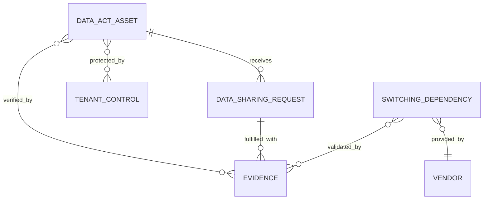
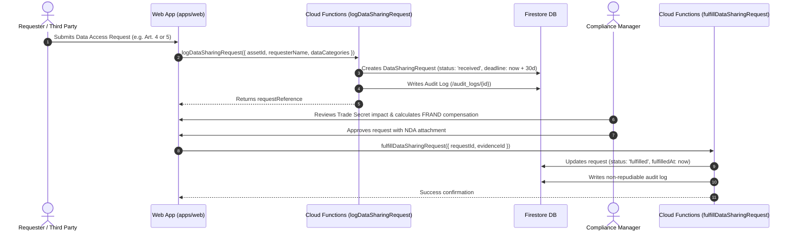

# EU Data Act Governance Module Specification: euroGovernance

**Regulation**: Regulation (EU) 2023/2854 (Data Act)  
**Primary User Roles**: `compliance_manager`, `privacy_manager`, `security_manager`, `approver`, `tenant_admin`  
**Data Residency**: `europe-west3` (Frankfurt)  

---

## 1. Scope & MVP Assumptions

1. **Focus Areas for MVP**:
   - **Chapter II & III (B2C & B2B Data Sharing)**: Making data generated by connected products or related services accessible to users (Art. 3, 4) and third-party data recipients (Art. 5) on Fair, Reasonable, and Non-Discriminatory (FRAND) terms (Art. 8).
   - **Chapter V (B2G Emergency Sharing)**: Handling exceptional public sector emergency data access requests (Art. 14, 15).
   - **Chapter VI (Cloud & Data Processing Switching)**: Identifying switching barriers, eliminating exit/egress fees, and tracking functional equivalence during cloud migration (Art. 23-31).
2. **Trade Secret Protection Invariant (Art. 4(6) & Art. 5(8))**: Data holders may refuse or restrict data access only where disclosure would cause serious economic damage from trade secret exposure, provided confidentiality agreements or technical safeguards are unfeasible.
3. **Decoupled Architecture**: Data files and real-time streaming APIs remain on customer infrastructure; euroGovernance stores the metadata register, legal agreements, trade secret risk assessments, fulfillment proofs, and audit logs.

---

## 2. Data Model

```
/tenants/{tenantId}
├── /data_act_assets/{assetId}
├── /data_sharing_requests/{requestId}
└── /switching_dependencies/{dependencyId}
```



### 2.1 Connected Product or Service Data Register (`/tenants/{tenantId}/data_act_assets/{assetId}`)
```typescript
interface DataActAssetDocument {
  id: string; // e.g. 'daa_01HQ9W...'
  tenantId: string;
  assetCode: string; // e.g. 'IOT-FLEET-001', 'SAAS-TELEMETRY-002'
  name: string; // e.g. 'Connected Fleet Telematics Gateway'
  assetType: 'connected_product' | 'related_service' | 'data_processing_service';
  description: string;
  
  // Organization's Role (Art. 2)
  role: 'data_holder' | 'data_recipient' | 'user' | 'data_processing_provider';
  
  // Data Generation & Nature (Art. 3(1))
  dataCategoriesGenerated: string[]; // e.g. ['engine_diagnostics', 'gps_telemetry', 'battery_status']
  dataVolumeEstimatedGb: number;
  dataAccessMechanism: 'rest_api' | 'streaming_mqtt' | 'direct_device_export' | 'batch_s3';
  isRealTimeAccessible: boolean;
  dataFormatStandard: string; // e.g. 'JSON', 'Protobuf', 'ISO 19867', 'CSV'
  
  // Trade Secret Flagging (Art. 4(6))
  containsTradeSecrets: boolean;
  tradeSecretJustification: string | null;
  tradeSecretSafeguards: string | null; // e.g. 'Confidentiality agreement required prior to export'
  
  // Linked GDPR Processing Activity
  involvesPersonalData: boolean;
  linkedRopaId: string | null; // Pointer to /ropa_entries
  
  status: 'active' | 'under_review' | 'decommissioned';
  ownerId: string;
  createdAt: string;
  updatedAt: string;
  createdBy: string;
  updatedBy: string;
}
```

### 2.2 Data Sharing Request & Decision Log (`/tenants/{tenantId}/data_sharing_requests/{requestId}`)
```typescript
interface DataSharingRequestDocument {
  id: string; // e.g. 'dsr_act_01HQ9W...'
  tenantId: string;
  requestReference: string; // e.g. 'REQ-DA-2026-009'
  assetId: string; // Linked DataActAsset ID
  
  // Requester Metadata
  requesterType:
    | 'product_user' // B2C / B2B user (Art. 4)
    | 'authorized_third_party' // Third-party data recipient designated by user (Art. 5)
    | 'public_sector_body' // B2G emergency request (Art. 14)
    | 'competitor';
  requesterName: string;
  requesterIdentifier: string; // EU VAT number / Business ID / User Email
  requestedAt: string; // ISO 8601 UTC
  
  // Statutory Response Deadline
  /* @serverManaged */ deadlineDate: string; // Standard prompt response deadline
  
  // Request Scope
  requestedDataCategories: string[];
  requestedTimeframeStart: string;
  requestedTimeframeEnd: string;
  intendedPurpose: string;
  
  // Decision & Rationale Log (Art. 8, 4(6), 14)
  status:
    | 'received'
    | 'evaluating'
    | 'frand_negotiation'
    | 'approved'
    | 'fulfilled'
    | 'rejected'
    | 'disputed';
  decisionRationale: string;
  rejectionLegalBasis:
    | 'trade_secret_severe_damage' // Art. 4(6) / 5(8)
    | 'security_requirement_breach'
    | 'unauthorized_requester'
    | 'disproportionate_request'
    | null;
  
  // FRAND Terms (Chapter III)
  frandTermsApplied: {
    compensationAmountEur: number;
    compensationRationale: string; // Costs of making data available (Art. 9)
    ndaSigned: boolean;
    ndaStoragePath: string | null;
  } | null;
  
  // Fulfillment Evidence
  fulfilledAt: string | null;
  deliveryMethod: string | null; // e.g. 'Automated SFTP / Signed S3 URL'
  evidenceId: string | null; // Linked proof of fulfillment from /evidence
  
  ownerId: string;
  createdAt: string;
  updatedAt: string;
  createdBy: string;
  updatedBy: string;
}
```

### 2.3 Cloud Switching & Lock-in Dependency Tracker (`/tenants/{tenantId}/switching_dependencies/{dependencyId}`)
```typescript
interface SwitchingDependencyDocument {
  id: string; // e.g. 'sw_01HQ9W...'
  tenantId: string;
  serviceName: string; // e.g. 'Core Database Infrastructure'
  vendorId: string; // Linked provider from /vendors (e.g. AWS, GCP, Azure)
  serviceCategory: 'iaas' | 'paas' | 'saas';
  
  // Article 23-31 Switching Barrier Evaluation
  dataExportabilityScore: number; // 1-5 rating (5 = open standard JSON/CSV)
  supportedExportFormats: string[];
  functionalEquivalenceFeasible: boolean; // Art. 26 functional continuity
  
  // Switching Fees & Contractual Notice (Art. 25 & 29)
  noticePeriodDays: number;
  dataEgressFeesWaived: boolean; // Mandatory 0-fee switching by Jan 2027
  estimatedSwitchingDurationWeeks: number;
  
  mitigationPlan: string;
  evidenceId: string | null; // Contract / SLA verification document from /evidence
  
  status: 'compliant' | 'remediation_needed' | 'non_compliant';
  ownerId: string;
  createdAt: string;
  updatedAt: string;
  createdBy: string;
  updatedBy: string;
}
```

---

## 3. Workflow for Access & Sharing Requests

```mermaid
flowchart TD
    ReqIn([Request Ingested: B2C, B2B, or B2G]) --> Eval[evaluating: Identity & Entitlement Verification]
    
    Eval --> TradeSecretCheck{Trade Secret Risk Analysis Art. 4(6)?}
    
    TradeSecretCheck -->|Severe Economic Harm & NDA Refused| Rej[rejected: Lawful Refusal Documented]
    TradeSecretCheck -->|B2B Commercial Data Access| FRAND[frand_negotiation: Chapter III Terms & NDA]
    TradeSecretCheck -->|B2C Direct User / B2G Emergency| Approved[approved: Data Delivery Authorized]
    
    FRAND -->|Terms Agreed & NDA Signed| Approved
    FRAND -->|Dispute over Reasonable Compensation| Dispute[disputed: Art. 10 Dispute Settlement Body]
    
    Approved --> Fulfilled[fulfilled: Secure API Access / File Delivered]
    
    style Approved fill:#2563eb,stroke:#1d4ed8,color:#ffffff
    style Fulfilled fill:#10b981,stroke:#059669,color:#ffffff
    style Rej fill:#ef4444,stroke:#dc2626,color:#ffffff
    style Dispute fill:#f59e0b,stroke:#d97706,color:#ffffff
```

### Request Execution Sequence



---

## 4. Reporting Outputs

1. **Data Act Compliance Dossier (PDF)**: Complete documentation of all connected products, telemetry data categories, technical access interfaces, and trade secret exclusions.
2. **B2B / B2C Data Sharing Register (XLSX / PDF)**: Formatted log of all inbound data requests, decision rationales, FRAND compensation terms, and fulfillment timestamps for regulatory audit.
3. **Cloud Switching & Anti-Lock-In Readiness Report (PDF)**: Comprehensive audit of all vendor dependencies (IaaS/PaaS/SaaS), egress fee waivers, exportability ratings, and Chapter VI migration readiness.

---

## 5. Security & Legal-Audit Considerations

| Consideration / Risk | Severity | Architectural Mitigation |
| :--- | :---: | :--- |
| **Trade Secret Leakage** | High | All requests involving trade secret assets enforce mandatory NDA execution records before status can transition to `approved`. Rejection rationales require formal justification documentation. |
| **Unlawful Compensation (Anti-Gouging)** | Medium | System enforces Art. 9 FRAND compensation validation: costs for SMEs cannot exceed the direct costs of making data available. |
| **Cross-Regulation Conflict (GDPR Art. 6 vs Data Act)** | High | When `involvesPersonalData == true`, the system verifies that the GDPR legal basis is valid before data is transmitted to third-party recipients. |

---

## 6. Acceptance Criteria

- [x] Data Act asset register models connected products, related digital services, and data processing services.
- [x] Sharing request tracker captures requester category (`user`, `third_party`, `b2g`), statutory deadlines, and FRAND terms.
- [x] Rejection workflows enforce explicit legal basis selection (trade secret damage, security breach, unauthorized requester).
- [x] Cloud switching module assesses exportability, notice periods, and egress fee elimination under Chapter VI.
- [x] Fulfillment actions link directly to verifiable evidence files in the `/evidence` module.
