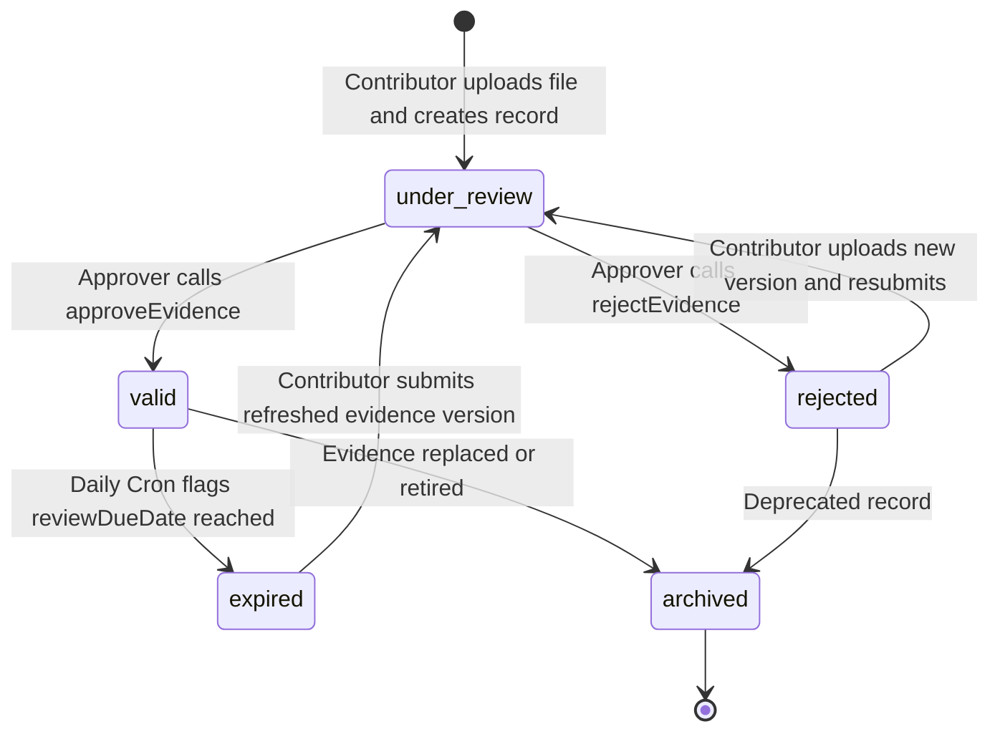

# Evidence Management Module Specification: euroGovernance

## 1. User Stories

### Story 1: Evidence Submission & Metadata Capture
- **As a** Compliance Contributor (e.g. IT Engineer / SecOps / HR / Legal Lead),
- **I want to** upload a compliance artifact (e.g. pentest report, DPA agreement, access review screenshot) and tag it with metadata (title, category, collection date, expiry/review frequency, linked controls, policies, and risks),
- **So that** the artifact is properly recorded, cataloged, and queued for compliance verification.

### Story 2: Versioning & Re-Submission
- **As a** Contributor,
- **I want to** submit an updated revision of an existing evidence record (e.g. annual penetration test report for 2026 replacing 2025),
- **So that** the historical audit trail is preserved while the latest document is submitted for re-approval without breaking existing control linkages.

### Story 3: Four-Eyes Review & Formal Approval
- **As an** Approver or Compliance Manager,
- **I want to** review uploaded evidence, verify document integrity and SHA-256 hash, and approve or reject it with mandatory remediation notes,
- **So that** only validated, genuine evidence satisfies our controls and updates organizational health scores.

### Story 4: Expiry Reminders & Automated Renewal
- **As a** Compliance Manager,
- **I want to** receive automatic notifications 30 days and 7 days prior to evidence expiry,
- **So that** our team can refresh recurring compliance artifacts before they lapse and trigger audit nonconformities.

### Story 5: Cross-Framework Traceability & Export Packaging
- **As an** Auditor or Compliance Lead,
- **I want to** link a single evidence file (e.g. encryption-at-rest configuration) across multiple frameworks (GDPR Art. 32, EU AI Act Art. 15, ISO 27001 A.8.24) and export a complete timestamped ZIP package,
- **So that** we eliminate duplicate work and provide verifiable compliance packages to external assessors.

---

## 2. Firestore Schema for Evidence and Evidence Versions

### 2.1 Parent Document: `/tenants/{tenantId}/evidence/{evidenceId}`

```typescript
interface EvidenceDocument {
  id: string; // e.g. 'ev_01HQ9K...'
  tenantId: string; // Organizational boundary
  title: string; // e.g. 'AWS Production Encryption-at-Rest KMS Policy'
  description: string; // Context, generation method, and testing rationale
  category:
    | 'audit_log'
    | 'screenshot'
    | 'policy_doc'
    | 'export_report'
    | 'assessment_doc'
    | 'configuration';
  status: 'valid' | 'expired' | 'under_review' | 'rejected' | 'archived';
  storagePath: string; // Latest file pointer: 'tenants/{tenantId}/evidence/{evidenceId}/v{versionNumber}_{filename}'
  fileSizeBytes: number;
  mimeType: string; // e.g. 'application/pdf', 'image/png'
  fileHashSha256: string; // Cryptographic integrity hash computed prior to upload
  currentVersion: number; // Incrementing integer (e.g. 1, 2, 3)

  // Relational Linkage Arrays (Foreign Key Pointers)
  controlIds: string[]; // Linked Tenant Control IDs
  requirementIds: string[]; // Linked Framework Requirement IDs
  policyIds: string[]; // Linked Policy IDs
  riskIds: string[]; // Linked Risk IDs
  assessmentIds: string[]; // Linked DPIA / TIA / AI Assessment IDs

  // Review & Approval Metadata
  collectedAt: string; // ISO 8601 UTC when the artifact was generated
  reviewFrequencyDays: number; // e.g. 90, 180, 365
  reviewDueDate: string | null; // Calculated expiry/renewal date (ISO 8601 UTC)
  reviewedBy: string | null; // UID of Approver / Compliance Manager
  reviewedAt: string | null; // ISO 8601 UTC timestamp of approval/rejection
  rejectionReason: string | null; // Remediation instructions if rejected

  // Base Audit Metadata
  ownerId: string; // UID of primary responsible owner
  createdAt: string; // ISO 8601 UTC
  updatedAt: string; // ISO 8601 UTC
  createdBy: string; // UID who created record
  updatedBy: string; // UID who last updated record
}
```

### 2.2 Subcollection: `/tenants/{tenantId}/evidence/{evidenceId}/versions/{versionId}`

```typescript
interface EvidenceVersionDocument {
  id: string; // e.g. 'v_01', 'v_02'
  tenantId: string;
  evidenceId: string;
  versionNumber: number; // 1, 2, 3...
  storagePath: string; // Exact Cloud Storage blob path
  fileSizeBytes: number;
  mimeType: string;
  fileHashSha256: string;
  changeSummary: string; // e.g. 'Updated for Q3 2026 quarterly audit'
  uploadedBy: string; // Firebase Auth UID
  uploadedAt: string; // ISO 8601 UTC (Immutable)
}
```

---

## 3. Cloud Storage Path Strategy

### 3.1 Path Hierarchy & Naming Convention
```
gs://eurogovernance-evidence-eu/
└── tenants/{tenantId}/
    ├── evidence/{evidenceId}/
    │   ├── v1_2026-08-14_pentest_report.pdf
    │   └── v2_2027-08-14_pentest_report.pdf
    └── exports/{exportJobId}/
        └── compliance_package_{tenantId}_2026-08-14.zip
```

### 3.2 Storage Constraints & Metadata
- **Max File Size**: 50 Megabytes (MB) per evidence upload.
- **Allowed MIME Types**: `application/pdf`, `image/png`, `image/jpeg`, `application/json`, `text/plain`, `application/zip`, `application/vnd.openxmlformats-officedocument.wordprocessingml.document` (`.docx`), `application/vnd.openxmlformats-officedocument.spreadsheetml.sheet` (`.xlsx`).
- **Custom Metadata Headers**: Every upload sets `{ customMetadata: { tenantId, evidenceId, fileHashSha256, uploadedBy } }`.

---

## 4. Security Rules Considerations

### 4.1 Cloud Storage Security Rules (`storage.rules`)
```javascript
rules_version = '2';
service firebase.storage {
  match /b/{bucket}/o {
    function isAuthenticated() {
      return request.auth != null && request.auth.uid != null;
    }
    
    function isTenantMember(tenantId) {
      return isAuthenticated() && (
        request.auth.token.get('platform_admin', false) == true ||
        request.auth.token.tenantId == tenantId ||
        request.auth.token.get('tenants', []).hasAny([tenantId])
      );
    }

    match /tenants/{tenantId}/evidence/{evidenceId}/{fileName} {
      allow read: if isTenantMember(tenantId);
      allow create: if isTenantMember(tenantId) &&
                       request.resource.size <= 50 * 1024 * 1024 &&
                       request.resource.contentType.matches('(application/pdf|image/.*|text/.*|application/json|application/zip|application/vnd.openxmlformats-officedocument.*|application/msword|application/vnd.ms-excel)');
      // Overwrites are prohibited; re-uploads create a new version with distinct fileName
      allow update: if false;
      allow delete: if isTenantMember(tenantId) && request.auth.token.get('role', '') == 'tenant_admin';
    }
  }
}
```

### 4.2 Firestore Security Rules (`firestore.rules`)
- **Evidence Creation**: Allowed for active tenant members (`contributor` and higher) with `status == 'under_review'`.
- **Evidence Updates**: Status transitions to `valid` or `rejected` are locked against direct client mutation. Direct client updates can only alter operational fields (e.g. `title`, `description`, `controlIds`) prior to approval.
- **Evidence Versions Subcollection**: Client writes `create` allowed; `update` is strictly `allow update: if false;` to guarantee immutability of version history.

---

## 5. Approval Workflow State Machine



### Transition Authorization Matrix

| Transition | From State | To State | Authorized Invocation | System Action / Side Effects |
| :--- | :--- | :--- | :--- | :--- |
| **Submit Draft** | `[*]` | `under_review` | Client SDK (`contributor`+) | Sets `currentVersion: 1`, creates version subcollection doc. |
| **Approve** | `under_review` | `valid` | Cloud Function `approveEvidence` | Sets `reviewedBy: uid`, `reviewedAt: now`, calculates `reviewDueDate = now + reviewFrequencyDays`, logs audit event. |
| **Reject** | `under_review` | `rejected` | Cloud Function `rejectEvidence` | Stores mandatory `rejectionReason`, notifies contributor, logs audit event. |
| **Re-Submit Revision**| `rejected` / `expired` / `valid` | `under_review` | Client SDK (`contributor`+) | Increments `currentVersion`, creates immutable version doc, resets rejection notes. |
| **Expire** | `valid` | `expired` | Daily Scheduled Cron | Updates status to `expired`, emits in-app and email reminder. |

---

## 6. Notifications and Reminders

### 6.1 Scheduled Cron Execution (`checkEvidenceExpiriesAndReminders`)
- **Schedule**: Every day at 04:00 UTC (`0 4 * * *`).
- **Query**: Searches active tenants for evidence where `status == 'valid'` and `reviewDueDate <= now()`.
- **Action**:
  1. Batch updates status from `valid` to `expired`.
  2. Creates notification document in `/tenants/{tenantId}/notifications/{id}` for the evidence `ownerId`.
  3. Emits `task_overdue` and `evidence_expiry_warning` alerts.

### 6.2 Pre-Expiry Warning Windows
- **30 Days Prior**: Warning notification to evidence owner.
- **7 Days Prior**: High-priority alert to evidence owner and Compliance Manager.
- **Deduplication Strategy**: Notifications check for existing unread notifications with identical `recipientId` and `actionUrl` within the last 7 days.

---

## 7. UI Screens and Actions

### 7.1 Screen 1: Evidence Inbox (`/evidence`)
- **Tabs**:
  1. *Pending Review* (`status == 'under_review'`): Actionable queue for approvers.
  2. *Expiring Soon* (`status == 'valid'` & `reviewDueDate <= 30d`): Proactive renewal queue.
  3. *Valid Evidence* (`status == 'valid'`): Filterable repository.
  4. *Expired & Rejected* (`status in ['expired', 'rejected']`): Remediation queue.
- **Actions**: Search by title, filter by framework, bulk export, "Upload New Evidence" button.

### 7.2 Screen 2: Evidence Upload & Linkage Modal
- **Fields**: File Drag & Drop (PDF, PNG, DOCX), Title, Description, Category, Collection Date, Review Frequency (Days), Multi-Select Control Linkages, Multi-Select Requirement Linkages, Multi-Select Policy & Risk Linkages.
- **Client Processing**: Computes SHA-256 hash in browser before uploading to Cloud Storage; then creates Firestore document.

### 7.3 Screen 3: Evidence Detail & Approval Workspace (`/evidence/[id]`)
- **Components**:
  - Embedded secure PDF/Image viewer (via short-lived signed URL).
  - Version History Drawer: Displays all previous revisions with file size, uploader, timestamp, and SHA-256 hash.
  - Linked Compliance Traceability: Visual chips linking to controls (e.g. `CTL-GDPR-01`), risks, and policies.
  - Approval Action Bar (for Approvers): "Approve Evidence" (triggers `approveEvidence`) and "Reject with Feedback" (modal prompting for mandatory rejection reason).

### 7.4 Screen 4: Compliance Package Export Modal
- **Options**: Select target frameworks (GDPR, EU AI Act, EU Data Act, ISO 27001), date range, include/exclude audit logs.
- **Execution**: Triggers `generateTenantEvidenceExport`; polls job status; presents instant download link once complete.

---

## 8. Acceptance Criteria & Test Matrix

### Acceptance Criteria
- [x] All evidence files reside strictly under `/tenants/{tenantId}/evidence/{evidenceId}/` with 50MB size limit.
- [x] Evidence versions are stored in an immutable subcollection (`/versions/{versionId}`) with no mutable history arrays.
- [x] Evidence status transitions to `valid` or `rejected` are locked against client writes and must execute through `approveEvidence` / `rejectEvidence`.
- [x] Approving evidence recalculates `reviewDueDate` based on `reviewFrequencyDays` and logs an append-only audit event.
- [x] Daily scheduled cron flags expired evidence and generates notification records.
- [x] Evidence supports multi-framework mapping via `controlIds` and `requirementIds` arrays.
