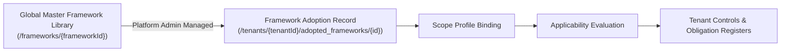
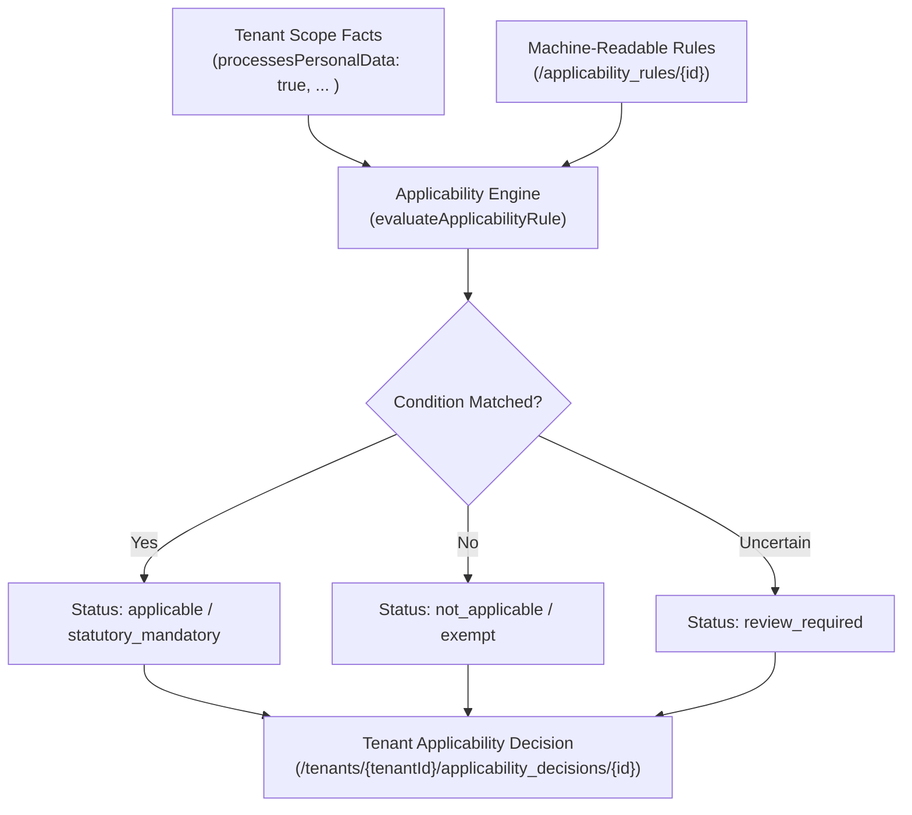
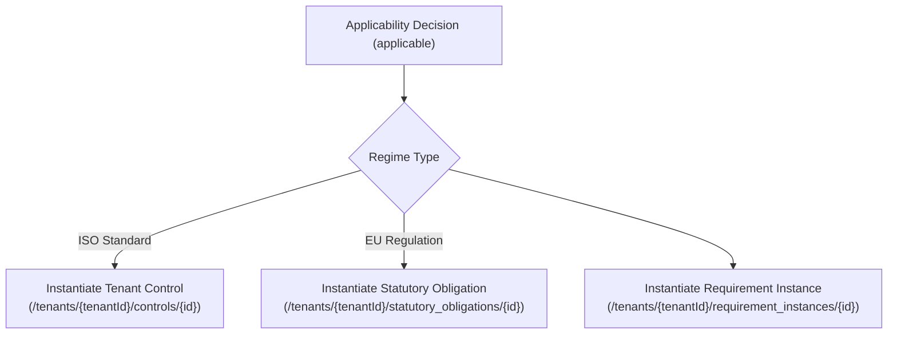

# Multi-Framework Adoption, Scoping, Applicability & Control Harmonization Engine

**euroGovernance Platform Documentation**  
**Version**: 1.0.0 (Production Implemented Behavior)  
**Supported Standards & Regulations**: GDPR (EU 2016/679), EU AI Act (EU 2024/1689), EU Data Act (EU 2023/2854), ISO/IEC 27001:2022, ISO/IEC 42001:2023.

---

## Table of Contents

1. [What Framework Adoption Is](#1-what-framework-adoption-is)
2. [How Scope Works](#2-how-scope-works)
3. [How Applicability Is Evaluated](#3-how-applicability-is-evaluated)
4. [How Tenant Controls & Obligations Are Generated](#4-how-tenant-controls--obligations-are-generated)
5. [How Control Harmonization Works ("One Control, Many Obligations")](#5-how-control-harmonization-works)
6. [ISO-Style vs. Regulation-Style Framework Differences](#6-iso-style-vs-regulation-style-framework-differences)
7. [Operational Caveats & Known Limitations](#7-operational-caveats--known-limitations)
8. [Developer Guide: Extending Rules, Harmonizations & Framework Content](#8-developer-guide-extending-rules-harmonizations--framework-content)

---

## 1. What Framework Adoption Is

Framework adoption in euroGovernance is the formal process by which a tenant binds one or more regulatory regimes or management standards to its operational compliance scope.



### 1.1 Architecture & Separation of Concerns
- **Global Master Library** (`/frameworks/{frameworkId}`): Platform-wide, read-only canonical catalog containing regulatory titles, official legal references, versions, and requirement inventories. Managed exclusively by Platform Admins (`isPlatformAdmin()`).
- **Tenant Adoption Record** (`/tenants/{tenantId}/adopted_frameworks/{frameworkId}`): Tenant-scoped document recording the tenant's commitment to adopt a specific framework.

### 1.2 Data Model
```typescript
interface TenantAdoptedFramework {
  id: string; // e.g. 'gdpr', 'iso_27001'
  tenantId: string;
  frameworkId: string; // references /frameworks/{frameworkId}
  versionPinned: string; // e.g. '2016/679', '2022'
  status: 'draft' | 'active' | 'suspended' | 'archived';
  scopeDescription: string;
  targetComplianceDate?: string | null;
  adoptedAt: string; // ISO 8601 UTC
  adoptedBy: string; // User UID
  createdAt: string;
  updatedAt: string;
  createdBy: string;
  updatedBy: string;
  ownerId: string;
}
```

### 1.3 Lifecycle States
1. **Draft**: Framework chosen, scoping questionnaires and fact gathering in progress.
2. **Active**: Scope confirmed, applicability rules evaluated, controls instantiated and actively monitored.
3. **Suspended**: Temporarily out of compliance tracking scope (audit freeze or reorganization).
4. **Archived**: Historical audit record retained for regulatory inspection.

---

## 2. How Scope Works

Scoping establishes the contextual boundaries, operational facts, and risk characteristics of a tenant organization. The applicability engine uses these scope facts to evaluate whether specific clauses or controls apply.

### 2.1 Scope Profiles (`/tenants/{tenantId}/scope_profiles/{profileId}`)
Scope profiles define the organizational boundary for compliance evaluations:
- `corporate_wide`: The entire legal entity and all corporate systems.
- `specific_service`: A dedicated SaaS application or cloud service.
- `data_processing_activity`: A distinct GDPR Article 30 processing activity.
- `ai_system`: A specific AI/ML model system under the EU AI Act / ISO 42001.

### 2.2 Scope Questionnaires & Answers
- **Questionnaires** (`/scope_questionnaires/{questionnaireId}`): Master questionnaires with branching logic, guidance notes, and linked target `factKey`s.
- **Tenant Scope Answers** (`/tenants/{tenantId}/scope_answers/{answerId}`): Stores recorded responses (`boolean`, `string`, `number`, `multi_choice`). Can be submitted by Contributors and Compliance Managers.

### 2.3 Scope Facts (`/tenants/{tenantId}/scope_facts/{factId}`)
Facts are normalized key-value representations of the tenant's operational reality:
```typescript
interface TenantScopeFact {
  id: string; // matches factKey or unique ID
  tenantId: string;
  scopeProfileId?: string | null;
  factKey: string; // e.g. 'processesPersonalData', 'deploysHighRiskAi'
  category: 'organizational' | 'cloud_usage' | 'data_processing' | 'ai_system' | 'cross_border';
  dataType: 'boolean' | 'string' | 'number' | 'array';
  valueBoolean?: boolean | null;
  valueString?: string | null;
  valueNumber?: number | null;
  valueArray?: string[] | null;
  rationale?: string | null;
  sourceQuestionId?: string | null;
  assessedBy: string;
  assessedAt: string;
  status: 'active' | 'superseded' | 'deprecated';
}
```

---

## 3. How Applicability Is Evaluated

The Applicability Engine processes machine-readable rules against the tenant's active scope facts to determine compliance obligations deterministically.



### 3.1 Rule Schema (`/applicability_rules/{ruleId}`)
Each rule evaluates a target requirement against a condition tree:
```typescript
interface ApplicabilityRule {
  id: string;
  ruleName: string;
  description: string;
  frameworkId: string;
  targetRequirementId: string;
  conditionGroup: ApplicabilityConditionGroup;
  resultingStatusIfMatched: ApplicabilityStatus;
  resultingStatusIfNotMatched: ApplicabilityStatus;
  statutoryRationale: string;
  isMandatoryUnlessExempt: boolean;
  version: string;
}

interface ApplicabilityConditionGroup {
  logicalOperator: 'all' | 'any' | 'none' | 'not';
  clauses: ApplicabilityConditionClause[];
  nestedGroups?: ApplicabilityConditionGroup[];
}

interface ApplicabilityConditionClause {
  factKey: string;
  operator: 'equals' | 'not_equals' | 'in' | 'not_in' | 'greater_than' | 'less_than' | 'contains' | 'contains_any' | 'is_true' | 'is_false' | 'is_null' | 'is_not_null';
  expectedValue?: unknown;
}
```

### 3.2 Evaluation Outcomes
- `applicable`: Requirement or control must be satisfied.
- `not_applicable`: Explicitly outside organizational scope based on facts.
- `review_required`: Automated heuristics require human specialist determination.
- `statutory_mandatory`: Hard statutory obligation under EU law (cannot be waived without legal exemption).

### 3.3 Manual Override Governance & History Tracking
Compliance Managers can override automated suggestions, subject to strict governance constraints:
1. **Mandatory Rationale**: Override rationales must be $\ge 10$ characters explaining the audit/legal basis.
2. **Immutable Auto-Result**: The original rule evaluation output is permanently stored in `autoResult` for auditor comparison.
3. **Audit History Chain**: All overrides, reviewer approvals, and reversions append an entry to `history`:
```typescript
interface ApplicabilityOverrideHistoryEntry {
  changeId: string;
  timestamp: string;
  actorId: string;
  actorRole: UserRole;
  previousStatus: ApplicabilityStatus;
  newStatus: ApplicabilityStatus;
  previousIsApplicable: boolean;
  newIsApplicable: boolean;
  decisionSource: 'user_override' | 'reviewer_override' | 'reversion';
  overrideRationale: string;
  reviewedBy?: string | null;
}
```

---

## 4. How Tenant Controls & Obligations Are Generated

Once applicability decisions are finalized, euroGovernance generates the corresponding operational objects:



1. **Requirement Instances** (`/tenants/{tenantId}/requirement_instances/{id}`): Tracks compliance status (`compliant`, `in_progress`, `non_compliant`, `not_applicable`) for every adopted framework section.
2. **Tenant Controls** (`/tenants/{tenantId}/controls/{id}`): Technical or organizational safeguards with health scores, assigned owners, review cadences, and linked evidence items.
3. **Statutory Obligations** (`/tenants/{tenantId}/statutory_obligations/{id}`): Formal legal compliance duties triggered by EU regulations:
   - `required_register`: Article 30 ROPA, High-Risk AI System Register, Data Sharing Contract Register.
   - `required_assessment`: DPIA, Transfer Impact Assessment (TIA), Fundamental Rights Impact Assessment (FRIA).
   - `required_operational_record`: Breach Log, AI Incident Log, Data Subject Request (DSR) Registry.

---

## 5. How Control Harmonization Works

Control harmonization prevents audit fatigue by allowing **one operational tenant control** to satisfy multiple overlapping requirements across diverse frameworks.

### 5.1 Canonical Control Mappings (`/control_mappings/{id}`)
Global mappings identify equivalence and overlap between framework obligations:
```typescript
interface CanonicalControlMapping {
  id: string; // e.g. 'map_sec_enc_01'
  canonicalControlGroupId: string; // e.g. 'CAN-SEC-ENC'
  canonicalTitle: string;
  canonicalDomain: 'security' | 'privacy' | 'ai_governance' | 'data_governance';
  allowsHarmonization: boolean;
  mappedObligations: Array<{
    frameworkId: string;
    requirementId: string;
    sectionCode: string;
    requirementTitle: string;
    relationship: 'exact' | 'subset' | 'superset' | 'related';
  }>;
}
```

### 5.2 Merge and Reuse Logic
When instantiating controls for a new framework:
1. The engine checks if an existing active control in `/tenants/{tenantId}/controls` already covers the `canonicalControlGroupId`.
2. If `allowsHarmonization === true`, the engine reuses the existing control, updating `frameworkIds` and `satisfiedRequirementIds` rather than creating a duplicate control.
3. The control is marked `isHarmonized = true`.

### 5.3 Auditor Explainability
Auditors can inspect a single control and see the complete coverage trace:
- Satisfies **GDPR Article 32 (Security of Processing)**
- Satisfies **ISO/IEC 27001:2022 Annex A.8.24 (Use of cryptography)**
- Satisfies **EU AI Act Article 15 (Cybersecurity of AI Systems)**

---

## 6. ISO-Style vs. Regulation-Style Framework Differences

euroGovernance natively handles the fundamental structural divergence between management system standards and statutory EU regulations:

| Dimension | ISO Management Standards (ISO 27001, ISO 42001) | EU Statutory Regulations (GDPR, EU AI Act, Data Act) |
|---|---|---|
| **Primary Philosophy** | Risk-based management system & continuous improvement | Legal compliance, fundamental rights protection & statutory mandates |
| **Applicability Output** | Statement of Applicability (SoA) | Statutory Obligation Registers, Assessments & Controls |
| **Exclusion Rules** | Controls can be excluded if justified by formal risk assessment | Mandatory legal duties cannot be excluded without explicit statutory exemption |
| **Audit Artifacts** | Management Review Minutes, Internal Audits, SoA | Article 30 ROPA, DPIAs, AI Conformity Assessments, Breach Records |
| **Approval Flow** | Formal Approver sign-off on SoA control selections | DPO / Legal Counsel validation of legal bases and derogations |

---

## 7. Operational Caveats & Known Limitations

1. **Storage Rules in Local Development**: The Firebase Storage emulator operates on port `9199`. In CI/CD or local test suites without an active storage emulator daemon, storage tests gracefully skip while Firestore rules are 100% verified.
2. **Export Immutability**: Direct client writes to `/tenants/{tenantId}/exports` in Cloud Storage are blocked. Export compilation must always execute via the backend Cloud Functions Admin SDK.
3. **Harmonization Guardrails**: Controls with `allowsHarmonization: false` (e.g. regime-specific regulatory reporting mechanisms) will never be merged, preserving jurisdictional integrity.
4. **Override Length Enforcement**: All manual overrides require $\ge 10$ characters of justification; one-word rationale entries are automatically rejected by validation helpers.

---

## 8. Developer Guide: Extending Rules, Harmonizations & Framework Content

### 8.1 Adding a New Machine-Readable Applicability Rule
Add the rule definition to `CANONICAL_APPLICABILITY_RULES` in [`packages/shared-types/src/scoping-and-harmonization.ts`](file:///Users/remon/Documents/euroGovernance/packages/shared-types/src/scoping-and-harmonization.ts):

```typescript
export const NEW_RULE: ApplicabilityRule = {
  id: 'rule_ai_act_art10_data_gov',
  ruleName: 'AI Act Article 10 Data Governance Obligation',
  description: 'Applies to high-risk AI training datasets.',
  frameworkId: 'eu_ai_act',
  targetRequirementId: 'ai_act_art_10',
  conditionGroup: {
    logicalOperator: 'all',
    clauses: [
      { factKey: 'deploysHighRiskAi', operator: 'equals', expectedValue: true },
      { factKey: 'trainsCustomAiModels', operator: 'equals', expectedValue: true },
    ],
  },
  resultingStatusIfMatched: 'applicable',
  resultingStatusIfNotMatched: 'not_applicable',
  statutoryRationale: 'High-risk AI systems utilizing training data are subject to Article 10 data quality mandates.',
  isMandatoryUnlessExempt: true,
  version: '1.0',
  createdAt: new Date().toISOString(),
  updatedAt: new Date().toISOString(),
};
```

### 8.2 Adding a Canonical Harmonization Mapping
Add new cross-framework mappings in `CANONICAL_CONTROL_MAPPINGS`:

```typescript
export const NEW_MAPPING: CanonicalControlMapping = {
  id: 'map_ai_transparency_01',
  canonicalControlGroupId: 'CAN-AI-TRANS',
  canonicalTitle: 'AI System Transparency & Informational Notice',
  canonicalDomain: 'ai_governance',
  allowsHarmonization: true,
  mappedObligations: [
    {
      frameworkId: 'eu_ai_act',
      frameworkShortName: 'EU AI Act',
      requirementId: 'ai_act_art_50',
      sectionCode: 'Article 50',
      requirementTitle: 'Transparency obligations for certain AI systems',
      relationship: 'exact',
    },
    {
      frameworkId: 'iso_42001',
      frameworkShortName: 'ISO 42001',
      requirementId: 'iso_42001_b82',
      sectionCode: 'B.8.2',
      requirementTitle: 'Transparency of AI systems',
      relationship: 'exact',
    },
  ],
  createdAt: new Date().toISOString(),
  updatedAt: new Date().toISOString(),
};
```

### 8.3 Running Local Verification
Execute the test suites to ensure zero regressions:

```bash
# 1. Typecheck all packages
npm run typecheck

# 2. Run End-to-End Governance Lifecycle Pack
npm run test --workspace=@eurogovernance/rules-tests -- governance-lifecycle-e2e.test.ts

# 3. Run Full 36-Suite Regression Matrix
npm run test:rules
```
