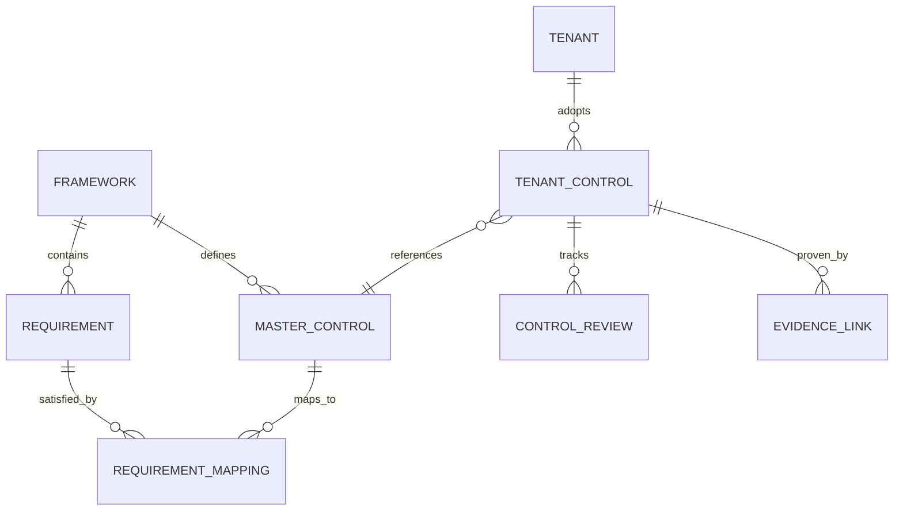
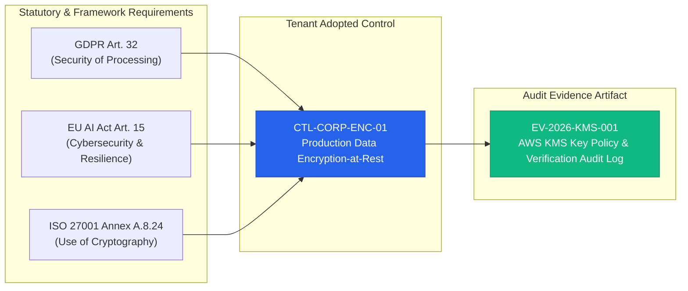
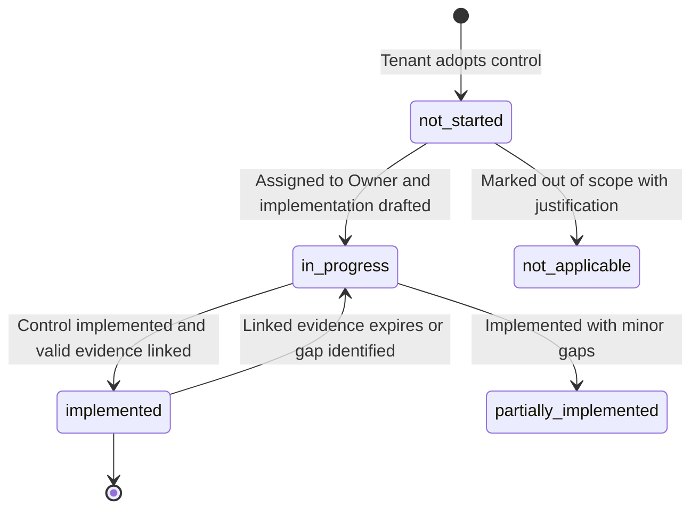

# Framework and Controls Engine Specification: euroGovernance

**Supported Frameworks**: GDPR (EU 2016/679), EU AI Act (EU 2024/1689), EU Data Act (EU 2023/2854), ISO/IEC 27001:2022, ISO/IEC 42001:2023.

---

## 1. Data Model for Frameworks, Requirements, Controls, and Mappings



### 1.1 Global Framework Document (`/frameworks/{frameworkId}`)
```typescript
interface FrameworkDocument {
  id: string; // 'gdpr', 'eu_ai_act', 'eu_data_act', 'iso_27001_2022', 'iso_42001_2023'
  code: string; // e.g. 'EU-2016-679', 'EU-2024-1689', 'ISO-27001-2022'
  name: string; // e.g. 'General Data Protection Regulation'
  version: string; // e.g. '2016/679/EU', '2024/1689/EU', '2022'
  category: 'privacy' | 'ai_governance' | 'data_governance' | 'security' | 'cross_domain';
  description: string;
  officialReferenceUrl: string;
  totalRequirementsCount: number;
  isSystem: boolean; // true for standard regulatory libraries
  createdAt: string; // ISO 8601 UTC
  updatedAt: string; // ISO 8601 UTC
}
```

### 1.2 Global Requirement Document (`/frameworks/{frameworkId}/requirements/{reqId}`)
```typescript
interface RequirementDocument {
  id: string; // e.g. 'gdpr_art_30', 'ai_act_art_9', 'iso_27001_a_8_24'
  frameworkId: string;
  sectionCode: string; // e.g. 'Art. 30(1)', 'Art. 9(2)(a)', 'Clause 6.1.2', 'Annex A.8.24'
  title: string;
  description: string; // Full statutory or standard requirement text
  guidanceText: string; // Practical audit and implementation guidance
  category: string; // e.g. 'Technical Measures', 'Risk Management', 'Data Governance'
  isMandatory: boolean;
  parentRequirementId: string | null; // Supports hierarchical clauses
  sortOrder: number;
}
```

### 1.3 Global Master Control Catalog (`/frameworks/{frameworkId}/master_controls/{controlId}`)
```typescript
interface MasterControlDocument {
  id: string; // e.g. 'mst_ctl_enc_01', 'mst_ctl_ai_oversight_01'
  frameworkId: string;
  code: string; // e.g. 'CTL-ENC-01', 'CTL-AIA-09'
  title: string;
  description: string; // Standard baseline implementation specification
  domain: string; // e.g. 'Cryptography', 'Human Oversight', 'Data Protection by Design'
  recommendedFrequencyDays: number; // e.g. 90, 180, 365
  mappedRequirementIds: string[]; // Standard regulatory requirements this master control satisfies
}
```

### 1.4 Tenant-Adopted Control Document (`/tenants/{tenantId}/controls/{controlId}`)
```typescript
interface TenantControlDocument {
  id: string; // e.g. 'ctl_01HQ8XZ...'
  tenantId: string;
  masterControlId: string | null; // Link to master template (null if custom internal control)
  code: string; // e.g. 'CTL-CORP-SEC-01'
  title: string;
  description: string;
  domain: string;
  frameworkIds: string[]; // e.g. ['gdpr', 'eu_ai_act', 'iso_27001_2022']
  requirementIds: string[]; // e.g. ['gdpr_art_32', 'ai_act_art_15', 'iso_27001_a_8_24']
  status:
    | 'not_started'
    | 'in_progress'
    | 'implemented'
    | 'partially_implemented'
    | 'not_applicable';
  healthScore: number; // 0 to 100 percentage based on active valid evidence
  enforcementMechanism: 'automated' | 'manual' | 'policy' | 'hybrid';
  reviewFrequencyDays: number;
  lastReviewDate: string | null;
  nextReviewDate: string | null;
  implementationNotes: string; // Tenant-specific operational implementation description
  ownerId: string; // Responsible user UID
  createdAt: string;
  updatedAt: string;
  createdBy: string;
  updatedBy: string;
}
```

### 1.5 Control Review Record (`/tenants/{tenantId}/controls/{controlId}/reviews/{reviewId}`)
```typescript
interface ControlReviewDocument {
  id: string;
  tenantId: string;
  controlId: string;
  status: 'draft' | 'pending_approval' | 'approved' | 'rejected';
  reviewerId: string;
  effectiveness: 'effective' | 'ineffective' | 'needs_improvement';
  notes: string;
  reviewedAt: string;
}
```

---

## 2. Distinction: Master Control Library vs. Tenant-Adopted Controls

| Characteristic | Master Control Library (`/frameworks/...`) | Tenant-Adopted Controls (`/tenants/{tenantId}/controls/...`) |
| :--- | :--- | :--- |
| **Location** | Global catalog at root (`/frameworks/{frameworkId}/master_controls`) | Tenant-scoped subcollection (`/tenants/{tenantId}/controls`) |
| **Authority** | Maintained exclusively by Platform Admins / Compliance Engineers. | Managed and customized by Tenant Compliance Managers. |
| **Immutability** | Read-only for tenant users; updates to statutory texts create versioned revisions. | Fully mutable operational state, implementation notes, and assignee pointers. |
| **Cross-Tenant Overwrites** | Impossible; tenants have zero write access to `/frameworks`. | Tenant customizations remain completely isolated inside their tenant partition. |
| **Custom Controls** | Standardized industry benchmarks (ISO Annex A, EU AI Act standards). | Supports bespoke organization-specific controls with `masterControlId: null`. |

---

## 3. Requirement-to-Control Mapping Model (Many-to-Many Traceability)

In enterprise compliance, **one control satisfies multiple requirements**, and **one requirement may require multiple controls**:



### Data Storage Representation
- Inside `Control`: `requirementIds: ['gdpr_art_32', 'ai_act_art_15', 'iso_27001_a_8_24']`.
- Inside `Evidence`: `controlIds: ['ctl_enc_01']`, `requirementIds: ['gdpr_art_32', 'ai_act_art_15', 'iso_27001_a_8_24']`.
- **Traceability Export Generator**: Joins `Requirement` -> `Control` -> `Evidence` to produce end-to-end Statement of Applicability (SoA) and audit traceability matrices.

---

## 4. Control Status & Review Lifecycle



### Health Score Calculation Algorithm
A control's `healthScore` (0-100%) is computed deterministically:
1. **Implementation Status (50% Weight)**:
   - `implemented`: 50 points
   - `partially_implemented`: 25 points
   - `in_progress` / `not_started`: 0 points
   - `not_applicable`: 50 points (if formal justification is recorded)
2. **Evidence Freshness (50% Weight)**:
   - Valid, approved evidence linked with `reviewDueDate > now()`: 50 points
   - Evidence under review / expiring in <= 7 days: 25 points
   - No evidence or expired evidence: 0 points
3. **Result**: `healthScore = Implementation Points + Evidence Freshness Points`.

---

## 5. Query Patterns for Framework Dashboards

### 5.1 Query: Framework Readiness Calculation
```typescript
// Fetch all controls adopted for a specific framework
const frameworkControlsQuery = db
  .collection('tenants')
  .doc(tenantId)
  .collection('controls')
  .where('frameworkIds', 'array-contains', 'gdpr');
```

### 5.2 Query: Gap Analysis (Controls Not Implemented or Missing Evidence)
```typescript
const openGapsQuery = db
  .collection('tenants')
  .doc(tenantId)
  .collection('controls')
  .where('frameworkIds', 'array-contains', 'eu_ai_act')
  .where('status', 'in', ['not_started', 'in_progress', 'partially_implemented']);
```

### 5.3 Query: Controls Due for Periodic Review
```typescript
const upcomingReviewsQuery = db
  .collection('tenants')
  .doc(tenantId)
  .collection('controls')
  .where('nextReviewDate', '<=', thirtyDaysFromNowISO)
  .orderBy('nextReviewDate', 'asc');
```

---

## 6. Required Rollups and Materialized Views

To ensure instant dashboard load times without issuing hundreds of document reads on every page view, euroGovernance maintains materialized summaries:

### Summary Document: `/tenants/{tenantId}/summary_metrics/latest`
```typescript
interface TenantComplianceSummary {
  tenantId: string;
  lastCalculatedAt: string; // ISO 8601 UTC
  overallHealthScore: number; // Aggregate average (0-100)
  frameworks: {
    [frameworkId: string]: {
      name: string;
      totalControlsCount: number;
      implementedControlsCount: number;
      inProgressControlsCount: number;
      notStartedControlsCount: number;
      notApplicableControlsCount: number;
      readinessPercentage: number; // (implemented / total) * 100
      averageHealthScore: number;
    };
  };
  evidenceSummary: {
    totalValid: number;
    totalUnderReview: number;
    totalExpired: number;
    totalRejected: number;
  };
  riskSummary: {
    totalOpenRisks: number;
    criticalRisksCount: number;
    highRisksCount: number;
  };
}
```
- **Update Mechanism**: Re-computed asynchronously via Firestore triggers on control and evidence mutations, or on-demand via `generateFrameworkReadinessReport`.

---

## 7. Acceptance Criteria

- [x] Global master frameworks (`/frameworks`) and requirements are read-only for tenant users and cannot be overwritten.
- [x] Multi-framework mapping allows one control to satisfy requirements across GDPR, EU AI Act, EU Data Act, ISO 27001, and ISO 42001 simultaneously.
- [x] Control health score dynamically incorporates implementation status and evidence validity.
- [x] Historical control reviews are stored in subcollections (`/reviews/{reviewId}`) to prevent document bloat.
- [x] Traceability model supports end-to-end export generation: `Requirement -> Control -> Evidence -> Audit Log`.
