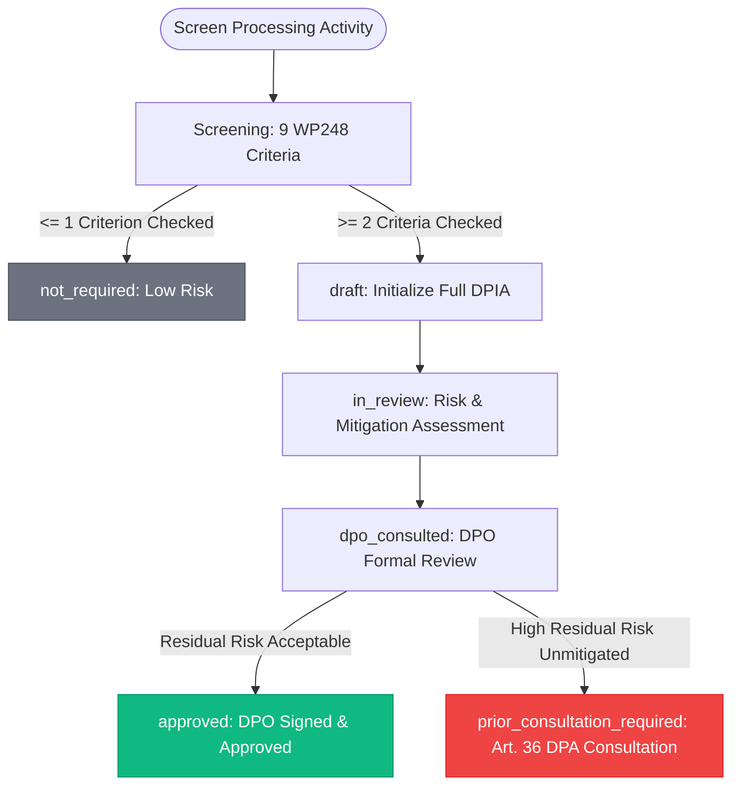
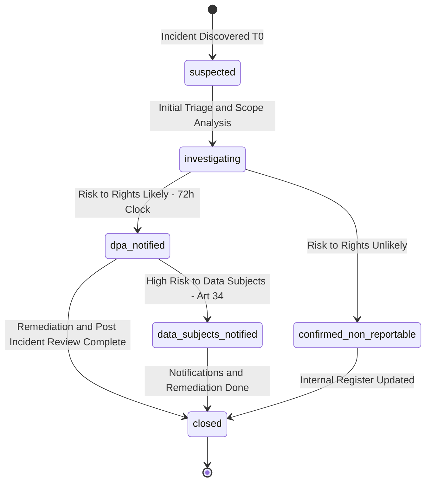
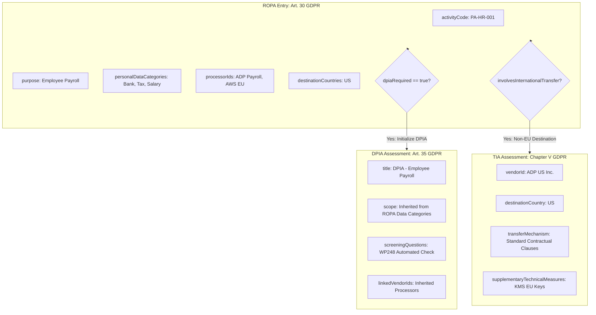

# GDPR Module Specification: euroGovernance

**Regulation**: Regulation (EU) 2016/679 (General Data Protection Regulation)  
**Primary User Roles**: `privacy_manager` (DPO), `compliance_manager`, `approver`, `tenant_admin`  
**Storage Region**: `europe-west3` (Frankfurt)  

---

## 1. Firestore Schema

```
/tenants/{tenantId}
├── /ropa_entries/{ropaId}
├── /dpia_assessments/{dpiaId}
├── /tia_assessments/{tiaId}
├── /breaches/{breachId}
└── /dsr_requests/{dsrId}
```

### 1.1 ROPA Entry (`/tenants/{tenantId}/ropa_entries/{ropaId}`)
```typescript
interface ROPAEntryDocument {
  id: string; // e.g. 'ropa_01HQ9Z...'
  tenantId: string;
  activityCode: string; // e.g. 'PA-HR-001', 'PA-MKT-004'
  activityName: string; // e.g. 'Employee Payroll and Benefits Administration'
  purpose: string; // Specific, explicit, and legitimate purpose (Art. 5(1)(b))
  legalBasis:
    | 'consent'
    | 'contractual_necessity'
    | 'legal_obligation'
    | 'vital_interests'
    | 'public_task'
    | 'legitimate_interests';
  legalBasisRationale: string; // Justification for the selected legal basis
  isSpecialCategoryData: boolean; // Flag for Art. 9 data
  specialCategoryBasis: string | null; // Art. 9(2)(a)-(j) basis if applicable
  
  // Data Subject & Personal Data Categories
  dataSubjectCategories: string[]; // e.g. ['employees', 'contractors', 'job_applicants']
  personalDataCategories: string[]; // e.g. ['bank_details', 'tax_id', 'contact_info']
  
  // Retention & Storage Limits (Art. 5(1)(e))
  retentionPeriodDescription: string; // e.g. '7 years following employment termination'
  retentionPeriodMonths: number; // 84
  
  // Security & Architecture
  dataSecurityMeasuresSummary: string; // Technical and organizational safeguards
  jointControllerInfo: {
    name: string;
    contactEmail: string;
    arrangementSummary: string;
  } | null;
  
  // Processor Linkages (Art. 28)
  processorIds: string[]; // Foreign keys to /tenants/{tenantId}/vendors/{vendorId}
  recipientCategories: string[]; // Internal/External departments
  
  // International Transfers (Chapter V)
  involvesInternationalTransfer: boolean;
  destinationCountries: string[]; // e.g. ['US', 'GB', 'IN']
  transferMechanism:
    | 'adequacy_decision'
    | 'standard_contractual_clauses'
    | 'binding_corporate_rules'
    | 'derogation_art49'
    | null;
  
  // Workflow & Assessment Cross-References
  dpiaRequired: boolean;
  linkedDpiaId: string | null;
  linkedTiaId: string | null;
  linkedSystemAssetIds: string[]; // Foreign keys to /system_assets
  
  status: 'draft' | 'active' | 'under_review' | 'archived';
  ownerId: string; // Privacy Manager UID
  createdAt: string;
  updatedAt: string;
  createdBy: string;
  updatedBy: string;
}
```

### 1.2 DPIA Assessment (`/tenants/{tenantId}/dpia_assessments/{dpiaId}`)
```typescript
interface DPIADocument {
  id: string; // e.g. 'dpia_01HQ9Z...'
  tenantId: string;
  code: string; // e.g. 'DPIA-2026-001'
  title: string;
  description: string;
  ropaEntryId: string; // Direct link to parent ROPA entry
  status:
    | 'screening'
    | 'not_required'
    | 'draft'
    | 'in_review'
    | 'dpo_consulted'
    | 'approved'
    | 'rejected'
    | 'prior_consultation_required';
  
  // WP248 9-Criteria Screening (High Risk Trigger Evaluation)
  screeningQuestionsAnswers: {
    systematicEvaluation: boolean; // Systematic evaluation / profiling
    automatedDecisionMaking: boolean; // Automated decision-making with legal effect
    largeScaleSpecialCategories: boolean; // Processing of sensitive data on large scale
    vulnerableSubjects: boolean; // Processing data of children / employees
    innovativeTechUsage: boolean; // Use of AI, biometrics, or IoT
    preventsExercisingRights: boolean; // Processing preventing exercising rights
  };
  
  necessityAndProportionalityAssessment: string;
  dataMinimizationMeasures: string;
  
  // Risk Analysis
  inherentRiskLevel: 'low' | 'medium' | 'high';
  residualRiskLevel: 'low' | 'medium' | 'high';
  mitigatingControlIds: string[]; // Linked tenant controls mitigating identified risks
  
  // DPO Formal Review
  dpoOpinionNotes: string | null;
  dpoApprovalDate: string | null;
  
  nextReviewDate: string; // Annual review requirement
  ownerId: string;
  createdAt: string;
  updatedAt: string;
  createdBy: string;
  updatedBy: string;
}
```

### 1.3 TIA Assessment (`/tenants/{tenantId}/tia_assessments/{tiaId}`)
```typescript
interface TIADocument {
  id: string; // e.g. 'tia_01HQ9Z...'
  tenantId: string;
  code: string; // e.g. 'TIA-2026-US-01'
  title: string;
  vendorId: string; // Linked Vendor ID (Data Importer)
  destinationCountry: string; // ISO 3166-1 alpha-2 (e.g. 'US')
  legalMechanism:
    | 'adequacy_decision'
    | 'standard_contractual_clauses'
    | 'binding_corporate_rules'
    | 'derogation_art49';
  
  // Third-Country Surveillance & Legal Landscape Assessment
  destinationCountryLegalAssessment: string; // Evaluation of local laws (e.g. FISA 702)
  supplementaryTechnicalMeasures: string; // e.g. 'End-to-end encryption with EU-held keys'
  supplementaryContractualMeasures: string; // e.g. 'Mandatory notification of government access requests'
  supplementaryOrganizationalMeasures: string; // e.g. 'Internal audit procedures'
  
  status: 'draft' | 'in_review' | 'approved' | 'restricted' | 'rejected';
  residualRiskLevel: 'low' | 'medium' | 'high';
  approvedBy: string | null;
  approvedAt: string | null;
  
  ownerId: string;
  createdAt: string;
  updatedAt: string;
  createdBy: string;
  updatedBy: string;
}
```

### 1.4 Personal Data Breach Register (`/tenants/{tenantId}/breaches/{breachId}`)
```typescript
interface PersonalDataBreachDocument {
  id: string; // e.g. 'br_01HQ9Z...'
  tenantId: string;
  incidentReference: string; // e.g. 'BR-2026-003'
  title: string;
  discoveredAt: string; // ISO 8601 UTC (T0 for 72h clock)
  occurredAt: string | null;
  severity: 'low' | 'medium' | 'high' | 'critical';
  status:
    | 'suspected'
    | 'investigating'
    | 'confirmed_non_reportable'
    | 'dpa_notified'
    | 'data_subjects_notified'
    | 'closed';
  description: string;
  affectedDataCategories: string[];
  estimatedDataSubjectsCount: number;
  natureOfBreach: 'confidentiality' | 'integrity' | 'availability';
  rootCauseAnalysis: string;
  
  // Statutory 72-Hour DPA Deadline (Art. 33)
  /* @serverManaged */ dpaNotificationDeadline72h: string; // T0 + 72 hours
  dpaNotifiedAt: string | null;
  dpaReferenceNumber: string | null;
  
  // Data Subject Notification (Art. 34)
  dataSubjectsNotificationRequired: boolean;
  dataSubjectsNotifiedAt: string | null;
  
  containmentActionsTaken: string;
  remedialIssueIds: string[]; // Linked remediation issues
  ownerId: string;
  createdAt: string;
  updatedAt: string;
  createdBy: string;
  updatedBy: string;
}
```

### 1.5 DSR Request Tracker (`/tenants/{tenantId}/dsr_requests/{dsrId}`)
```typescript
interface DSRRequestDocument {
  id: string; // e.g. 'dsr_01HQ9Z...'
  tenantId: string;
  ticketNumber: string; // e.g. 'DSR-2026-042'
  requestType:
    | 'access'
    | 'rectification'
    | 'erasure'
    | 'restriction'
    | 'data_portability'
    | 'object'
    | 'automated_decision_making';
  status: 'received' | 'identity_verified' | 'in_progress' | 'completed' | 'rejected';
  requesterEmailMasked: string; // e.g. 'j***n@domain.com' (Privacy protection)
  requesterVerifiedAt: string | null;
  receivedAt: string; // ISO 8601 UTC
  
  // Statutory 30-Day Deadline (Art. 12(3))
  /* @serverManaged */ statutoryDeadlineDate: string; // ReceivedAt + 30 calendar days
  extensionReason: string | null; // Mandatory if extended by +60 days (complex cases)
  extendedDeadlineDate: string | null;
  
  processingNotes: string;
  fulfilledAt: string | null;
  rejectionReason: string | null;
  affectedRopaIds: string[]; // Linked processing activities queried for personal data
  ownerId: string;
  createdAt: string;
  updatedAt: string;
  createdBy: string;
  updatedBy: string;
}
```

---

## 2. Workflow State Machines

### 2.1 DPIA Workflow (Art. 35 GDPR)



### 2.2 Personal Data Breach 72-Hour Response Machine (Art. 33 & 34 GDPR)



### 2.3 Data Subject Rights (DSR) 30-Day Response Machine (Art. 12(3) GDPR)

```mermaid
flowchart LR
    Recv[received: Ingest Ticket] --> Verify[identity_verified: Verify Requester]
    Verify --> InProg[in_progress: Query Personal Data Systems]
    
    InProg -->|Fulfill Request <= 30d| Comp[completed: Data Exported / Rectified / Erased]
    InProg -->|Legitimate Exemption Art. 12(5)| Rej[rejected: Refusal with Legal Justification]
    InProg -->|Complex Multi-System Request| Ext[extended: +60d Deadline Extension Notice]
    Ext --> Comp
    
    style Comp fill:#10b981,stroke:#059669,color:#ffffff
    style Rej fill:#ef4444,stroke:#dc2626,color:#ffffff
    style Ext fill:#f59e0b,stroke:#d97706,color:#ffffff
```

---

## 3. Prefill Relationships: ROPA ➔ DPIA ➔ TIA



---

## 4. Required Cloud Functions for GDPR

| Function Name | Trigger | Authorized Role | Description |
| :--- | :--- | :--- | :--- |
| `createROPAFromTemplate` | HTTPS Callable | `privacy_manager`, `compliance_manager`, `tenant_admin` | Creates standardized ROPA entries with pre-validated legal bases and retention schedules. |
| `transitionDPIAStatus` | HTTPS Callable | `privacy_manager`, `compliance_manager`, `approver`, `tenant_admin` | Transitions DPIA lifecycle; captures DPO consultation notes and formal sign-off. |
| `transitionTIAStatus` | HTTPS Callable | `privacy_manager`, `compliance_manager`, `approver`, `tenant_admin` | Evaluates third-country surveillance safeguards and signs off on international transfer assessments. |
| `logPersonalDataBreach` | HTTPS Callable | `privacy_manager`, `security_manager`, `compliance_manager`, `tenant_admin` | Records breach; computes `dpaNotificationDeadline72h = discoveredAt + 72h`; alerts privacy team. |
| `logDSRRequest` | HTTPS Callable | `privacy_manager`, `compliance_manager`, `tenant_admin` | Ingests DSR ticket; masks requester email; computes `statutoryDeadlineDate = receivedAt + 30d`. |
| `checkGDPRDeadlinesCron` | Scheduled (Hourly) | Cloud Scheduler | Evaluates active breaches against 72h deadline and open DSRs against 30d deadline; sends escalation alerts. |

---

## 5. Required Composite Indexes

```json
[
  {
    "collectionGroup": "ropa_entries",
    "queryScope": "COLLECTION",
    "fields": [
      { "fieldPath": "status", "order": "ASCENDING" },
      { "fieldPath": "activityCode", "order": "ASCENDING" }
    ]
  },
  {
    "collectionGroup": "dpia_assessments",
    "queryScope": "COLLECTION",
    "fields": [
      { "fieldPath": "status", "order": "ASCENDING" },
      { "fieldPath": "residualRiskLevel", "order": "ASCENDING" }
    ]
  },
  {
    "collectionGroup": "tia_assessments",
    "queryScope": "COLLECTION",
    "fields": [
      { "fieldPath": "status", "order": "ASCENDING" },
      { "fieldPath": "updatedAt", "order": "DESCENDING" }
    ]
  },
  {
    "collectionGroup": "breaches",
    "queryScope": "COLLECTION",
    "fields": [
      { "fieldPath": "status", "order": "ASCENDING" },
      { "fieldPath": "discoveredAt", "order": "ASCENDING" }
    ]
  },
  {
    "collectionGroup": "dsr_requests",
    "queryScope": "COLLECTION",
    "fields": [
      { "fieldPath": "status", "order": "ASCENDING" },
      { "fieldPath": "statutoryDeadlineDate", "order": "ASCENDING" }
    ]
  }
]
```

---

## 6. Reporting Outputs

1. **Article 30 ROPA Official Export (XLSX / PDF)**: Standardized tabular format matching EU Data Protection Authority (CNIL, BfDI, DPC) inspection templates.
2. **DPIA Executive Summary & Technical Report (PDF)**: Complete documentation of data flows, WP248 criteria analysis, risk mitigations, and signed DPO opinion.
3. **TIA International Transfer Package (PDF)**: Complete documentation of transfer mechanisms (SCCs), supplementary technical measures (e.g. encryption key residency), and destination country surveillance law analysis.
4. **Breach Register & DPA Notification Dossier (PDF)**: Verifiable incident summary, timeline from T0, containment measures, and DPA reference log.

---

## 7. Security and Privacy Risks & Mitigations

| Privacy / Security Risk | Severity | Architectural Mitigation |
| :--- | :---: | :--- |
| **Exposure of Breach Incident Details** | Critical | Breaches are restricted in `firestore.rules` exclusively to `tenant_admin`, `privacy_manager`, `security_manager`, and `auditor`. Read access is denied for `viewer` and `contributor` roles. |
| **Exposure of Data Subject Contact Information in DSRs** | High | Requester email addresses are stored masked (`j***n@domain.com`) in Firestore list views, with full identity records stored in encrypted access vaults. |
| **Missed 72-Hour DPA Reporting Window** | High | Server-calculated deadline timestamp (`dpaNotificationDeadline72h`) with hourly Cloud Scheduler monitoring and real-time visual UI countdown timers. |

---

## 8. Acceptance Criteria

- [x] All 5 core GDPR entities (`ROPAEntry`, `DPIA`, `TIA`, `PersonalDataBreach`, `DSRRequest`) extend `BaseEntity`.
- [x] ROPA entries can be referenced directly by DPIA and TIA assessments without duplicating data entry.
- [x] Personal data breach records enforce calculated 72-hour notification deadlines and are restricted to authorized privacy and security managers.
- [x] DSR tracking enforces statutory 30-day deadlines with justification capture for complex extensions.
- [x] Composite indexes enable sub-second queries across ROPA codes, DPIA risk levels, and urgent breach deadlines.
