# euroGovernance — Obsidian Knowledge Vault Index

Welcome to the **euroGovernance** Technical Documentation and Knowledge Graph. This index organizes all architectural, security, domain, and operational specifications for graph traversal and visual analysis in Obsidian.

---

## 🗺️ Visual Map of Content (MOC)

```mermaid
graph TD
    INDEX["[[INDEX|Knowledge Hub]]"]

    %% Core Architecture Cluster
    subgraph Architecture ["🏗️ Core Architecture & Data Engine"]
        ARCH["[[ARCHITECTURE|System Architecture]]"]
        DM["[[data-model|Data Model]]"]
        FS["[[FIRESTORE_SCHEMA_AND_QUERIES|Firestore Schema & Queries]]"]
        IDX["[[INDEXES_AND_PERFORMANCE_REVIEW|Indexes & Performance]]"]
        MIG["[[MIGRATION_SAFETY_REVIEW|Migration Safety]]"]
        ROADMAP["[[MVP_DELIVERY_ROADMAP|Delivery Roadmap]]"]
        PROMPT["[[MASTER_PROMPT_CONTEXT|Master System Context]]"]
    end

    %% Security & Tenancy Cluster
    subgraph Security ["🔒 Identity, Tenancy & Security"]
        TENANT["[[TENANT_MODEL_AND_IDENTITY_FLOWS|Tenant & Identity Flows]]"]
        ROLES["[[ROLES_AND_PERMISSIONS|Roles & RBAC Matrix]]"]
        SEC_MODEL["[[security-model|Security Model]]"]
        SEC_RULES["[[SECURITY_RULES_AND_CLOUD_FUNCTIONS_ARCHITECTURE|Security Rules & Privileges]]"]
        AUDIT["[[AUDIT_LOG_DESIGN|Immutable Audit Logging]]"]
    end

    %% Backend & Platform Infrastructure
    subgraph Platform ["⚙️ Backend & Platform Operations"]
        CF_PLAN["[[CLOUD_FUNCTIONS_PLAN|Cloud Functions Plan]]"]
        BE_WORKFLOW["[[backend-workflows|Backend Workflows]]"]
        NOTIF["[[NOTIFICATIONS_AND_SCHEDULED_JOBS_DESIGN|Notifications & Schedulers]]"]
        DASH["[[DASHBOARD_AND_REPORTING_ARCHITECTURE|Dashboard & Exports]]"]
        RUN["[[runbooks|Operational Runbooks]]"]
        TEST["[[testing|Testing Strategy]]"]
        EMU["[[EMULATOR_AND_TEST_PLAN|Emulator & Test Plan]]"]
    end

    %% Governance & Compliance Engines
    subgraph GovernanceEngine ["📐 Governance Engines & Harmonization"]
        FCE["[[FRAMEWORK_AND_CONTROLS_ENGINE|Framework & Controls Engine]]"]
        FAS["[[FRAMEWORK_ADOPTION_SCOPING_AND_HARMONIZATION|Scoping & Harmonization]]"]
        FSA["[[framework-scoping-harmonization-audit-2026-08-14|Harmonization Audit]]"]
        DOM["[[domain-modules|Domain Modules]]"]
    end

    %% Regulatory Subsystems
    subgraph Regulations ["⚖️ Statutory Regulatory Subsystems"]
        GDPR["[[GDPR_MODULE_DESIGN|GDPR Subsystem]]"]
        AIACT["[[EU_AI_ACT_MODULE_DESIGN|EU AI Act Module]]"]
        DATAACT["[[EU_DATA_ACT_MODULE_DESIGN|EU Data Act Module]]"]
        ISO["[[ISO_MANAGEMENT_SYSTEM_DESIGN|ISO Management Layer]]"]
    end

    %% Third-Party Processors, Transfers & Evidence
    subgraph Processors ["🛡️ Processors, Assurance & Evidence"]
        PROC_TRANS["[[PROCESSOR_AND_TRANSFER_MANAGEMENT|Processors & Cross-Border Transfers]]"]
        PROC_ASSESS["[[THIRD_PARTY_ASSESSMENT_AND_QUESTIONNAIRE_MODULE|Third-Party Assessments]]"]
        PROC_CERT["[[PROCESSOR_CERTIFICATIONS_AND_ASSURANCE|Processor Certifications & Assurance]]"]
        EVID["[[EVIDENCE_MODULE_DESIGN|Evidence Repository Locker]]"]
    end

    INDEX --> Architecture
    INDEX --> Security
    INDEX --> Platform
    INDEX --> GovernanceEngine
    INDEX --> Regulations
    INDEX --> Processors

    ARCH --- TENANT
    ARCH --- CF_PLAN
    ARCH --- FS
    FCE --- FAS
    FAS --- GDPR
    FAS --- AIACT
    FAS --- DATAACT
    FAS --- ISO
    GDPR --- PROC_TRANS
    PROC_TRANS --- PROC_ASSESS
    PROC_ASSESS --- PROC_CERT
    PROC_CERT --- EVID
    CF_PLAN --- DASH
    CF_PLAN --- NOTIF
    AUDIT --- SEC_RULES
```

---

## 📚 Vault Directory by Domain Cluster

### 1. Core Architecture & Storage Layer
- [[ARCHITECTURE|System Architecture & Component Specification]] — High-level system design, sovereignty in `europe-west3`, and execution boundaries.
- [[data-model|Entity Relationship & Data Model Reference]] — Canonical schemas and TypeScript data models.
- [[FIRESTORE_SCHEMA_AND_QUERIES|Firestore Schema, Data Dictionary & Queries]] — Document paths, collection structures, and query patterns.
- [[INDEXES_AND_PERFORMANCE_REVIEW|Firestore Composite Indexes & Performance]] — Query optimization and compound index configurations.
- [[MIGRATION_SAFETY_REVIEW|Database Migration & Schema Evolution Safety]] — Safe rollout practices and schema versioning.
- [[MVP_DELIVERY_ROADMAP|Product Delivery Roadmap & Implementation Phases]] — Milestones and capability delivery schedule.
- [[MASTER_PROMPT_CONTEXT|Master System Context & Engineering Baseline]] — Core design principles and tech stack invariants.
- [[ai Guide 2026-08-15|AI Agent Platform & Engineering Guide (2026-08-15)]] — Architectural briefing, capabilities, level of polish, and agent operating instructions.
- [[RUNNING_COSTS_AND_FINANCIAL_OPTIMIZATION_GUIDE|Running Costs & Financial Optimization Guide]] — Complete GCP/Firebase cost breakdown per tenant, unit cost drivers, and optimization playbook.
- [[UI and UX improvement plan 2026-08-15|UI & UX Improvement Plan (2026-08-15)]] — UI redesign plan, navigation consolidation (17 tabs to 5 hubs), and persona-based onboarding flows.

### 2. Multi-Tenancy, Security & Access Control
- [[TENANT_MODEL_AND_IDENTITY_FLOWS|Tenant Model & Identity Provisioning Flows]] — Multi-tenant partitioning, membership lifecycle, and domain isolation.
- [[ROLES_AND_PERMISSIONS|Role-Based Access Control (RBAC) Specification]] — 8 standard user roles and granular capability matrix.
- [[security-model|Security Architecture & Threat Model]] — Principle of least privilege and cryptographic controls.
- [[SECURITY_RULES_AND_CLOUD_FUNCTIONS_ARCHITECTURE|Firestore Security Rules & Privileged Functions]] — Dual-layer enforcement (Rules + Cloud Functions).
- [[AUDIT_LOG_DESIGN|Immutable Append-Only Audit Logging Subsystem]] — Tamper-evident logging and compliance attribution.

### 3. Backend, Platform Operations & Testing
- [[CLOUD_FUNCTIONS_PLAN|Cloud Functions Architecture & API Catalog]] — Node 20 / v2 Cloud Function handlers and RBAC middleware.
- [[backend-workflows|Core Backend State Machines & Event Workflows]] — Lifecycle transitions, validation gates, and triggers.
- [[NOTIFICATIONS_AND_SCHEDULED_JOBS_DESIGN|In-App Notifications & Scheduled Cron Dispatchers]] — Alerting, renewal reminders, and cron jobs.
- [[DASHBOARD_AND_REPORTING_ARCHITECTURE|Executive Dashboard & Compliance Reporting Pipeline]] — KPI aggregation, export queues, and ZIP/PDF generation.
- [[runbooks|Operational Runbooks & Incident Response]] — Deployment, maintenance, monitoring, and recovery procedures.
- [[testing|Comprehensive Testing Strategy]] — Unit, integration, security rules, and end-to-end testing approaches.
- [[EMULATOR_AND_TEST_PLAN|Firebase Local Emulator & Rules Verification Plan]] — Local emulator test suites and isolated execution.

### 4. Governance Engines, Scoping & Control Harmonization
- [[FRAMEWORK_AND_CONTROLS_ENGINE|Master Framework & Unified Controls Engine]] — Global governance library and control mapping.
- [[FRAMEWORK_ADOPTION_SCOPING_AND_HARMONIZATION|Framework Adoption, Dynamic Scoping & Harmonization]] — Overlap detection, scoping questionnaires, and applicability engines.
- [[framework-scoping-harmonization-audit-2026-08-14|Framework Scoping & Harmonization Audit]] — Implementation audit and alignment report.
- [[domain-modules|GRC Domain Modules & Functional Boundaries]] — Module definitions and operational scope.

### 5. Statutory & Regulatory Subsystems
- [[GDPR_MODULE_DESIGN|GDPR Compliance Subsystem (Articles 6, 28, 30, 32, 35, 44-49)]] — ROPA, DPIA, DSAR, Breach management.
- [[EU_AI_ACT_MODULE_DESIGN|EU AI Act Compliance Subsystem (Regulation EU 2024/1689)]] — AI system risk classification, CE marking, and conformity.
- [[EU_DATA_ACT_MODULE_DESIGN|EU Data Act Subsystem (Regulation EU 2023/2854)]] — Data sharing agreements, switching barriers, and essential requirements.
- [[ISO_MANAGEMENT_SYSTEM_DESIGN|ISO Management Systems (ISO 27001, ISO 27701, ISO 42001)]] — Statement of Applicability (SoA), internal audits, and CAPA.

### 6. Processors, Cross-Border Transfers, Evidence & Assurance
- [[PROCESSOR_AND_TRANSFER_MANAGEMENT|Data Processor & Cross-Border Transfer Governance (GDPR Art. 28 & Chapter V)]] — Vendor vs Processor distinction, DPAs, SCCs, and TIAs.
- [[THIRD_PARTY_ASSESSMENT_AND_QUESTIONNAIRE_MODULE|Third-Party Questionnaire Assessment & Vendor Due Diligence]] — Dynamic templates, secure magic links, internal reviews, risk scoring, recurring schedules, and control evidence.
- [[PROCESSOR_CERTIFICATIONS_AND_ASSURANCE|Processor Certifications & Third-Party Assurance]] — SOC reports, ISO certs, evidence linkage, reminders, and export matrix.
- [[EVIDENCE_MODULE_DESIGN|Evidence Repository Locker & Integrity Verification]] — Multi-tenant evidence collection, hashing, and versioning.
