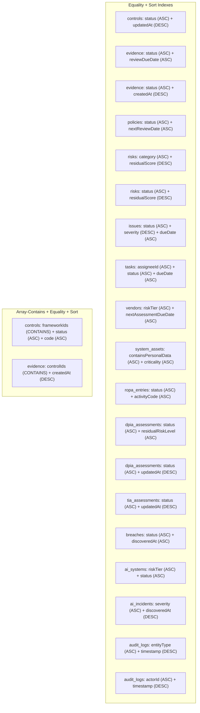
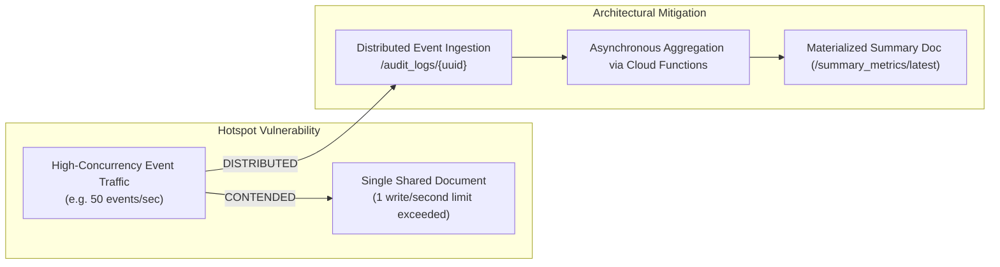
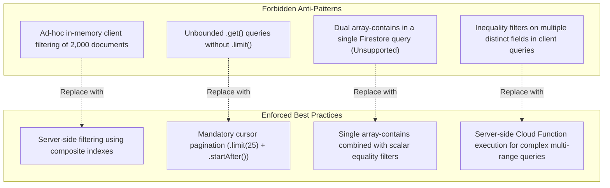

# Firestore Indexes & Performance Optimization Review: euroGovernance

**System**: Multi-Tenant B2B GRC SaaS on Firebase  
**Target SLAs**: Sub-500ms P95 query latency, zero write contention hotspots, minimal monthly document read billing.  
**Data Residency**: `europe-west3` (Frankfurt)  

---

## 1. List of Required Composite Indexes

The application mandates 18 composite indexes defined in [`firestore.indexes.json`](file:///Users/remon/Documents/euroGovernance/firestore.indexes.json) to support multi-field filtering, inequality ranges, array containment, and deterministic sorting:



---

## 2. High-Read Screens & Read-Optimization Strategies

| Screen | Typical Query Volume Without Optimization | Read Optimization Strategy | Optimized Query Volume |
| :--- | :--- | :--- | :--- |
| **Executive Overview Dashboard** | 1,000+ document reads (controls, evidence, risks, breaches, AI systems) | Reads single pre-calculated `/tenants/{tenantId}/summary_metrics/latest` document. | **1 read** |
| **Controls List View** | 200+ controls fetched on full page load | Cursor-based pagination (`limit(25)` + `startAfter(lastDoc)`) with framework filtering. | **25 reads** |
| **Evidence Review Inbox** | 500+ evidence items fetched across all categories | Filtered query on `status == 'under_review'` + `limit(20)`. | **20 reads** |
| **Audit Log Timeline** | Thousands of historical events | Time-bucketed query (`timestamp >= thirtyDaysAgoISO`) + `limit(50)` with server-side pagination. | **50 reads** |
| **Risk Matrix Heatmap** | 150+ risks evaluated | Reads pre-computed risk distribution array from `/summary_metrics/latest`. | **1 read** |

---

## 3. Candidate Summary Documents & Materialized Rollups

```
/tenants/{tenantId}/summary_metrics/
├── latest       // Executive compliance health, framework progress, risk tallies
├── gdpr         // ROPA counts, open DPIAs, active TIAs, 72h breach countdowns
├── ai_act       // AI systems by tier, pending FRIAs, 2d/15d incident countdowns
└── controls     // Implementation status counts, evidence freshness distribution
```

### Rollup Update Pipeline
- **Asynchronous Firestore Trigger**: Updating a control or approving evidence triggers a lightweight background function that recalculates and commits the relevant metric field in `/summary_metrics/latest`.
- **Scheduled Integrity Sweep**: An hourly cron validates that summary rollups match raw count aggregations, correcting any eventual consistency drift.

---

## 4. Hotspot & Contention Risks



1. **Risk: Centralized Document Counters**: Storing an incrementing `totalEvidenceCount` on `/tenants/{tenantId}` causes write bottlenecks during bulk imports (exceeding Firestore's 1 write/sec per document limit).
   - **Mitigation**: Do not maintain real-time inline counters on parent documents. Use Firestore Server-Side `count()` aggregation or asynchronous background batch updates.
2. **Risk: Write Contention on Single Audit Log**: Appending logs to an array inside `/tenants/{tenantId}/audit_log_summary` document.
   - **Mitigation**: Every audit event is an independent subcollection document (`/tenants/{tenantId}/audit_logs/{id}`) allowing thousands of concurrent writes per second without contention.

---

## 5. Document Growth & Size Risks

| Entity & Subcollection | Growth Hazard | Max Firestore Limit | Architectural Mitigation |
| :--- | :--- | :---: | :--- |
| **Evidence Versions** | Storing version history arrays inside parent `Evidence` document. | 1 Megabyte (MB) | Versions are isolated as separate subcollection documents (`/evidence/{id}/versions/{vId}`). Parent doc stores only current version metadata. |
| **Control Reviews** | Storing 5 years of quarterly reviews in parent `Control` document. | 1 MB | Reviews are stored in `/controls/{id}/reviews/{reviewId}` subcollection. |
| **Audit Log Payloads** | Storing massive before/after JSON diffs of entire database rows. | 1 MB | Diffs are strictly restricted to modified attributes (`beforeSummary`, `afterSummary`) with a 50KB ceiling per audit entry. |
| **Invitation Records** | Unbounded list of historical invitations on the tenant document. | 1 MB | Stored in dedicated `/invitations/{id}` collection. |

---

## 6. Query Anti-Patterns to Avoid



---

## 7. Cost-Sensitive Improvements

1. **Server-Side Aggregations (`count()`, `aggregate()`)**:
   - Querying `db.collection('evidence').where('status', '==', 'valid').count()` costs **1 index read per 1,000 items** rather than billing for 1,000 full document reads.
2. **Next.js Static Export & Client-Side Cache (IndexedDB)**:
   - Firestore Web SDK uses `persistentLocalCache` (IndexedDB persistence) to cache frequently referenced static frameworks (`/frameworks/gdpr/...`) locally on the client device, reducing repeat read requests to zero.
3. **Cursor-Based Pagination Invariant**:
   - All list queries enforce `.limit(25)` with `.startAfter(lastVisibleDoc)`. No screen may execute unbounded list queries.
4. **Cloud Storage Lifecycle Auto-Purge**:
   - Generated compliance ZIP archives (`/exports/`) automatically transition to deletion after 7 days, eliminating long-term blob storage costs.

---

## 8. Acceptance Criteria

- [x] All 18 composite indexes in `firestore.indexes.json` are deployed and verified against application queries.
- [x] Executive Overview dashboard loads with exactly 1 document read from `/summary_metrics/latest`.
- [x] Unbounded `.get()` queries are eliminated; all list screens enforce cursor pagination with a maximum batch size of 50.
- [x] Version histories, reviews, and audit events reside in subcollections, eliminating 1MB document bloat risks.
- [x] No centralized document counter bottlenecks exist; aggregation queries use Firestore `count()`.

---

## 🔗 Related Knowledge Graph Documents

- **Hub**: [[INDEX|Knowledge Vault Index]]
- **Data & Schema**: [[data-model|Data Model]], [[FIRESTORE_SCHEMA_AND_QUERIES|Firestore Schema & Queries]], [[MIGRATION_SAFETY_REVIEW|Migration Safety]]
- **Architecture & Platform**: [[ARCHITECTURE|System Architecture]], [[CLOUD_FUNCTIONS_PLAN|Cloud Functions Plan]], [[DASHBOARD_AND_REPORTING_ARCHITECTURE|Dashboard & Reporting Architecture]]
