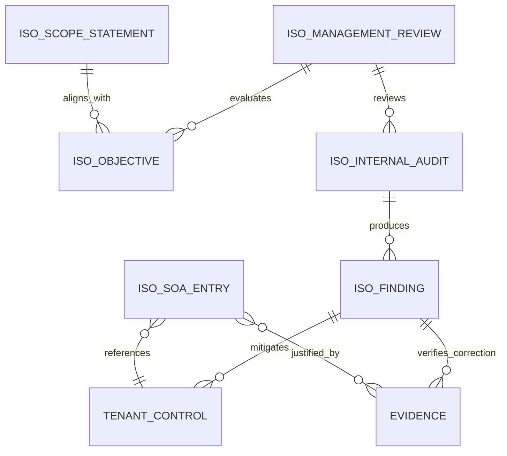
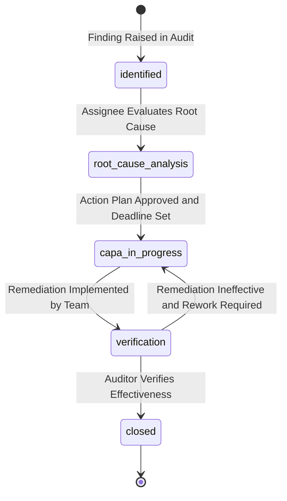
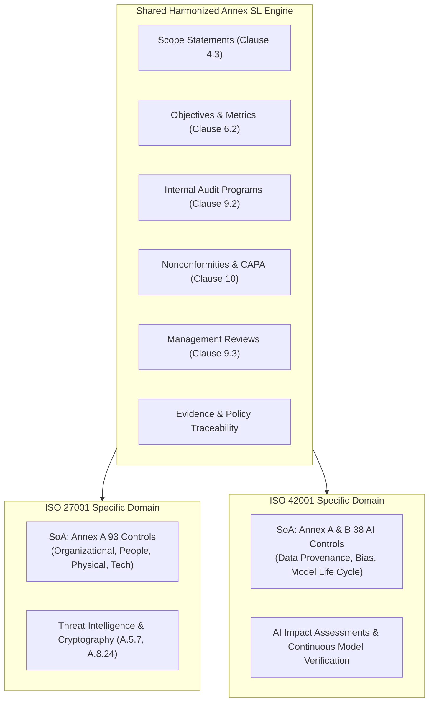

# ISO 27001 & ISO 42001 Shared Management-System Layer Specification: euroGovernance

**Standards**: ISO/IEC 27001:2022 (ISMS) & ISO/IEC 42001:2023 (AIMS)  
**Architecture**: Unified Harmonized Structure (Annex SL / High-Level Structure Alignment)  
**Primary Roles**: `security_manager`, `ai_governance_manager`, `compliance_manager`, `auditor`, `approver`, `tenant_admin`  
**Data Residency**: `europe-west3` (Frankfurt)  

---

## 1. Scope & Unified Architecture

Both ISO 27001:2022 and ISO 42001:2023 share the exact same 10-clause **Harmonized Structure (Annex SL)**:
- **Clause 4**: Context of the Organization (Scope & Boundaries)
- **Clause 5**: Leadership & Policy
- **Clause 6**: Planning (Risk Assessment & Measurable Objectives)
- **Clause 7**: Support (Competence & Documented Information)
- **Clause 8**: Operation (Control Implementation)
- **Clause 9**: Performance Evaluation (Internal Audit & Management Review)
- **Clause 10**: Improvement (Nonconformity & Corrective Action)

Instead of duplicating database tables and business logic, euroGovernance provides a **single, shared Management System Engine** parameterized by `standard: 'iso_27001' | 'iso_42001' | 'integrated_isms_aims'`.

---

## 2. Shared Data Model

```
/tenants/{tenantId}
├── /iso_scope_statements/{scopeId}
├── /iso_objectives/{objectiveId}
├── /iso_soa_entries/{soaEntryId}
├── /iso_internal_audits/{auditId}
│   └── /findings/{findingId}
└── /iso_management_reviews/{reviewId}
```



### 2.1 Scope Statement (`/tenants/{tenantId}/iso_scope_statements/{scopeId}`)
```typescript
interface ISOScopeStatementDocument {
  id: string; // e.g. 'scope_01HQ9V...'
  tenantId: string;
  standard: 'iso_27001' | 'iso_42001' | 'integrated_isms_aims';
  title: string; // e.g. 'Global Cloud SaaS Information Security & AI Management System Scope'
  version: string; // e.g. 'v2.1'
  status: 'draft' | 'under_review' | 'approved' | 'superseded';
  
  // Clause 4.3 Core Boundaries
  organizationalUnits: string[]; // e.g. ['Engineering', 'Cloud Ops', 'Data Science', 'Security']
  physicalLocations: string[]; // e.g. ['Frankfurt DC1', 'Berlin HQ', 'Remote Work Force']
  technologicalBoundaries: string[]; // e.g. ['GCP europe-west3', 'Production Kubernetes Clusters']
  exclusionsJustification: string | null; // Justification for any excluded clauses/controls
  
  approvedBy: string | null; // UID of Executive / Tenant Admin
  approvedAt: string | null;
  ownerId: string;
  createdAt: string;
  updatedAt: string;
  createdBy: string;
  updatedBy: string;
}
```

### 2.2 Measurable Objectives Register (`/tenants/{tenantId}/iso_objectives/{objectiveId}`)
```typescript
interface ISOObjectiveDocument {
  id: string; // e.g. 'obj_01HQ9V...'
  tenantId: string;
  standard: 'iso_27001' | 'iso_42001' | 'integrated_isms_aims';
  code: string; // e.g. 'OBJ-SEC-2026-01', 'OBJ-AI-2026-02'
  title: string; // e.g. 'Achieve 99.99% patch compliance on internet-facing AI gateways'
  description: string;
  
  // Clause 6.2 Measurability
  targetMetricDescription: string;
  baselineValue: number;
  targetValue: number;
  currentValue: number;
  unit: string; // '%', 'days', 'hours', 'incidents'
  targetDate: string; // ISO 8601 UTC
  
  status: 'on_track' | 'at_risk' | 'behind' | 'achieved' | 'cancelled';
  linkedControlIds: string[]; // Controls implemented to achieve this objective
  linkedRiskIds: string[]; // Risks mitigated by this objective
  
  ownerId: string;
  createdAt: string;
  updatedAt: string;
  createdBy: string;
  updatedBy: string;
}
```

### 2.3 Statement of Applicability (SoA) Entry (`/tenants/{tenantId}/iso_soa_entries/{soaEntryId}`)
```typescript
interface StatementOfApplicabilityEntryDocument {
  id: string; // e.g. 'soa_27001_a_8_24', 'soa_42001_b_7_2'
  tenantId: string;
  standard: 'iso_27001' | 'iso_42001';
  controlCode: string; // e.g. 'A.8.24' (ISO 27001) or 'B.7.2' (ISO 42001)
  controlTitle: string;
  domain: string; // e.g. 'Technological Controls', 'AI System Life Cycle'
  
  // Clause 6.1.3 SoA Determination
  isApplicable: boolean;
  justificationRationale: string; // Why it is applicable or excluded
  applicabilityBasis:
    | 'legal_regulatory_requirement'
    | 'contractual_obligation'
    | 'risk_assessment_treatment'
    | 'business_best_practice';
  
  // Implementation Status
  implementationStatus:
    | 'implemented'
    | 'partially_implemented'
    | 'planned'
    | 'not_applicable';
  tenantControlId: string | null; // Direct link to /tenants/{tenantId}/controls/{id}
  linkedEvidenceIds: string[]; // Proof of control operation from /evidence
  
  lastReviewedDate: string;
  reviewedBy: string;
}
```

### 2.4 Internal Audit Program & Plan (`/tenants/{tenantId}/iso_internal_audits/{auditId}`)
```typescript
interface ISOInternalAuditDocument {
  id: string; // e.g. 'aud_01HQ9V...'
  tenantId: string;
  standard: 'iso_27001' | 'iso_42001' | 'integrated_isms_aims';
  auditReference: string; // e.g. 'INT-AUD-2026-Q3'
  title: string; // e.g. 'Annual ISMS & AIMS Integrated Operations Audit'
  
  // Clause 9.2 Audit Planning
  scopeDescription: string;
  auditCriteria: string[]; // Clauses / Annex Controls evaluated
  leadAuditorId: string; // UID of Lead Internal Auditor
  auditTeamIds: string[];
  plannedStartDate: string;
  plannedEndDate: string;
  actualCompletedDate: string | null;
  
  status: 'planned' | 'in_progress' | 'report_drafting' | 'completed' | 'cancelled';
  auditSummaryReport: string | null;
  totalFindingsCount: number;
  openNonconformitiesCount: number;
  
  ownerId: string;
  createdAt: string;
  updatedAt: string;
  createdBy: string;
  updatedBy: string;
}
```

### 2.5 Audit Finding & Corrective Action (`/tenants/{tenantId}/iso_internal_audits/{auditId}/findings/{findingId}`)
```typescript
interface ISOFindingDocument {
  id: string; // e.g. 'fnd_01HQ9V...'
  tenantId: string;
  auditId: string;
  findingReference: string; // e.g. 'NC-2026-001'
  title: string;
  
  // Clause 10.1 Classification
  severity:
    | 'major_nonconformity'
    | 'minor_nonconformity'
    | 'opportunity_for_improvement'
    | 'observation';
  standardClauseViolated: string; // e.g. 'ISO 27001 Clause 8.2' or 'ISO 42001 B.6.2'
  conditionObserved: string; // What was found during audit
  auditEvidenceNotes: string; // Evidence references
  
  // Clause 10.2 Corrective Action Plan
  rootCauseAnalysis: string | null; // 5-Whys or Fishbone Analysis
  correctiveActionPlan: string | null;
  correctiveActionDeadline: string | null;
  assignedAssigneeId: string | null;
  
  // Verification of Effectiveness
  status: 'identified' | 'root_cause_analysis' | 'capa_in_progress' | 'verification' | 'closed';
  verificationNotes: string | null;
  verifiedBy: string | null;
  verifiedAt: string | null;
  
  linkedIssueId: string | null; // Linked task in /issues
  createdAt: string;
  updatedAt: string;
}
```

### 2.6 Management Review Record (`/tenants/{tenantId}/iso_management_reviews/{reviewId}`)
```typescript
interface ISOManagementReviewDocument {
  id: string; // e.g. 'mr_01HQ9V...'
  tenantId: string;
  standard: 'iso_27001' | 'iso_42001' | 'integrated_isms_aims';
  meetingReference: string; // e.g. 'MR-2026-ANNUAL'
  meetingDate: string;
  chairpersonId: string; // Executive Sponsor UID
  attendeeIds: string[];
  
  // Clause 9.3 Mandatory Inputs Evaluated
  agendaInputsEvaluated: {
    statusOfPreviousActions: boolean;
    changesInInternalExternalIssues: boolean;
    feedbackOnSecurityAndAiPerformance: boolean;
    nonconformitiesAndCorrectiveActions: boolean;
    auditResults: boolean;
    objectiveAchievement: boolean;
    opportunitiesForContinuousImprovement: boolean;
  };
  
  // Clause 9.3 Mandatory Outputs & Decisions
  managementConclusions: string;
  resourceAllocationDecisions: string;
  strategicImprovementDecisions: string;
  
  status: 'draft' | 'under_review' | 'approved';
  approvedBy: string | null;
  approvedAt: string | null;
  
  ownerId: string;
  createdAt: string;
  updatedAt: string;
  createdBy: string;
  updatedBy: string;
}
```

---

## 3. Workflow Design

### 3.1 Nonconformity & Corrective Action (CAPA) Lifecycle (Clause 10)



### 3.2 Management Review Lifecycle (Clause 9.3)


---

## 4. What is Reused vs Framework-Specific



| Feature | Reused Architecture | ISO 27001 Specifics | ISO 42001 Specifics |
| :--- | :--- | :--- | :--- |
| **Scope & Boundaries** | Reusable `ISOScopeStatement` | Focus on Information Assets & Networks | Focus on AI Models, Data Pipelines, & Model Deployments |
| **Statement of Applicability** | Reusable `StatementOfApplicabilityEntry` | Evaluates 93 controls across 4 Annex A themes | Evaluates 38 controls across AI lifecycle, data governance, and bias |
| **Internal Audits** | Reusable `ISOInternalAudit` & Finding model | Audits Infosec controls | Audits AI model provenance and algorithmic fairness |
| **CAPA & Nonconformity** | 100% Shared `ISOFinding` model | Addresses security breaches & misconfigurations | Addresses model drift, bias spikes, & unapproved fine-tuning |
| **Management Review** | 100% Shared `ISOManagementReview` | Evaluates Infosec KPIs | Evaluates AI safety, societal impact, and regulatory readiness |

---

## 5. Reporting Requirements

1. **Statement of Applicability (SoA) Official Dossier (PDF / Excel)**: Complete matrix of all 93 controls (ISO 27001) or 38 controls (ISO 42001) showing applicability status, legal/contractual/risk rationale, implementation state, and verified evidence links.
2. **Internal Audit Summary & Finding Report (PDF)**: Executive audit report showing audited scopes, lead auditor credentials, open major/minor nonconformities, root-cause summaries, and CAPA target dates.
3. **Management Review Minutes & Action Matrix (PDF)**: Complete documentation of all 7 mandatory Clause 9.3 input evaluations, executive conclusions, and signed resource allocation commitments.

---

## 6. Acceptance Criteria

- [x] Unified management system layer models Scope, Objectives, SoA, Internal Audits, Findings, and Management Reviews.
- [x] Supports single standards (`iso_27001`, `iso_42001`) and integrated dual certification (`integrated_isms_aims`).
- [x] Statement of Applicability tracks applicability justification, implementation status, and links directly to verified evidence.
- [x] Finding and Corrective Action (CAPA) workflow enforces root cause analysis, target dates, and effectiveness verification.
- [x] Management review records evaluate all 7 mandatory Annex SL agenda inputs before executive approval.
