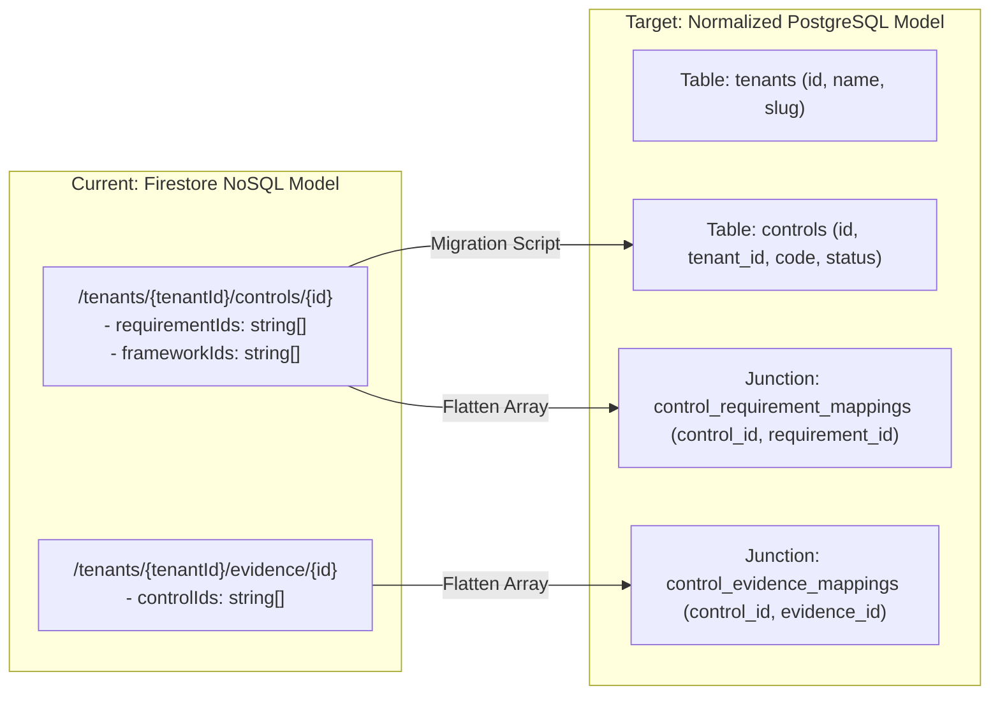

# Migration Safety Review: Firestore to PostgreSQL

**System**: euroGovernance Multi-Tenant B2B GRC SaaS  
**Migration Goal**: Zero-data-loss, deterministic transition path from Firestore NoSQL document collections to Relational PostgreSQL (e.g. Cloud SQL / Supabase / Neon with Row-Level Security).  

---

## 1. Migration Risk Summary & High-Level Architecture

Firestore documents excel at hierarchical tenant nesting and denormalized snapshots for UI speed, but direct 1:1 translations to relational SQL often suffer from:
1. **Unbounded Embedded Arrays**: Many-to-many relationship arrays (e.g. `controlIds: string[]`, `frameworkIds: string[]`) that require conversion into relational junction tables.
2. **Denormalized Snapshots**: Snapshots like `tenantName` inside `/invitations` or `actorEmail` inside `/audit_logs` that require clear distinction between historical immutable logs (valid snapshot) and mutable relationships (must normalize).
3. **Implicit vs Explicit State Enums**: Multi-field state flags (e.g. `isApproved: boolean`, `isExpired: boolean`) that must be strictly normalized into deterministic `status` enums.



---

## 2. Field-Level & Collection-Level Migration Risks

| Entity & Field | Firestore Representation | Relational Migration Risk | Target PostgreSQL Construct |
| :--- | :--- | :--- | :--- |
| **`Control.requirementIds`** | String array `string[]` | Relational databases cannot enforce Foreign Key constraints on JSON arrays. | Junction Table `control_requirement_mappings (control_id, requirement_id)` with composite primary key and cascading FKs. |
| **`Evidence.controlIds`** | String array `string[]` | Difficult to perform relational `INNER JOIN` queries for audit exports without junction tables. | Junction Table `control_evidence_mappings (control_id, evidence_id)`. |
| **`AISystem.classificationPayload`** | Embedded Object map | Deeply nested schema risks schema evolution mismatch across versions. | Stored as `JSONB` with generated virtual columns or separate `ai_classification_assessments` table. |
| **`DPIA.screeningQuestionsAnswers`** | Embedded Map of booleans | Difficult to run SQL analytics on individual screening criteria across tenants. | Dedicated `dpia_screening_responses` table or structured typed `JSONB` column. |
| **`TenantMembership`** | Subcollection `/memberships/{uid}` | Firestore uses the Auth UID as doc ID. | Relational table `tenant_memberships` with `(tenant_id, user_id)` unique composite constraint. |

---

## 3. Recommended Firebase-Friendly Refactors Now (V1 Implementation)

To make future migration frictionless without sacrificing Firestore performance today:

### Rule 1: Keep Arrays Lean & Monolithic (<100 items)
Never store unbounded arrays in parent documents. All relational arrays (`controlIds`, `requirementIds`, `frameworkIds`) are restricted to short lists of foreign IDs ($<50$ items). Historical logs and version histories are **already partitioned into subcollections** (`/versions`, `/reviews`, `/audit_logs`).

### Rule 2: Standardize Primary Key & Foreign Key Naming Conventions
- Every entity strictly includes a global unique string `id` (ULID or UUIDv4 format).
- Every tenant-scoped entity strictly includes `tenantId: string`.
- All relational references follow `singularEntityId` (e.g. `ropaEntryId`, `aiSystemId`, `vendorId`) rather than ambiguous names.

### Rule 3: Explicit State Machine Enums (No Implicit State)
Every entity has a single authoritative `status` string field backed by TypeScript union enums (e.g. `PolicyStatus`, `DPIAStatus`, `AIRiskTier`), avoiding conflicting boolean flags.

---

## 4. Standardized SQL Target Schema Mapping

```sql
-- Core Tenancy Tables
CREATE TABLE tenants (
    id VARCHAR(64) PRIMARY KEY,
    slug VARCHAR(64) UNIQUE NOT NULL,
    name VARCHAR(255) NOT NULL,
    tier VARCHAR(32) NOT NULL DEFAULT 'starter',
    status VARCHAR(32) NOT NULL DEFAULT 'active',
    created_at TIMESTAMPTZ NOT NULL DEFAULT NOW(),
    updated_at TIMESTAMPTZ NOT NULL DEFAULT NOW()
);

CREATE TABLE tenant_memberships (
    id VARCHAR(64) PRIMARY KEY,
    tenant_id VARCHAR(64) NOT NULL REFERENCES tenants(id) ON DELETE CASCADE,
    user_id VARCHAR(64) NOT NULL,
    role VARCHAR(32) NOT NULL,
    status VARCHAR(32) NOT NULL DEFAULT 'active',
    joined_at TIMESTAMPTZ NOT NULL DEFAULT NOW(),
    UNIQUE(tenant_id, user_id)
);

-- Core Controls & Many-to-Many Junctions
CREATE TABLE controls (
    id VARCHAR(64) PRIMARY KEY,
    tenant_id VARCHAR(64) NOT NULL REFERENCES tenants(id) ON DELETE CASCADE,
    code VARCHAR(64) NOT NULL,
    title VARCHAR(255) NOT NULL,
    status VARCHAR(32) NOT NULL DEFAULT 'not_started',
    health_score INT NOT NULL DEFAULT 0,
    owner_id VARCHAR(64) NOT NULL,
    created_at TIMESTAMPTZ NOT NULL DEFAULT NOW(),
    updated_at TIMESTAMPTZ NOT NULL DEFAULT NOW()
);

CREATE TABLE control_requirement_mappings (
    control_id VARCHAR(64) NOT NULL REFERENCES controls(id) ON DELETE CASCADE,
    requirement_id VARCHAR(64) NOT NULL,
    PRIMARY KEY(control_id, requirement_id)
);

CREATE TABLE control_evidence_mappings (
    control_id VARCHAR(64) NOT NULL REFERENCES controls(id) ON DELETE CASCADE,
    evidence_id VARCHAR(64) NOT NULL,
    PRIMARY KEY(control_id, evidence_id)
);

-- Append-Only Immutable Audit Log Table
CREATE TABLE audit_logs (
    id VARCHAR(64) PRIMARY KEY,
    tenant_id VARCHAR(64) NOT NULL REFERENCES tenants(id) ON DELETE CASCADE,
    actor_id VARCHAR(64) NOT NULL,
    actor_email VARCHAR(255) NOT NULL,
    actor_role VARCHAR(32) NOT NULL,
    entity_type VARCHAR(64) NOT NULL,
    entity_id VARCHAR(64) NOT NULL,
    action VARCHAR(32) NOT NULL,
    before_summary JSONB,
    after_summary JSONB,
    source VARCHAR(32) NOT NULL,
    workflow_context VARCHAR(64),
    ip_address VARCHAR(45),
    user_agent TEXT,
    timestamp TIMESTAMPTZ NOT NULL DEFAULT NOW()
);
```

---

## 5. Export Pipelines from Day One

To ensure zero lock-in from Day 1:
1. **JSONL Bulk Exporter (`generateTenantFullExport`)**: Streams each tenant subcollection as newline-delimited JSON (`tenants.jsonl`, `controls.jsonl`, `evidence.jsonl`, `audit_logs.jsonl`).
2. **Schema Invariant Validator**: Automated test verifies that all Firestore JSONL records can be ingested directly into PostgreSQL using standard `COPY FROM` or Prisma / Drizzle ORM migrations without data transformation loss.

---

## 6. Acceptance Criteria for a Migration-Friendly V1

- [x] Zero unbounded embedded arrays in Firestore parent documents; all growth entities reside in subcollections.
- [x] Relational ID references (`tenantId`, `ownerId`, `vendorId`, `ropaEntryId`) use consistent naming conventions across all 30 entities.
- [x] All lifecycle states use explicit TypeScript string enums rather than ambiguous boolean flags.
- [x] Target PostgreSQL relational DDL schema is defined and validated against existing TypeScript interfaces.
- [x] Complete JSON-ND / CSV export capability is integrated into the export engine for disaster recovery and migration portability.
