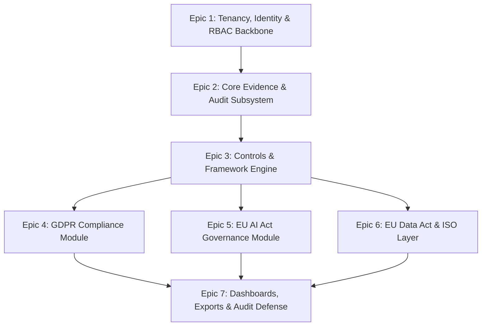
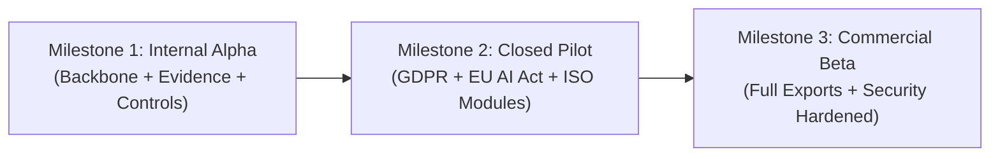

# MVP Delivery Roadmap & Technical Sequencing: euroGovernance

**Target**: Multi-Tenant B2B GRC SaaS covering GDPR, EU AI Act, EU Data Act, ISO 27001, and ISO 42001.  
**Execution Strategy**: **Security-First Backbone** $\rightarrow$ **Shared Governance Workflows** $\rightarrow$ **Specialized Regulatory Engines** $\rightarrow$ **Audit Readiness & Packaging**.  

---

## 1. Epic Catalog & Story Breakdown



### Epic 1: Tenancy, Identity & RBAC Backbone
- **Story 1.1**: Firebase Auth initialization with email verification, MFA configuration, and user profile management (`/users/{uid}`).
- **Story 1.2**: Atomic tenant provisioning via `createTenant` Cloud Function with automatic initial `tenant_admin` membership.
- **Story 1.3**: Cryptographic invitation workflow (`inviteUserToTenant`, `acceptTenantInvite`) with 7-day token expiration and seat quota enforcement.
- **Story 1.4**: Role-based access control engine (`assignTenantRole`) supporting 10 standard roles.
- **Story 1.5**: Frontline Firestore Security Rules enforcing tenant path isolation (`/tenants/{tenantId}/...`) and membership caching.

### Epic 2: Core Evidence & Immutable Audit Subsystem
- **Story 2.1**: Direct Cloud Storage file upload under `gs://.../tenants/{tenantId}/evidence/{id}/` with 50MB ceiling and MIME validation in `storage.rules`.
- **Story 2.2**: Evidence metadata capture with browser-computed SHA-256 integrity hashing and multi-relational linkage arrays.
- **Story 2.3**: Immutable version history tracking via `/evidence/{id}/versions/{versionId}` subcollection.
- **Story 2.4**: Privileged Four-Eyes evidence approval state machine (`approveEvidence`, `rejectEvidence`) in Cloud Functions.
- **Story 2.5**: Append-only immutable audit logging engine (`/audit_logs/{id}`) with zero client mutation permissions.
- **Story 2.6**: Daily scheduled cron sweep (`checkEvidenceExpiriesAndReminders`) for 30d/7d renewal reminders.

### Epic 3: Unified Controls & Multi-Framework Engine
- **Story 3.1**: Global Master Regulatory Framework catalog (`/frameworks/`) for GDPR, EU AI Act, Data Act, ISO 27001, and ISO 42001.
- **Story 3.2**: Tenant control adoption workflow (`/tenants/{tenantId}/controls/{id}`) linked to master templates and custom internal controls.
- **Story 3.3**: Many-to-many requirement mapping model (`controlIds`, `requirementIds`).
- **Story 3.4**: Deterministic Control Health Score calculation engine (0-100%) combining implementation state and evidence validity.
- **Story 3.5**: Control review history subcollection (`/controls/{id}/reviews/{reviewId}`).

### Epic 4: GDPR Compliance Module
- **Story 4.1**: Article 30 ROPA register with legal basis tracking (Art. 6 & 9), retention schedules, and processor mappings.
- **Story 4.2**: WP248 9-criteria automated DPIA screening with prefill integration from ROPA entries.
- **Story 4.3**: Full DPIA review and DPO sign-off workflow (`transitionDPIAStatus`).
- **Story 4.4**: International Transfer Impact Assessment (TIA) workflow evaluating third-country surveillance laws and SCCs.
- **Story 4.5**: Personal Data Breach register with server-calculated 72-hour statutory notification deadline.
- **Story 4.6**: Data Subject Rights (DSR) tracker with statutory 30-day fulfillment deadline and masked requester privacy protection.

### Epic 5: EU AI Act Governance Module
- **Story 5.1**: AI System register capturing value chain role (`provider`, `deployer`, `importer`, `distributor`), model type, and deployment status.
- **Story 5.2**: Deterministic AI risk classification engine (`classifyAISystem`) evaluating Prohibited Practices (Art. 5) vs High-Risk Annex III.
- **Story 5.3**: Fundamental Rights Impact Assessment (FRIA) workflow (Art. 27) and technical oversight controls linkage.
- **Story 5.4**: Substantial change logging and re-conformity evaluation (Art. 43).
- **Story 5.5**: Post-market monitoring log (Art. 72) and serious AI incident reporting with 2-day/15-day statutory notification clocks (Art. 73).

### Epic 6: EU Data Act & ISO Shared Management Layer
- **Story 6.1**: Connected product / service data register and B2B/B2C data access request tracker (Data Act Chapters II & III).
- **Story 6.2**: Cloud switching barrier evaluator and egress fee elimination tracker (Data Act Chapter VI).
- **Story 6.3**: Shared ISO Harmonized Annex SL management system layer (`ISOScopeStatement`, `ISOObjective`).
- **Story 6.4**: Statement of Applicability (SoA) engine mapping ISO 27001 (93 controls) and ISO 42001 (38 controls) with verified evidence links.
- **Story 6.5**: Internal audit planning, nonconformity finding (CAPA), and management review workflows.

### Epic 7: Dashboards, Compliance Exports & Audit Readiness
- **Story 7.1**: Executive Overview and Framework Readiness dashboards powered by materialized summary documents (`/summary_metrics/latest`).
- **Story 7.2**: Domain dashboards for GDPR, EU AI Act, Controls Assurance, and Overdue Evidence.
- **Story 7.3**: In-app notification center and multi-channel email/webhook dispatcher.
- **Story 7.4**: On-demand asynchronous compliance package export engine (`generateTenantEvidenceExport`) compiling timestamped ZIP archives in Cloud Storage.
- **Story 7.5**: Official Article 30 ROPA (XLSX) and EU AI Act Annex IV Technical Documentation (PDF) export generators.

---

## 2. Technical Sequencing (Sprint Roadmap)

```mermaid
flowchart TD
    subgraph Phase1 [Phase 1: Tenant Backbone & Evidence (Weeks 1-2)]
        P1_E1["Epic 1: Tenancy, Auth & RBAC Engine"]
        P1_E2["Epic 2: Core Evidence & Immutable Audit Logs"]
        P1_E1 --> P1_E2
    end

    subgraph Phase2 [Phase 2: Controls & GDPR Foundations (Weeks 3-4)]
        P2_E3["Epic 3: Unified Master & Adopted Controls"]
        P2_E4["Epic 4: GDPR ROPA, DPIA & Breach Register"]
        P2_E3 --> P2_E4
    end

    subgraph Phase3 [Phase 3: EU AI Act & ISO Management Layer (Weeks 5-6)]
        P3_E5["Epic 5: EU AI Act System Register & Classification"]
        P3_E6["Epic 6: Data Act Tracker & ISO 27001/42001 SoA"]
        P3_E5 --> P3_E6
    end

    subgraph Phase4 [Phase 4: Dashboards, Exports & Pilot Readiness (Weeks 7-8)]
        P4_E7["Epic 7: Rollup Dashboards & Compliance ZIP Exports"]
        P4_Harden["Security Hardening, Penetration Testing & Pilot Prep"]
        P4_E7 --> P4_Harden
    end

    Phase1 --> Phase2
    Phase2 --> Phase3
    Phase3 --> Phase4

    style Phase1 fill:#f0fdf4,stroke:#22c55e,color:#000000
    style Phase2 fill:#eff6ff,stroke:#3b82f6,color:#000000
    style Phase3 fill:#faf5ff,stroke:#a855f7,color:#000000
    style Phase4 fill:#fffbeb,stroke:#f59e0b,color:#000000
```

---

## 3. Prerequisite Stories for Security Rules Finalization

The following stories **must be completed and frozen** before `firestore.rules` and `storage.rules` can be locked:
1. **Story 1.2 & 1.5 (Membership Document Schema)**: The exact schema of `/tenants/{tenantId}/memberships/{uid}` (specifically `status: 'active'` and `role: string`) must be finalized because all Security Rules helper functions (`isTenantMember`, `hasAnyRole`) depend on this exact path and field shape.
2. **Story 2.1 (Storage Pathing)**: Storage prefix convention `tenants/{tenantId}/evidence/{id}/...` must be strictly adhered to by the upload client.
3. **Story 2.5 (Audit Immutability)**: Locking client writes on `/audit_logs` requires Cloud Functions Admin SDK emission to be fully verified.

---

## 4. Stories Requiring Emulator Tests Immediately

The following test suites must run in CI on the local Firebase Emulator Suite prior to merging:
1. **`tenant-isolation.test.ts`**: Verifies zero cross-tenant data leakage across all subcollections (`controls`, `evidence`, `ropa_entries`, `ai_systems`).
2. **`rbac-matrix.test.ts`**: Verifies that `auditor` and `viewer` roles are 100% read-only, while `contributor` cannot self-approve evidence or elevate permissions.
3. **`audit-immutability.test.ts`**: Verifies that direct client SDK calls to `set()`, `update()`, or `delete()` on `/audit_logs` throw `PERMISSION_DENIED`.
4. **`ai-classification-engine.test.ts`**: Verifies deterministic evaluation of Prohibited Practices (Art. 5) vs High-Risk Annex III rules.

---

## 5. Milestone Release Criteria



### Milestone 1: Internal Alpha (Weeks 1-4)
- **Target**: Internal Engineering & Security Team dogfooding.
- **Capabilities**: Tenant creation, user invites, role assignment, evidence upload & versioning, Four-Eyes approval, master control adoption, and append-only audit logging.
- **Exit Gate**: 100% pass rate on `tenant-isolation.test.ts` emulator test suite; zero typecheck or build errors.

### Milestone 2: Closed Pilot (Weeks 5-8)
- **Target**: 5 Selected B2B Design Partner Customers (AI startups, SaaS scale-ups).
- **Capabilities**: Complete GDPR Article 30 ROPA, DPIA/TIA workflows, EU AI Act system registration & classification, 72h breach & AI incident response trackers, and Statement of Applicability (SoA) engine.
- **Exit Gate**: Successful validation of EU AI Act classification accuracy with legal design partners; P95 dashboard load times $<500\text{ms}$.

### Milestone 3: Commercial Beta (Weeks 9-12)
- **Target**: General B2B Availability.
- **Capabilities**: Automated Annex IV Technical Documentation export, full evidence ZIP packaging, multi-channel notifications, EU Data Act switching tracker, and complete third-party penetration test certification.
- **Exit Gate**: Clean independent third-party penetration test report; SOC 2 Type 1 / ISO 27001 readiness review complete.

---

## 6. Acceptance Criteria for the Delivery Roadmap

- [x] Epics and stories cover the entire scope of the approved architecture across GDPR, EU AI Act, EU Data Act, ISO 27001, and ISO 42001.
- [x] Clear technical sequencing prioritizes tenant-safe foundations and shared controls before regulatory specialization.
- [x] Exact Security Rules prerequisites and emulator testing suites are formally identified.
- [x] Defined exit criteria for Internal Alpha, Closed Pilot, and Commercial Beta milestones.
