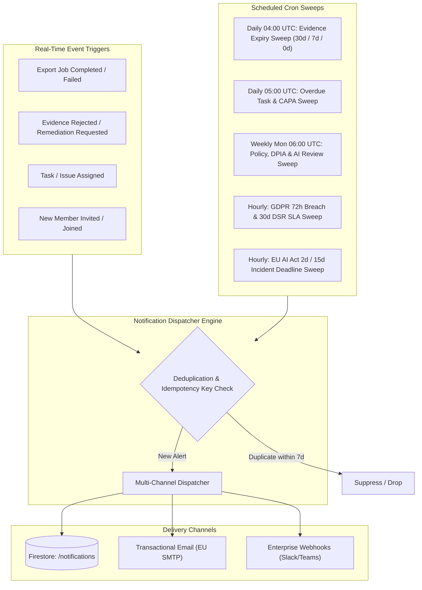
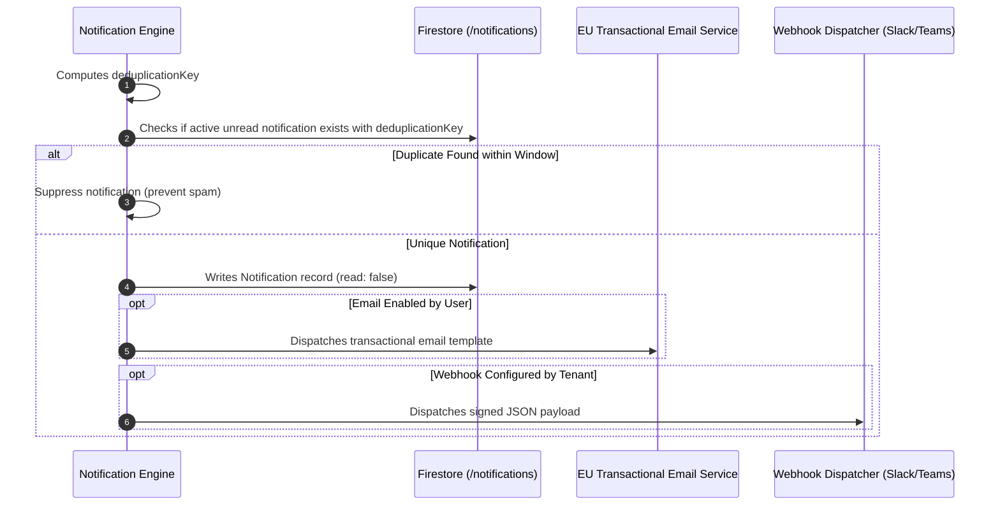

# Notification and Reminder Subsystem Specification: euroGovernance

**Runtime**: Node.js 20 on Cloud Functions v2 & Cloud Scheduler  
**Primary Region**: `europe-west3` (Frankfurt)  
**Supported Delivery Channels**: In-App Notification Center, EU Transactional Email (Postmark/SendGrid EU), Enterprise Webhooks  

---

## 1. Event Sources & Trigger Architecture

The notification engine is driven by two distinct mechanisms:
1. **Real-Time Reactive Event Triggers**: Triggered immediately by Cloud Functions on workflow state changes (e.g. export completed, task assigned, evidence rejected).
2. **Time-Based Scheduled Sweep Triggers**: Triggered on recurring cron schedules by Google Cloud Scheduler to evaluate statutory deadlines, expiry horizons, and SLA escalations.



---

## 2. Notification Schema

### 2.1 Tenant Notification Document (`/tenants/{tenantId}/notifications/{notificationId}`)
```typescript
interface NotificationDocument {
  id: string; // e.g. 'notif_01HQ9U...'
  tenantId: string;
  recipientId: string; // Target user UID
  recipientEmail: string;
  
  // Categorization & Priority
  type:
    | 'evidence_expiry_warning'
    | 'evidence_expired'
    | 'evidence_rejected'
    | 'task_overdue'
    | 'policy_review_due'
    | 'dpia_review_due'
    | 'ai_assessment_review_due'
    | 'gdpr_breach_sla_warning'
    | 'ai_incident_sla_warning'
    | 'export_job_completed'
    | 'export_job_failed';
  priority: 'low' | 'medium' | 'high' | 'urgent';
  
  // Presentation & Actionability
  title: string; // e.g. 'Evidence Expiring in 7 Days'
  message: string; // e.g. 'AWS KMS Key Policy (EV-2026-001) will expire on 2026-08-21.'
  actionUrl: string; // Relative deep-link: '/evidence/ev_01HQ9K...'
  
  // Lifecycle & Status
  read: boolean;
  readAt: string | null;
  deliveredChannels: Array<'in_app' | 'email' | 'webhook'>;
  
  // Idempotency & Deduplication
  deduplicationKey: string; // SHA-256(tenantId + recipientId + type + entityId + window)
  
  // Associated Entity Reference
  entityType: 'evidence' | 'task' | 'policy' | 'dpia' | 'ai_assessment' | 'breach' | 'export_job';
  entityId: string;
  
  createdAt: string; // ISO 8601 UTC
}
```

### 2.2 User Notification Preferences (`/users/{userId}/preferences`)
```typescript
interface UserNotificationPreferences {
  emailNotificationsEnabled: boolean;
  emailDigestFrequency: 'instant' | 'daily_summary' | 'never';
  categories: {
    evidenceExpiries: boolean;
    taskAssignments: boolean;
    policyReviews: boolean;
    statutoryDeadlines: boolean; // Urgent alerts (cannot be disabled)
    exportCompletions: boolean;
  };
}
```

---

## 3. Scheduled Job Plan

All scheduled jobs run via Cloud Functions v2 (`onSchedule`) with maximum concurrency and isolated timeout configurations:

| Job Name | Cron Expression | Frequency | Target Evaluated | Action Taken |
| :--- | :--- | :--- | :--- | :--- |
| **`checkEvidenceExpiriesAndReminders`** | `0 4 * * *` | Daily at 04:00 UTC | `/evidence` where `status == 'valid'` and `reviewDueDate <= now + 30d` | Transitions status to `expired` if overdue; generates 30d and 7d advance warnings. |
| **`checkOverdueTasksAndReminders`** | `0 5 * * *` | Daily at 05:00 UTC | `/tasks` and `/issues` where `status != 'completed'` and `dueDate < now` | Generates overdue task notifications and escalates to manager if overdue $>7$ days. |
| **`checkPeriodicComplianceReviews`** | `0 6 * * 1` | Weekly (Monday 06:00 UTC) | `/policies`, `/dpia_assessments`, `/ai_assessments` with `nextReviewDate <= now + 30d` | Creates annual review reminder notices for DPO, CISO, and AI Governance Manager. |
| **`checkStatutoryDeadlinesHourly`** | `0 * * * *` | Every Hour | Open `/breaches` (72h clock), `/dsr_requests` (30d clock), `/ai_incidents` (2d/15d clock) | Calculates remaining countdown time; emits urgent alarms if $<12\text{h}$ remaining before regulatory breach. |
| **`cleanupExpiredExportArchives`** | `0 2 * * 0` | Weekly (Sunday 02:00 UTC) | Cloud Storage `/exports/` older than 7 days | Deletes expired compliance ZIP blobs and updates export job records to `purged`. |

---

## 4. Multi-Channel Delivery Strategy



---

## 5. Deduplication & Idempotency Strategy

To prevent spamming users when a scheduled sweep runs repeatedly:
1. **Deterministic Deduplication Key**:
   $$\text{Key} = \text{SHA-256}(\text{tenantId} + \text{recipientId} + \text{type} + \text{entityId} + \text{dateBucket})$$
   - Where `dateBucket` partitions time into weekly (`2026-W33`) or milestone intervals (`7d_warning`, `30d_warning`, `overdue`).
2. **Suppression Query**:
   ```typescript
   const existing = await db
     .collection('tenants')
     .doc(tenantId)
     .collection('notifications')
     .where('deduplicationKey', '==', deduplicationKey)
     .limit(1)
     .get();

   if (!existing.empty) {
     return; // Notification already dispatched for this interval
   }
   ```

---

## 6. Failure Handling & Resiliency

1. **Dead Letter Queue (DLQ)**: Failed email or webhook deliveries are pushed to a Pub/Sub Dead Letter Topic (`projects/eurogovernance/topics/notification-dlq`) for inspection and automated replay.
2. **Exponential Backoff Retries**: Webhook delivery retries up to 3 times with exponential backoff (1s, 5s, 25s) before marking delivery as `failed`.
3. **Non-Blocking Core Logic**: Notification failures **never fail the primary business transaction**. For example, if email dispatch fails during evidence approval, the evidence approval succeeds and the error is logged separately.

---

## 7. Acceptance Criteria

- [x] All 7 required reminder types are modeled in the notification schema.
- [x] Scheduled daily cron sweeps evaluate evidence expiries, overdue tasks, and annual policy/DPIA review cycles.
- [x] Hourly statutory sweeps monitor GDPR 72h breach clocks and EU AI Act incident clocks.
- [x] Hash-based deduplication keys prevent notification spam.
- [x] In-app notifications support real-time delivery and read state tracking in `/tenants/{tenantId}/notifications`.

---

## 🔗 Related Knowledge Graph Documents

- **Hub**: [[INDEX|Knowledge Vault Index]]
- **Backend & Scheduling**: [[CLOUD_FUNCTIONS_PLAN|Cloud Functions Plan]], [[backend-workflows|Backend Workflows]], [[runbooks|Operational Runbooks]]
- **Domain Triggers**: [[GDPR_MODULE_DESIGN|GDPR 72h Breach Clocks]], [[EU_AI_ACT_MODULE_DESIGN|AI Act Incident Clocks]], [[PROCESSOR_AND_TRANSFER_MANAGEMENT|Transfer Review Reminders]], [[PROCESSOR_CERTIFICATIONS_AND_ASSURANCE|Certification Expiry Reminders]], [[EVIDENCE_MODULE_DESIGN|Evidence Expiry]]
