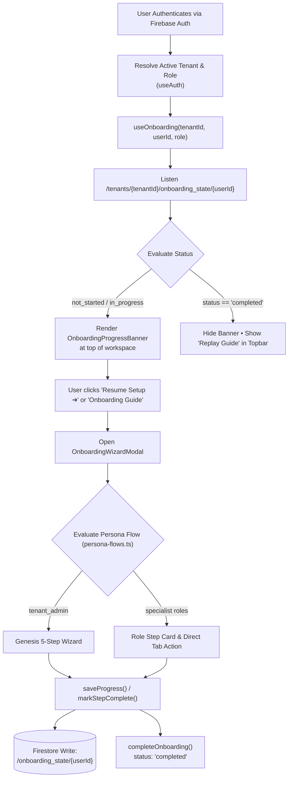

# Sovereign Onboarding System Architecture

```
                               ┌─────────────────────────────────────────────────────────┐
                               │             euroGovernance Identity Gateway             │
                               │        Firebase Auth JWT & Active Tenant Context        │
                               └────────────────────────────┬────────────────────────────┘
                                                            │
                                                            ▼
                               ┌─────────────────────────────────────────────────────────┐
                               │           Tenant Isolation & Membership Gate            │
                               │       /tenants/{tenantId}/memberships/{userId}          │
                               └──────────────┬───────────────────────────┬──────────────┘
                                              │                           │
                                              ▼                           ▼
                        ┌───────────────────────────┐       ┌───────────────────────────┐
                        │   Tenant Provisioning     │       │   Active Workspace User   │
                        │      First-Run Flow       │       │    (Role-Specific Tour)   │
                        │    (isTenantAdmin=true)   │       │  /onboarding_state/{uid}  │
                        └─────────────┬─────────────┘       └─────────────┬─────────────┘
                                      │                                   │
                                      ▼                                   ▼
┌────────────────────────────────────────────────────────────────────────────────────────────────────────┐
│                                 5-Hub Progressive Workspace Interface                                   │
│  📊 Executive & Posture │ 📐 Frameworks & Controls │ 🛡️ Third Parties │ ⚖️ Statutory │ ⚙️ Operations   │
└────────────────────────────────────────────────────────────────────────────────────────────────────────┘
```

---

## 1. Purpose and User Outcomes

The **euroGovernance Sovereign Onboarding System** provides a deterministic, multi-tenant, and persona-tailored first-run experience across European regulatory compliance domains (GDPR, EU AI Act, EU Data Act, ISO 27001, ISO 42001).

### Verified User Outcomes:
1. **Zero "Empty Canvas" Confusion**: Replaces blank dashboards with guided, dependency-aware step flows.
2. **Role-Tailored Cognition**: Exposes only role-relevant statutory modules to each persona, eliminating cognitive fatigue.
3. **Resumable Multi-Device Progress**: Persists step state in Firestore under `/tenants/{tenantId}/onboarding_state/{userId}`.
4. **Sovereign Security Invariants**: Enforces strict separation between client-side UX navigation and server-side authorization boundaries.

### Non-Goals:
* **Client-Side Authorization**: UI visibility or step progression is strictly for user guidance and is never treated as backend authorization.
* **Direct Database Role Changes**: Client code cannot alter membership roles or bypass Four-Eyes approval checks.

---

## 2. High-Level Architecture & Lifecycle



---

## 3. Tenant-Level vs. User-Level State

| Scope | Firestore Path | Write Authority | Verified Properties |
| :--- | :--- | :--- | :--- |
| **Tenant Baseline** | `/tenants/{tenantId}` | `tenant_admin` / Cloud Functions | `name`, `country`, `status`, `mandatorySetupFlags` |
| **User Progress** | `/tenants/{tenantId}/onboarding_state/{userId}` | Authenticated user (`auth.uid == userId`) \| `tenant_admin` | `status`, `currentStepId`, `currentStepIndex`, `completedStepIds`, `stepData`, `hasDismissedBanner` |
| **Audit Logs** | `/tenants/{tenantId}/audit_logs/{logId}` | Cloud Functions Admin SDK | `actorId`, `action`, `beforeSummary`, `afterSummary`, `timestamp` |

---

## 4. Resumption, Skip, Completion, and Reset Behavior

1. **Auto-Save & Resumption**:
   * Invoking `markStepComplete(stepId, nextIdx)` updates `completedStepIds` and advances `currentStepIndex`.
   * When re-opening the application on any device, `useOnboarding` restores the exact saved step index.
2. **Dismissal ("Skip for Now")**:
   * Clicking the `✕` dismiss button on [`OnboardingProgressBanner`](file:///Users/remon/Documents/euroGovernance/apps/web/src/app/onboarding/onboarding-progress-banner.tsx) calls `dismissBanner()`, setting `hasDismissedBanner: true` and `status: 'dismissed'`.
   * The banner unmounts, but onboarding can be resumed at any time by clicking the topbar **"🚀 Onboarding Guide"** button.
3. **Completion**:
   * Completing the final step calls `completeOnboarding()`, marking all step IDs as completed, setting `status: 'completed'`, recording `completedAt`, and setting `hasDismissedBanner: true`.
4. **Replay Guide**:
   * Once completed, the topbar CTA transforms to **"🚀 Replay Guide"**, allowing users to re-review compliance checklists on demand.

---

## 5. Trust Boundaries & Authorization Model

```
┌──────────────────────────────────────────────────┬──────────────────────────────────────────────────┐
│             FRONTEND (UNTRUSTED UI)              │         BACKEND (TRUSTED CLOUD FUNCTIONS)        │
├──────────────────────────────────────────────────┼──────────────────────────────────────────────────┤
│ • Evaluates current step and renders UI wizard   │ • Issues & verifies cryptographic JWT Auth tokens│
│ • Manages local input validation & state drafts  │ • Validates tenant memberships and active roles  │
│ • Writes progress to /onboarding_state/{userId}  │ • Instantiates control masters into Firestore    │
│ • Optimistically shows/hides role-relevant hubs  │ • Enforces Four-Eyes approvals on evidence       │
│ • Listens to live Firestore changes (onSnapshot) │ • Writes immutable append-only audit records     │
└──────────────────────────────────────────────────┴──────────────────────────────────────────────────┘
```

> [!WARNING]
> **Security Invariant**: Client-side step completion does **not** grant authorization privileges. All mutations (e.g. creating controls, inviting colleagues, adopting frameworks, approving evidence) must execute via verified Cloud Functions or pass strict Firestore Security Rules.

---

## 6. Related Notes

* [[ONBOARDING_FLOW_MATRIX|Onboarding Flow Matrix (All Personas)]]
* [[ONBOARDING_TENANT_ADMIN|Tenant Admin Genesis Setup Documentation]]
* [[ONBOARDING_ROLE_BASED_FLOWS|Specialist Role Onboarding Flows]]
* [[ONBOARDING_DATA_MODEL|Onboarding Data Model & Firestore Schema]]
* [[ONBOARDING_SECURITY_AND_AUTHORIZATION|Onboarding Security & Authorization Model]]
* [[ONBOARDING_OPERATIONS_AND_SUPPORT|Operations, Troubleshooting & Support Guide]]
* [[TENANT_MODEL_AND_IDENTITY_FLOWS|Tenant Model & Identity Provisioning Flows]]
* [[ROLES_AND_PERMISSIONS|Role-Based Access Control (RBAC) Specification]]

---

## 7. Verification Sources

* `apps/web/src/app/onboarding/persona-flows.ts`
* `apps/web/src/app/onboarding/use-onboarding.ts`
* `apps/web/src/app/onboarding/onboarding-progress-banner.tsx`
* `apps/web/src/app/onboarding/onboarding-wizard-modal.tsx`
* `apps/web/src/app/page.tsx`
* `packages/shared-types/src/onboarding.ts`
* `firestore.rules` (Lines 180–188)
* `tests/rules/onboarding-flow-and-rules.test.ts`
