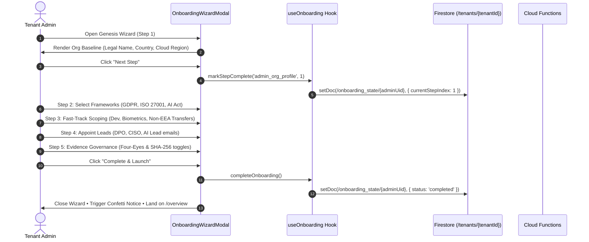

# Tenant Admin Genesis Onboarding Flow

```
┌────────────────────────────────────────────────────────────────────────────────────────────────────────────────────────┐
│  euroGovernance Enterprise Genesis Setup                                                      [Step 3 of 5: Scoping]   │
│  Establishing Sovereign Governance Baseline for EuroCorp Technologies SE                                               │
├────────────────────────────────────────────────────────────────────────────────────────────────────────────────────────┤
│  1. Org Profile    ──►  2. Scope & Frameworks  ──►  3. Control Engine  ──►  4. Team Leads  ──►  5. Policies  ──►  [Launch]   │
│     [ ✓ Done ]              [ ✓ Done ]                 [ ● Active ]             [ ○ Next ]        [ ○ Next ]       [ Launch ]  │
└────────────────────────────────────────────────────────────────────────────────────────────────────────────────────────┘
```

---

## 1. Preconditions & Entry Point

* **Preconditions**:
  * User is authenticated via Firebase Auth.
  * User has an active membership record in `/tenants/{tenantId}/memberships/{uid}` with `role: 'tenant_admin'`.
* **Entry Point**:
  * Component: [`apps/web/src/app/onboarding/onboarding-wizard-modal.tsx`](file:///Users/remon/Documents/euroGovernance/apps/web/src/app/onboarding/onboarding-wizard-modal.tsx)
  * Invoked by [`apps/web/src/app/page.tsx`](file:///Users/remon/Documents/euroGovernance/apps/web/src/app/page.tsx) via the topbar **"🚀 Onboarding Guide"** button or top-level progress banner.

---

## 2. Step-by-Step Genesis Flow



---

## 3. Verified Step Details & Form Fields

### Step 1: Organization Baseline & Sovereign Boundaries
* **Form Inputs**:
  * `legalEntityName` (string, default: `"EuroCorp Technologies SE"`)
  * `country` (select: `DE`, `FR`, `NL`, `SE`, `IE`)
  * `cloudRegion` (select: `europe-west3` Frankfurt, `europe-west9` Paris, `europe-west1` Belgium)
* **Compliance Impact**: Determines Lead Supervisory Authority under GDPR Art. 56 and statutory 72h incident notification deadlines.

### Step 2: Regulatory Scope & Framework Selection
* **Available Options**:
  * `eu_gdpr`: EU General Data Protection Regulation (Mandatory for EEA personal data)
  * `iso_27001_2022`: ISO/IEC 27001:2022 ISMS Baseline (93 controls)
  * `eu_ai_act`: EU Artificial Intelligence Act (2024/1689)
  * `iso_42001_2023`: ISO/IEC 42001:2023 AIMS Standard
  * `eu_nis2`: NIS2 Directive (EU 2022/2555)

### Step 3: Fast-Track Scoping Questionnaire
* **Questions & State**:
  1. *In-house software development?* $\to$ `scopingAnswers.dev: boolean`
  2. *Biometric data or AI models?* $\to$ `scopingAnswers.ai_bio: boolean`
  3. *Non-EEA data transfers?* $\to$ `scopingAnswers.transfers: boolean`
  4. *Critical infrastructure?* $\to$ `scopingAnswers.nis2_infra: boolean`
* **Harmonization Banner**: `214 potential requirements condensed into 68 unified master controls.`

### Step 4: Appoint Governance Leads
* **Inputs**:
  * `email` (string)
  * `role` (`privacy_manager`, `security_manager`, `ai_governance_manager`, `compliance_manager`, `auditor`)
  * `dept` (string)
* **Pre-seeded defaults**: `dpo@eurocorp.de`, `ciso@eurocorp.de`, `ai-lead@eurocorp.de`.

### Step 5: Evidence Governance & Security Policies
* **Toggles**:
  * `fourEyesPolicy` (boolean, default: `true`)
  * `sha256Strict` (boolean, default: `true`)
  * `autoRenewal` (boolean, default: `true`)

---

## 4. Data Created & Security Invariants

1. **State Persistence**:
   * Every step transition updates `/tenants/{tenantId}/onboarding_state/{adminUserId}`.
2. **Security Rules Boundary**:
   * Writing to `/tenants/{tenantId}/onboarding_state/{userId}` is strictly authorized under rule:
     ```javascript
     match /onboarding_state/{onboardingUserId} {
       allow read, write: if isTenantMember(tenantId) && (request.auth.uid == onboardingUserId || isTenantAdmin(tenantId));
     }
     ```
3. **Backend Cloud Function Invocations**:
   * Direct control creation or framework adoption in the workspace invokes trusted callables: `adoptFramework`, `instantiateTenantFrameworkControls`, and `inviteUserToTenant`.

---

## 5. Known Gaps / Deviations

> [!NOTE]
> **Implemented Behavior vs. Target Blueprint**:
> * **Atomic Genesis Batch Callable**: In the current frontend implementation, Step 5 completion saves the completed onboarding state to Firestore and lands the Admin on the active overview dashboard. Control instantiation and framework adoption can also be triggered via the dedicated **Framework Adoption Wizard** ([`apps/web/src/app/framework-adoption-wizard.tsx`](file:///Users/remon/Documents/euroGovernance/apps/web/src/app/framework-adoption-wizard.tsx)) or on-demand via the controls catalog.
> * A consolidated server-side batch callable (`completeTenantGenesisSetup`) that performs all 5 backend steps in a single atomic transaction is documented in the design roadmap and can be added as a backend enhancement.

---

## 6. Related Notes

* [[ONBOARDING_SYSTEM|Sovereign Onboarding System Architecture]]
* [[ONBOARDING_FLOW_MATRIX|Onboarding Flow Matrix]]
* [[ONBOARDING_DATA_MODEL|Onboarding Data Model & Firestore Schema]]
* [[FRAMEWORK_AND_CONTROLS_ENGINE|Framework & Controls Engine]]
* [[TENANT_MODEL_AND_IDENTITY_FLOWS|Tenant Model & Identity Provisioning Flows]]

---

## 7. Verification Sources

* `apps/web/src/app/onboarding/onboarding-wizard-modal.tsx` (Lines 80–300)
* `apps/web/src/app/onboarding/persona-flows.ts` (Lines 15–80)
* `tests/rules/onboarding-flow-and-rules.test.ts`
