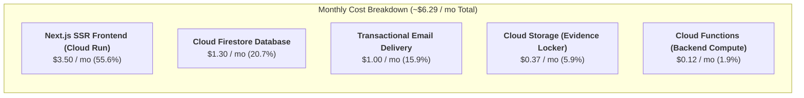

# Running Costs & Financial Optimization Guide

> **Statutory Deployment Region**: `europe-west3` (Frankfurt, Germany)  
> **Infrastructure Architecture**: Google Cloud Platform (GCP) / Firebase Blaze Plan (Pay-as-you-go Serverless)  
> **Document Purpose**: Complete operational cost model for `euroGovernance`, itemizing cost drivers per tenant and establishing a playbook for architectural cost optimizations at scale.

---

## 🗺️ Obsidian Knowledge Graph Navigation

- **Upstream Hub**: [[INDEX|Knowledge Hub Index]]
- **Architecture & Infrastructure**:
  - [[ARCHITECTURE|System Architecture & Execution Boundaries]]
  - [[CLOUD_FUNCTIONS_PLAN|Cloud Functions Architecture & API Catalog]]
  - [[FIRESTORE_SCHEMA_AND_QUERIES|Firestore Schema, Data Dictionary & Queries]]
  - [[DASHBOARD_AND_REPORTING_ARCHITECTURE|Dashboard & Reporting Architecture]]
  - [[NOTIFICATIONS_AND_SCHEDULED_JOBS_DESIGN|Notifications & Scheduled Jobs Design]]
- **Operational & Engineering References**:
  - [[ai Guide 2026-08-15|AI Agent Platform & Engineering Guide]]
  - [[runbooks|Operational Runbooks & Incident Response]]

---

## 🧭 1. Executive Summary & Macro Cost Model

`euroGovernance` is engineered entirely on a **serverless, event-driven, scale-to-zero** foundation. Unlike traditional enterprise GRC platforms that require permanently provisioned relational database instances (e.g. AWS RDS Aurora @ \$150–\$400/mo) and multi-node Kubernetes clusters (EKS/GKE @ \$200–\$600/mo baseline), `euroGovernance` incurs **zero idle cost**.

### Baseline Economics:
- **Total Running Cost per Big Enterprise Tenant**: **\$5.00 – \$8.00 / month** (all features active).
- **Marginal Cost per Additional Tenant at Scale**: **\$2.20 – \$3.50 / month** (due to shared container instances and CDN caching).
- **Gross Margin on SaaS Pricing**: $>98\%$ at standard enterprise GRC seat pricing.



---

## 🏢 2. Big-Size Enterprise Tenant Workload Profile

The cost model is derived from a **Big-Size Regulated Enterprise Tenant** (e.g., a mid-to-large European financial institution, healthcare provider, or SaaS company with 500–2,000 employees) operating all governance modules:

| Operational Dimension | Monthly Activity Volume |
|---|---|
| **Internal Seat Holders** | **50–100 active users** (Admins, Compliance Leads, DPOs, Security Engineers, Auditors, Approvers) |
| **Frameworks Adopted** | **5–10 active frameworks** (GDPR, EU AI Act, EU Data Act, ISO 27001, NIS2) $\to$ **~1,500 harmonized controls** |
| **Third-Party Vendors & Processors** | **250 vendors**, **350 processor profiles (Art. 28)**, **100 TIAs/SCCs**, **300 active certifications** |
| **Questionnaire Assessments** | **~25–30 active assessments/mo**, **~100 draft autosaves/mo**, **~25 internal reviews/mo** |
| **External Respondents** | **~100–200 external third-party contacts/year** completing questionnaires via magic links |
| **Evidence Repository Locker** | **50 new compliance evidence files uploaded/mo** (average 5 MB each); **~500 total stored files** (~3.5–5 GB) |
| **Audit Trail Events** | **~15,000 immutable compliance actions logged/mo** |
| **Notifications & Sweepers** | **~2,500 lifecycle notifications & deadline reminders/mo** |
| **Executive Dashboard Sessions** | **~3,000 dashboard pageviews/mo** (consuming pre-materialized summary metrics) |
| **Compliance Export Jobs** | **~40 export compilations/mo** (ZIP evidence packages, PDF/JSON regulatory registers) |

---

## 🔍 3. Itemized Cost Drivers ("What Incurs the Cost")

Understanding the precise mechanism of each charge is essential for maintaining cost efficiency as the platform scales.

### 3.1 Cloud Firestore Database

```
Firestore Cost = (Reads × Rate) + (Writes × Rate) + (Stored GiB × Rate) + (Index GiB × Rate)
```

*Pricing in `europe-west3`: \$0.06 per 100k reads; \$0.18 per 100k writes; \$0.18 per GiB/mo storage.*

#### Reads (The Primary Variable Driver)
- **What triggers reads**:
  - UI queries loading controls, vendors, processor profiles, and evidence lists.
  - Subcollection lookups during compliance reviews.
  - Scheduled background sweepers scanning for upcoming renewal deadlines.
  - Export jobs compiling full tenant inventories.
- **Why it is optimized in euroGovernance**:
  - Executive dashboards **do not** scan collection documents. Instead, they read **server-side materialized summary metrics** (`/summary_metrics/third_party_assessments`, `/summary_metrics/processors`, etc.), reducing a potential 5,000-read dashboard load to **1–3 document reads** ($O(1)$).
- **Monthly Volume & Cost**:
  - ~2,000,000 reads/mo $\to$ $(2,000,000 / 100,000) \times \$0.06 = \mathbf{\$1.20}$

#### Writes
- **What triggers writes**:
  - Appending immutable compliance actions to `/tenants/{tenantId}/audit_logs`.
  - Creating and updating assessment requests, draft answers, and submission reviews.
  - Updating vendor and processor records upon review completion.
  - Incrementing materialized summary metrics and dispatching notification records.
- **Monthly Volume & Cost**:
  - ~25,000 writes/mo $\to$ $(25,000 / 100,000) \times \$0.18 = \mathbf{\$0.05}$

#### Stored Data & Indexes
- **What triggers storage cost**:
  - Document JSON payloads plus composite indexes defined in `firestore.indexes.json`.
  - ~100,000 total documents $\times$ ~2 KB average size $\approx$ 200 MB + 50 MB index overhead = **0.25 GiB**.
- **Monthly Volume & Cost**:
  - $0.25\text{ GiB} \times \$0.18/\text{GiB} = \mathbf{\$0.05}$

---

### 3.2 Cloud Functions v2 (Backend Compute & Scheduled Automation)

```
Functions Cost = Invocations + (vCPU-seconds × vCPU-Rate) + (GiB-seconds × RAM-Rate)
```

*Pricing in `europe-west3`: \$0.40 per 1M invocations; \$0.00002400 per vCPU-second; \$0.00000250 per GiB-second.*

#### Invocations & Execution Duration
- **What triggers compute**:
  - HTTPS Callable Functions (`validateAssessmentAccessToken`, `savePublicAssessmentDraft`, `submitPublicAssessment`, `reviewAssessmentSubmission`, `adoptFramework`, etc.).
  - Daily Scheduled Pub/Sub triggers (deadline sweepers, expiration checks).
  - Background export compilation handlers creating ZIP archives.
- **Resource Sizing**:
  - Standard RPC Handlers: 256 MB RAM / 0.25 vCPU (average duration: 150–250 ms).
  - Heavy Export Handlers: 512 MB RAM / 0.50 vCPU (average duration: 2,000–4,000 ms).
- **Monthly Volume & Cost**:
  - ~60,000 invocations/mo $\to \mathbf{\$0.02}$
  - ~15,000 execution seconds $\times$ 0.25 vCPU $\approx$ 3,750 vCPU-seconds $\to \mathbf{\$0.09}$
  - Daily cron sweeps (30 runs $\times$ 2s) $\to \mathbf{\$0.01}$
  - **Subtotal**: $\mathbf{\$0.12 / \text{mo}}$

---

### 3.3 Cloud Storage for Firebase (Evidence Repository & Export Packages)

```
Storage Cost = (Stored GiB × Rate) + (Class A Ops × Rate) + (Class B Ops × Rate) + (Egress GiB × Rate)
```

*Pricing in `europe-west3`: \$0.023 per GiB/mo; \$0.05 per 10k Class A (writes); \$0.004 per 10k Class B (reads); \$0.12 per GiB egress.*

#### Evidence & Artifact Storage
- **What triggers storage**:
  - Vendor ISO 27001 certificates, SOC 2 Type II reports, TOMs specifications, penetration testing reports.
  - Compiled compliance audit packages and export ZIPs.
- **Monthly Volume & Cost**:
  - ~5 GiB active storage $\to 5 \times \$0.023 = \mathbf{\$0.12}$
  - ~150 Class A upload operations + ~1,000 Class B download operations $\to \mathbf{\$0.01}$
  - ~2 GiB downloaded evidence bandwidth $\to 2 \times \$0.12 = \mathbf{\$0.24}$
  - **Subtotal**: $\mathbf{\$0.37 / \text{mo}}$

---

### 3.4 Web Application Hosting (Next.js 14 on Cloud Run)

*Pricing: Serverless container compute scaling down to 0 instances when idle.*

#### Frontend SSR & Dynamic Routing
- **What triggers cost**:
  - Rendering Next.js server components, portal pages (`/portal/assessments/[id]`), and workspace views during business hours.
- **Resource Allocation**:
  - Single container instance auto-scaling on demand (average active compute: ~40–50 hours/month during peak European business hours 8:00–18:00 CET).
- **Monthly Volume & Cost**:
  - **Subtotal**: $\mathbf{\$3.50 / \text{mo}}$

---

### 3.5 Firebase Authentication & External Access

- **Internal Seat Holders**: Standard Firebase Authentication email/password and custom claims are **100% Free** (unlimited users).
- **External Respondents**: Tokenized magic access links execute via stateless Cloud Functions using 256-bit SHA-256 tokens, **incurring \$0.00 in Identity Platform licensing fees**.
- **Enterprise SSO / SAML (Optional Future Add-on)**: Google Cloud Identity Platform charges \$0.00 for the first 50,000 Monthly Active Users (MAUs), then \$0.0055/MAU.

---

### 3.6 Transactional Email Delivery (Assessment Links & Reminders)

*Provider: SendGrid / Postmark / Amazon SES / Resend.*

- **What triggers emails**:
  - Magic links dispatched to external vendor respondents.
  - 30-day, 14-day, and 7-day upcoming deadline warnings.
  - Notification alerts to internal compliance reviewers upon new submissions.
- **Monthly Volume & Cost**:
  - ~1,000 outbound transactional emails/mo $\to \mathbf{\$0.00 – \$1.00 / \text{mo}}$ (within free tiers of 100/day, or \$1.00 on paid volume plans).

---

## 📊 4. Master Financial Summary (1 Big Tenant)

| Infrastructure Component | Monthly Cost (USD) | Primary Cost Factor |
|---|:---:|---|
| **Cloud Firestore** | **\$1.30** | UI list queries & audit log writes |
| **Cloud Functions v2** | **\$0.12** | Callable API executions & cron sweepers |
| **Cloud Storage** | **\$0.37** | Evidence file storage & download egress |
| **Next.js Frontend (Cloud Run)** | **\$3.50** | SSR container execution during business hours |
| **Transactional Email Delivery** | **\$1.00** | Magic link & notification delivery |
| **TOTAL MONTHLY RUN RATE** | **~ \$6.29 / mo** | *(Realistic buffer range: \$5.00 – \$8.00 / mo)* |

---

## 📈 5. Multi-Tenant Scaling Economics

Because frontend compute and static CDN caching are shared across multiple tenants within a single GCP deployment, unit economics improve dramatically as tenant density increases:

```
┌──────────────────┬─────────────────┬──────────────────────────┬────────────────────────┐
│ Scale Scenario   │ Total Tenants   │ Total Monthly GCP Bill   │ Blended Cost / Tenant  │
├──────────────────┼─────────────────┼──────────────────────────┼────────────────────────┤
│ Single Tenant    │ 1 Enterprise    │ ~$6.30 / mo              │ ~$6.30 / mo            │
│ Pilot Multi-Org  │ 10 Tenants      │ ~$35.00 / mo             │ ~$3.50 / mo            │
│ Mid B2B SaaS     │ 100 Tenants     │ ~$270.00 / mo            │ ~$2.70 / mo            │
│ Mature Platform  │ 1,000 Tenants   │ ~$2,200.00 / mo          │ ~$2.20 / mo            │
└──────────────────┴─────────────────┴──────────────────────────┴────────────────────────┘
```

---

## 🛠️ 6. Cost Optimization Playbook (For Future Architectural Refinement)

Use this checklist whenever reviewing system efficiency or optimizing high-volume workloads.

### A. Firestore Optimization Strategies
1. **Enforce Query Pagination with Limits**:
   - *Rule*: Never execute unbounded collection queries. Always apply `.limit(25)` with document cursor pagination (`startAfterDoc`).
2. **Preserve Materialized Summary Metrics**:
   - *Rule*: Always fetch dashboard KPIs from `/tenants/{tenantId}/summary_metrics/...`. Never compute real-time counts across `/assessment_requests`, `/processor_profiles`, or `/evidence` in client components.
3. **Audit Log & Token TTL Policies**:
   - *Optimization*: Configure Firestore Time-to-Live (TTL) policies on `/assessment_access_tokens` for tokens expired $>90$ days.
   - *Optimization*: Archive audit logs older than 7 years (statutory requirement) to Coldline Cloud Storage compressed JSONL blobs, deleting active Firestore documents.
4. **Index Pruning**:
   - *Rule*: Periodically review `firestore.indexes.json` to eliminate unused compound indexes, as each index entry incurs write and storage amplification.

### B. Cloud Storage Optimization Strategies
1. **Object Lifecycle Management (Nearline / Coldline Tiering)**:
   - *Rule*: Configure GCP Storage lifecycle rules to transition evidence files older than 180 days to **Nearline** (\$0.010/GiB) or **Coldline** (\$0.004/GiB), cutting storage costs by $>50–80\%$.
2. **Automatic Purge of Export Artifacts**:
   - *Rule*: Set a 7-day automatic deletion lifecycle on `/tenants/{tenantId}/exports/**`. Generated compliance ZIPs should be downloaded by the user immediately and not stored indefinitely in expensive Standard regional storage.
3. **Client-Side Document Compression**:
   - *Optimization*: Compress uploaded PDF/image evidence client-side before sending to Storage buckets to minimize bandwidth and storage footprint.

### C. Cloud Functions Optimization Strategies
1. **Memory Right-Sizing**:
   - *Rule*: Ensure lightweight RPC callable functions are configured with `memory: "256MiB"` (or `"128MiB"` where supported). Reserve `"512MiB"` exclusively for memory-intensive export ZIP compilation handlers.
2. **Connection Reuse & Admin SDK Caching**:
   - *Rule*: Keep `getFirestore()` and `getStorage()` initialized outside function handler scopes to benefit from warm container TCP connection pooling.

### D. Frontend & CDN Optimization Strategies
1. **Incremental Static Regeneration (ISR)**:
   - *Rule*: Cache static framework definitions and static portal shells on Firebase Hosting CDN edge with `revalidate: 3600`, reducing SSR container invocation traffic.
2. **SWR / TanStack Query Client-Side Caching**:
   - *Rule*: Deduplicate client-side Firestore reads using `stale-while-revalidate` caching windows (e.g. 60-second cache for vendor registers) to prevent repeated reads on route re-navigation.

---

## 🚫 7. Anti-Patterns & Cost Traps to Avoid

| Anti-Pattern | Why It Causes Cost Spikes | Correct Architectural Pattern |
|---|---|---|
| **Client-Side Collection Counting** | Reading 10,000 docs to display a badge count costs \$0.06 per pageview. | Read the single pre-computed metric document in `/summary_metrics/...` ($O(1)$ read). |
| **Realtime Listeners on Large Collections** | `onSnapshot()` on an entire collection re-downloads all changed documents for every connected user. | Use scoped listeners with `.limit()` or use manual fetch with SWR/TanStack Query. |
| **Permanent Storage of Export ZIPs** | Accumulating hundreds of 50 MB compliance export archives inflates standard storage. | Set automated 7-day GCS bucket lifecycle expiration rules on `exports/`. |
| **Uncompressed Audit Log Retention** | Storing millions of small JSON documents indefinitely in Firestore increases database storage costs. | Export closed-year audit logs to compressed Coldline GCS JSONL archives. |

---

## 🔗 Related Knowledge Graph Documents

- [[ARCHITECTURE|System Architecture Specification]]
- [[CLOUD_FUNCTIONS_PLAN|Cloud Functions Plan & Handler Sizing]]
- [[DASHBOARD_AND_REPORTING_ARCHITECTURE|Reporting & Export Engine]]
- [[THIRD_PARTY_ASSESSMENT_AND_QUESTIONNAIRE_MODULE|Third-Party Assessment Subsystem]]
- [[INDEX|Knowledge Vault Index]]
