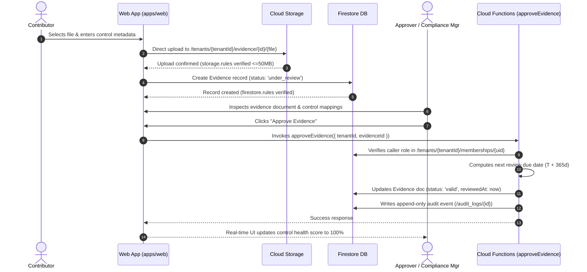

# Security Rules & Cloud Functions Architecture (Prompts 6 & 7)

**Document**: Architecture, Implementation Details, and Strategic Rationale ("How" & "Why")  
**System**: euroGovernance Multi-Tenant B2B GRC SaaS  
**Region**: `europe-west3` (Frankfurt)

---

## 1. Executive Summary & Philosophy

In a multi-tenant B2B Compliance SaaS covering stringent regulatory domains (GDPR, EU AI Act, EU Data Act, ISO 27001, and ISO 42001), **authorization must never rely on client-side logic**.

We enforce a dual-layer security perimeter:
1. **Firestore Security Rules (Frontline Gatekeeper)**: Enforces organizational isolation, denies unsigned or cross-tenant traffic, applies role-based reading/writing restrictions, and forbids direct mutation of immutable logs and membership records.
2. **Cloud Functions v2 (Privileged State Machines & Non-Repudiation)**: Orchestrates complex business logic, atomic multi-document onboarding, cryptographic token issuance, deterministic regulatory classification algorithms, and append-only audit event emission.

---

## 2. Firestore Security Rules (Prompt 6): The "How" and "Why"

### 2.1 The "Why": Threat Model & Regulatory Mandates
- **GDPR Art. 32 & ISO 27001 A.9 (Access Control)**: Demands that tenant data is segregated so that Organization A can never access Organization B's records under any query permutation.
- **Audit Immutability (ISO 27001 A.12.4 & EU AI Act Art. 12)**: Compliance audit logs must be tamper-proof. If a tenant administrator could edit or delete audit events, the system would fail any independent third-party SOC 2 or ISO certification audit.
- **Separation of Duties (Four-Eyes Principle)**: A contributor who uploads evidence must not be able to mark that evidence as "approved" or "valid" without an independent review by an approver or compliance manager.

### 2.2 The "How": Rules Architecture & Path-Based Isolation

#### A. Path Determinism (`/tenants/{tenantId}/...`)
Every tenant subcollection is explicitly scoped under `/tenants/{tenantId}/`. This enables simple, highly performant wildcard matching:
```javascript
match /tenants/{tenantId} {
  match /controls/{controlId} { ... }
  match /evidence/{evidenceId} { ... }
  match /ropa_entries/{ropaId} { ... }
}
```

#### B. Direct Membership Resolution Helper
Rather than scanning collections or trusting client input, the rules perform an `O(1)` direct document lookup against the caller's unique UID:
```javascript
function membershipPath(tenantId) {
  return /databases/$(database)/documents/tenants/$(tenantId)/memberships/$(request.auth.uid);
}

function isTenantMember(tenantId) {
  return isAuthenticated() && (
    isPlatformAdmin() ||
    (exists(membershipPath(tenantId)) &&
     get(membershipPath(tenantId)).data.status == 'active')
  );
}
```
- **Why this works**: Firestore caches document lookups made during rule evaluation. When evaluating a list query fetching 50 controls, the membership document is read **once** and cached in memory across the entire query.
- **Active Status Check**: Immediately revokes access if a user is `suspended` or `inactive`, without waiting for JWT token refresh cycles.

#### C. Role-Based Permission Gatekeepers
```javascript
function isReadOnlyRole(tenantId) {
  return isAuditor(tenantId) || isViewer(tenantId);
}

function hasAnyRole(tenantId, roles) {
  return isAuthenticated() && (
    isPlatformAdmin() ||
    (isTenantMember(tenantId) && roles.hasAny([getTenantRole(tenantId)]))
  );
}
```
- **Auditor & Viewer Enforcement**: Blocked from any `create`, `update`, or `delete` actions.
- **Tenant Admin Scope**: `tenant_admin` can manage organizational resources within their tenant, but has zero write privileges on global `/frameworks` catalogs.

#### D. Non-Repudiable Append-Only Audit Logs
```javascript
match /audit_logs/{logId} {
  allow read: if hasAnyRole(tenantId, ['tenant_admin', 'compliance_manager', 'auditor', 'security_manager']);
  allow update, delete: if false;
  allow create: if false; // Cloud Functions Admin SDK only
}
```
- **Why**: Prohibiting all client write operations on `/audit_logs` guarantees that no client SDK can forge, alter, or erase audit trails.

---

## 3. Cloud Functions Layer (Prompt 7): The "How" and "Why"

### 3.1 The "Why": Why Rules Alone Are Insufficient
Firestore Security Rules are a declarative authorization barrier; they cannot:
1. Coordinate complex multi-document atomic transactions across disparate root collections.
2. Execute deterministic, algorithmic multi-step decision trees (e.g. EU AI Act Prohibited vs High-Risk Annex III classification).
3. Generate cryptographic hashes, one-time invitation secret tokens, or calculate statutory deadlines (e.g. GDPR 72h countdown or EU AI Act 2-day / 15-day incident notifications).
4. Package gigabyte-scale compliance ZIP archives from Cloud Storage blobs.

### 3.2 The "How": Comprehensive Privileged Workflow Catalog

| Cloud Function Name | Trigger Type | Authorized Roles | Business Problem Solved & Rationale |
| :--- | :--- | :--- | :--- |
| **`createTenant`** | HTTPS Callable | Authenticated User | Atomically provisions the tenant document, initializes the first `tenant_admin` membership, and writes the initial audit event in a single atomic batch commit. Prevents orphaned organizations. |
| **`inviteUserToTenant`** | HTTPS Callable | `tenant_admin` | Generates a cryptographically secure token hash, sets a 7-day expiration date, validates tenant seat quotas, and logs an invitation audit event. |
| **`acceptTenantInvite`** | HTTPS Callable | Authenticated User | Validates invitation token validity, checks expiration, provisions `/tenants/{tenantId}/memberships/{userId}`, marks invite as accepted, and binds the user profile. |
| **`assignTenantRole`** | HTTPS Callable | `tenant_admin` | Modifies member roles; validates that caller is active admin; prevents self-demotion if sole admin; writes `permission_assigned` audit log with before/after state diff. |
| **`approveEvidence`** | HTTPS Callable | `approver`, `compliance_manager`, `security_manager`, `tenant_admin` | Formally approves evidence; transitions status to `valid`; updates review due date; records reviewer UID and timestamp; emits non-repudiable audit log. |
| **`rejectEvidence`** | HTTPS Callable | `approver`, `compliance_manager`, `security_manager`, `tenant_admin` | Transitions evidence to `rejected`; captures mandatory remediation reasoning; prompts contributor for revised version. |
| **`transitionPolicyStatus`** | HTTPS Callable | `compliance_manager`, `security_manager`, `privacy_manager`, `approver`, `tenant_admin` | Validates required signatories before moving policy from `under_review` to `approved` or `active`. |
| **`transitionDPIAStatus`** | HTTPS Callable | `privacy_manager`, `compliance_manager`, `approver`, `tenant_admin` | Captures DPO consultation notes and approval date prior to marking high-risk DPIA assessments as compliant. |
| **`transitionTIAStatus`** | HTTPS Callable | `privacy_manager`, `compliance_manager`, `approver`, `tenant_admin` | Validates international transfer legal mechanisms (SCCs, BCRs, Adequacy) before approving cross-border data flows. |
| **`createROPAFromTemplate`** | HTTPS Callable | `privacy_manager`, `compliance_manager`, `tenant_admin` | Creates GDPR Article 30 records with pre-validated legal bases, data categories, and processor linkages. |
| **`classifyAISystem`** | HTTPS Callable | `ai_governance_manager`, `compliance_manager`, `security_manager`, `tenant_admin` | Evaluates EU AI Act (Regulation (EU) 2024/1689) rules: Prohibited Practices (Art. 5) -> High-Risk Annex III -> GPAI -> Minimal Risk. Writes immutable assessment and updates system risk tier. |
| **`transitionAIAssessmentStatus`**| HTTPS Callable | `ai_governance_manager`, `compliance_manager`, `approver`, `tenant_admin` | Manages formal sign-offs on Fundamental Rights Impact Assessments (FRIA) and technical risk evaluations. |
| **`logAIIncident`** | HTTPS Callable | `ai_governance_manager`, `compliance_manager`, `security_manager`, `tenant_admin`, `contributor` | Records serious malfunctions or adverse events; automatically calculates statutory market surveillance notification deadlines (2 days for critical harm, 15 days standard). |
| **`generateTenantEvidenceExport`**| HTTPS Callable | `tenant_admin`, `compliance_manager`, `security_manager`, `privacy_manager`, `ai_governance_manager`, `auditor` | Asynchronously compiles tenant controls, evidence documents, and audit logs into a timestamped ZIP package with a temporary signed download URL. |
| **`generateFrameworkReadinessReport`**| HTTPS Callable | `tenant_admin`, `compliance_manager`, `security_manager`, `privacy_manager`, `ai_governance_manager`, `auditor`, `approver` | Compiles an on-demand PDF readiness report for executive board or external auditor review. |
| **`checkEvidenceExpiriesAndReminders`**| Scheduled Cron (Daily 04:00 UTC) | Cloud Scheduler | Scans active evidence across all active tenants; marks overdue evidence as `expired`; dispatches in-app and email review warnings. |

---

## 4. End-to-End Execution Flow: Evidence Lifecycle



---

## 5. Security Guarantees Summary

1. **Zero Client Elevation**: No user can elevate their role, alter another member's status, or delete audit trails from client code.
2. **Deterministic Regulatory Integrity**: Classification and approval state transitions are executed by server-side deterministic logic.
3. **Automated Continuous Auditability**: Every privileged action leaves a tamper-proof timestamped audit trail capturing the actor, action, and before/after state diff.
