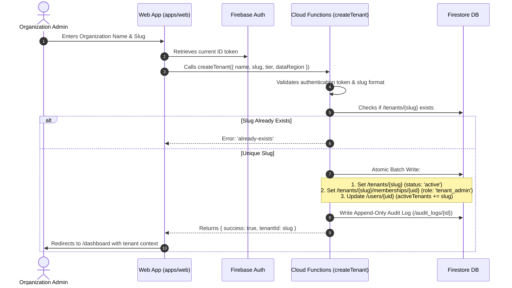
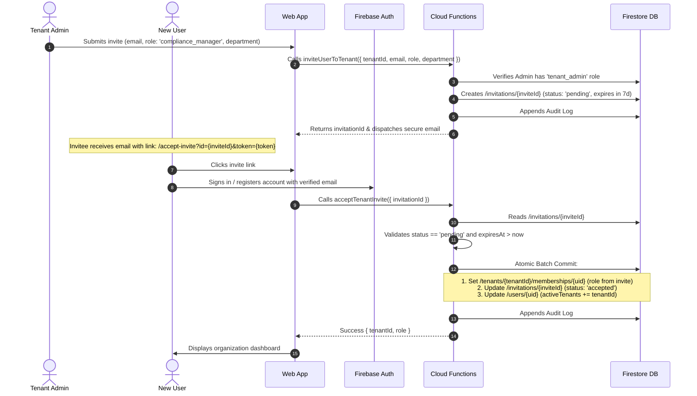
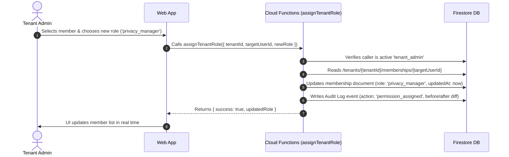
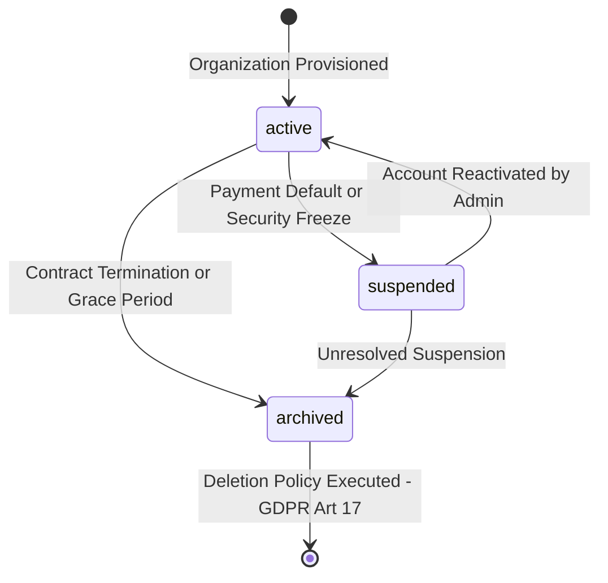

# Tenant Model and Identity Flows Specification: euroGovernance

## 1. Tenant Document Schema

**Firestore Path**: `/tenants/{tenantId}`

```typescript
interface TenantDocument {
  id: string; // Tenant unique identifier (e.g. slug 'acme-corp' or UUID 'tnt_01HQ7XZ...')
  name: string; // Legal or display organization name
  slug: string; // Normalized unique URL subdomain identifier
  tier: 'starter' | 'professional' | 'enterprise';
  status: 'active' | 'suspended' | 'archived';
  primaryContactEmail: string;
  dataRegion: 'europe-west3' | 'europe-west1';
  enabledFrameworks: Array<'gdpr' | 'eu_ai_act' | 'eu_data_act' | 'iso_27001' | 'iso_42001'>;
  settings: {
    mfaEnforced: boolean;
    sessionTimeoutMinutes: number;
    allowedEmailDomains: string[]; // Whitelist for automated domain matching
    dpoContact: {
      name: string;
      email: string;
      phone: string | null;
    } | null;
    cisoContact: {
      name: string;
      email: string;
      phone: string | null;
    } | null;
  };
  subscription: {
    planId: string;
    maxSeats: number;
    currentSeatsCount: number;
    expiresAt: string | null;
  };
  createdAt: string; // ISO 8601 UTC
  updatedAt: string; // ISO 8601 UTC
  createdBy: string; // User ID of creator
  updatedBy: string; // User ID of last updater
}
```

---

## 2. Membership Document Schema

**Firestore Path**: `/tenants/{tenantId}/memberships/{userId}`

```typescript
interface TenantMembershipDocument {
  id: string; // Matches Firebase Auth UID
  tenantId: string; // Parent organization ID
  userId: string; // Firebase Auth UID
  role:
    | 'platform_admin'
    | 'tenant_admin'
    | 'compliance_manager'
    | 'privacy_manager'
    | 'ai_governance_manager'
    | 'security_manager'
    | 'auditor'
    | 'contributor'
    | 'viewer'
    | 'approver';
  status: 'active' | 'inactive' | 'suspended';
  department: string; // e.g. 'Legal & Compliance', 'Engineering', 'Security'
  title: string; // e.g. 'Lead DPO', 'Chief Information Security Officer'
  invitedBy: string; // User ID who initiated the invite
  joinedAt: string; // ISO 8601 UTC
  updatedAt: string; // ISO 8601 UTC
  createdBy: string;
  updatedBy: string;
}
```

---

## 3. User Profile Schema

**Firestore Path**: `/users/{userId}`

```typescript
interface UserProfileDocument {
  id: string; // Firebase Auth UID
  email: string;
  displayName: string;
  avatarUrl: string | null;
  defaultTenantId: string | null; // Primary tenant to open on initial dashboard load
  isPlatformAdmin: boolean; // Flag for global platform administration
  mfaEnabled: boolean;
  activeTenants: Array<{
    tenantId: string;
    tenantName: string;
    role: string;
  }>;
  preferences: {
    emailNotifications: boolean;
    digestFrequency: 'instant' | 'daily' | 'weekly';
    theme: 'light' | 'dark' | 'system';
  };
  lastLoginAt: string;
  createdAt: string;
  updatedAt: string;
}
```

---

## 4. Invitation Model

**Firestore Path**: `/invitations/{invitationId}`

```typescript
interface TenantInvitationDocument {
  id: string; // Cryptographic secure UUID or Firestore auto-ID
  tenantId: string; // Target organization ID
  tenantName: string; // Display name snapshot
  email: string; // Lowercased normalized invitee email
  role:
    | 'tenant_admin'
    | 'compliance_manager'
    | 'privacy_manager'
    | 'ai_governance_manager'
    | 'security_manager'
    | 'auditor'
    | 'contributor'
    | 'viewer'
    | 'approver';
  department: string;
  status: 'pending' | 'accepted' | 'expired' | 'revoked';
  tokenHash: string; // SHA-256 hash of the one-time invitation secret
  expiresAt: string; // ISO 8601 UTC (defaults to +7 days from creation)
  createdAt: string;
  createdBy: string; // User ID of tenant_admin
}
```

---

## 5. Tenant Creation Flow



---

## 6. User Invitation and Acceptance Flow



---

## 7. Role Assignment Flow



---

## 8. Tenant Suspension and Archive Flow



1. **Suspension Mechanics**:
   - Status updated to `suspended` via `suspendTenant`.
   - Security Rules immediately deny read/write operations because `getMembership(tenantId).data.status == 'active'` condition fails.
   - Users viewing the portal see an account suspended interstitial.
2. **Archival Mechanics**:
   - Status updated to `archived`.
   - Data is preserved in cold storage for 90 days for statutory retention compliance before permanent purge.

---

## 9. Tenant Deletion Policy (GDPR Art. 17 Right to Erasure)

1. **Grace Period**: Tenant deletion enters a mandatory 30-day soft-delete holding period.
2. **Hard Deletion Cascade**:
   - Automated server-side recursive deletion job deletes all subcollections under `/tenants/{tenantId}/` in 500-document batches using the Firebase Admin SDK.
   - Deletes all uploaded evidence and compliance export blobs under `gs://eurogovernance-evidence/tenants/{tenantId}/`.
   - Removes `tenantId` references from `/users/{userId}` active tenant lists.
3. **Audit Immutability Exception**: A cryptographic hash summary of the deletion certificate is preserved in a secure archive for platform liability defense.

---

## 10. Required Cloud Functions for Tenancy

| Function Name | Trigger | Required Caller Role | Core Responsibility |
| :--- | :--- | :--- | :--- |
| `createTenant` | HTTPS Callable | Authenticated User | Atomically provisions tenant and initial admin membership. |
| `inviteUserToTenant` | HTTPS Callable | `tenant_admin` | Validates seat quota, generates token, and saves invitation. |
| `acceptTenantInvite` | HTTPS Callable | Authenticated User | Validates invitation token and activates membership. |
| `revokeTenantInvite` | HTTPS Callable | `tenant_admin` | Cancels a pending invitation before acceptance. |
| `assignTenantRole` | HTTPS Callable | `tenant_admin` | Promotes/demotes user roles and records audit trails. |
| `suspendTenant` | HTTPS Callable | `platform_admin` / `tenant_admin` | Freezes all tenant subcollection read/write activity. |
| `archiveTenant` | HTTPS Callable | `tenant_admin` | Transitions organization to cold archived state. |
| `purgeDeletedTenants`| Scheduled (Weekly) | Cloud Scheduler | Executes recursive batch deletion on expired archived tenants. |

---

## 11. Security Assumptions

1. **No Cross-Tenant Read/Write**: Every client read must specify `/tenants/{tenantId}/...` explicitly.
2. **Direct Membership Writes Prohibited**: Client cannot write to `/tenants/{tenantId}/memberships`. All membership changes occur via Cloud Functions with Admin SDK privileges.
3. **Multi-Tenancy Isolation**: A user belonging to multiple tenants must select an active tenant context in the UI, and each query must target that tenant's path.

---

## 12. Acceptance Criteria

- [x] Users can belong to multiple tenants simultaneously via distinct `/tenants/{tenantId}/memberships/{userId}` records.
- [x] Membership document specifies `id`, `tenantId`, `userId`, `role`, `status`, `department`, `title`, `joinedAt`, `updatedAt`.
- [x] Tenant creation is atomic across tenant document, admin membership, and audit log.
- [x] Direct client creation or mutation of `/invitations` and `/memberships` is blocked by Firestore Security Rules.
- [x] Role re-assignment emits a non-repudiable `permission_assigned` audit event capturing prior and new roles.
- [x] Deletion policy complies with GDPR Article 17 with recursive batch purging and storage cleanup.
