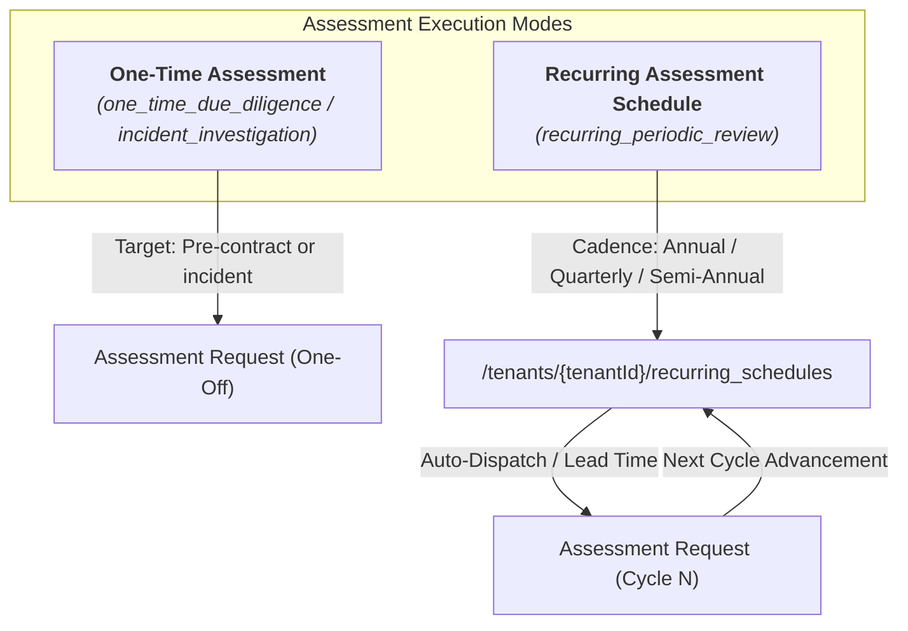
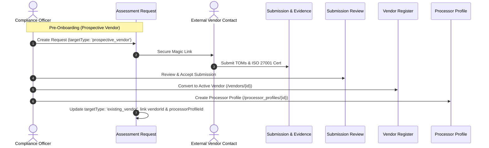
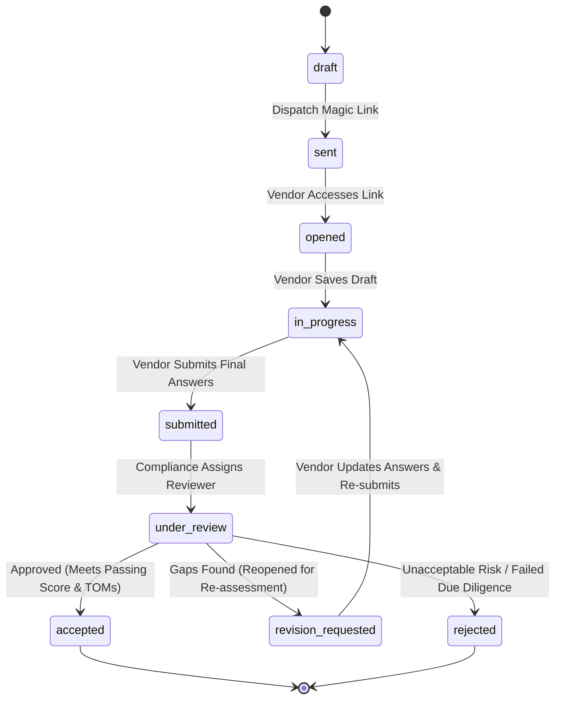
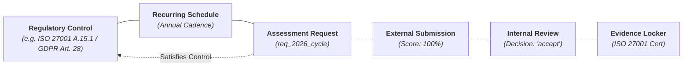

# Third-Party Questionnaire Assessment & Vendor Due Diligence Subsystem

The **Third-Party Assessment Subsystem** provides end-to-end management of vendor security evaluations, GDPR Article 28 data processor due diligence, NIS2 supply chain screening, and ISO 27001 / ISO 42001 supplier assurance.

This document details the architectural design, data models, security boundaries, review workflows, risk derivation engines, control assurance integrations, and reporting capabilities implemented in euroGovernance.

---

## 🗺️ Obsidian Knowledge Graph Navigation

- **Upstream Hub**: [[INDEX|Knowledge Hub Index]]
- **Related Governance Modules**:
  - [[PROCESSOR_AND_TRANSFER_MANAGEMENT|Data Processor & Transfer Governance (GDPR Art. 28)]]
  - [[PROCESSOR_CERTIFICATIONS_AND_ASSURANCE|Processor Certifications & Assurance]]
  - [[EVIDENCE_MODULE_DESIGN|Evidence Repository & Integrity Locker]]
  - [[FRAMEWORK_AND_CONTROLS_ENGINE|Master Framework & Controls Engine]]
- **Infrastructure & Security**:
  - [[SECURITY_RULES_AND_CLOUD_FUNCTIONS_ARCHITECTURE|Security Rules & Privileged Functions]]
  - [[AUDIT_LOG_DESIGN|Immutable Audit Logging]]
  - [[DASHBOARD_AND_REPORTING_ARCHITECTURE|Dashboard & Export Jobs Pipeline]]
  - [[NOTIFICATIONS_AND_SCHEDULED_JOBS_DESIGN|Notifications & Scheduled Deadline Checkers]]

---

## 1. One-Time vs. Recurring Assessments

The subsystem supports both ad-hoc screening and structured, periodic compliance re-evaluations:

### One-Time Assessments (`'one_time_due_diligence'`, `'incident_investigation'`, `'custom_deep_dive'`)
- Used for pre-contractual due diligence of prospective suppliers, merger/acquisition reviews, or deep-dive investigations following a security incident.
- Operates independently without requiring a recurring schedule.
- Immutable snapshot of answers and evidence preserved upon completion.

### Recurring Assessments (`'recurring_periodic_review'`)
- Managed via `/tenants/{tenantId}/recurring_schedules/{scheduleId}`.
- Supports standardized cadences:
  - `'annual'` (every 12 months — default for GDPR Article 28 / ISO 27001 vendor reviews)
  - `'semi_annual'` (every 6 months)
  - `'quarterly'` (every 3 months for critical processors)
  - `'biennial'` (every 2 years for low-risk tier vendors)
- Configurable `leadTimeDays` (e.g. 30 days before due date) triggering automatic dispatch notifications.
- When a cycle completes, the next cycle is generated (`generateNextRecurringAssessmentCycle`), advancing `nextScheduledDispatchDate` and `nextAssessmentDueDate` while preserving complete audit history of all prior cycles.

---

## 2. Potential Processors vs. Existing Processors Support

The system handles both pre-onboarding vendor screening and active processor compliance:

### Prospective Vendors (`targetType: 'prospective_vendor'`)
- Enables evaluating vendors before adding them to official procurement or processor registers.
- Requires only commercial contact information (`prospectCompanyName`, `prospectWebsite`, `respondent.email`).
- Does not pollute active GDPR Article 30 ROPA or vendor registries until approved.

### Vendor Conversion & Processor Profile Linkage (`linkAssessmentToVendorOrProcessor`)
- Upon acceptance of a prospective submission, the compliance officer can convert the prospect into an official vendor record and link an active `ProcessorProfile`.
- The `Vendor` and `ProcessorProfile` records are updated with:
  - `latestAssessmentRequestId`
  - `latestAssessmentSubmissionId`
  - `latestAssessmentScorePercent`
  - `latestAssessmentDate`
- Full historical preservation: subsequent assessments update the latest pointers while retaining historical request records in `/assessment_requests`.

---

## 3. Questionnaire Template Model

Questionnaire templates reside at `/tenants/{tenantId}/questionnaire_templates/{templateId}` and define dynamic, weighted questionnaires:

### Template Structure (`QuestionnaireTemplate`)
- **Metadata**: `code`, `title`, `description`, `version`, `category`, `status` (`'draft'`, `'published'`, `'archived'`).
- **Target Scope**: `'subprocessor' | 'processor' | 'vendor' | 'ai_system' | 'custom' | 'any'`.
- **Scoring Thresholds**: `passingScoreThreshold` (e.g. 75%), `defaultValidDays` (e.g. 365), `defaultRecurrenceCadence` (`'annual'`).
- **Dynamic Sections (`DynamicQuestionnaireSection`)**:
  - Contains section `code`, `title`, `weight` (contribution to overall score), and `passingThresholdPercent`.
- **Questions (`DynamicQuestionnaireQuestion` / `QuestionnaireQuestion`)**:
  - `questionType`: `'yes_no'`, `'single_select'`, `'multi_select'`, `'text_freeform'`, `'numeric'`, `'date'`, `'file_upload_only'`.
  - `options`: Selectable choices with individual point values (`score`), risk trigger flags (`isRiskTrigger`, `riskCode`, `riskSeverity`, `riskRationale`).
  - `requiresEvidence`: Boolean requiring supporting file upload (e.g. SOC 2 report, ISO certificate).
  - `statutoryCitations`: Associated regulatory citations (e.g. `['GDPR Art. 28(3)(c)', 'ISO 27001 A.15.1']`).

### Immutable Template Snapshots
When an assessment request is dispatched, an exact copy of the template is committed into `request.templateSnapshot`. Subsequent edits to the master template do not mutate or invalidate in-flight or historical assessments.

---

## 4. Secure External Access Model

External respondents complete questionnaires without creating full tenant user accounts:

```mermaid
graph LR
    subgraph TokenSecurity ["Cryptographic Token Model"]
        RAW["Raw 256-bit Secret<br><i>(Held only by vendor via magic URL)</i>"]
        SHA["SHA-256 Hash<br><i>(Stored in DB)</i>"]
        DB["/tenants/{tenantId}/assessment_access_tokens"]
    end

    RAW -->|"One-Way Hash"| SHA
    SHA -->|"Persisted"| DB

    subgraph ValidationGates ["Cloud Function Validation Gates"]
        GATE1["1. Token Hash Match"]
        GATE2["2. Expiration Date Check"]
        GATE3["3. Status Check (not revoked/superseded)"]
        GATE4["4. Usage Counter Check (maxUses)"]
        GATE5["5. Optional 2FA Email Code Verification"]
    end

    DB --> ValidationGates
    ValidationGates -->|"Pass"| SANITIZED["Sanitized Public View<br><i>(Internal controls & risks stripped)</i>"]
```

### Security Architecture Highlights
1. **Zero Raw Token Storage**: Tokens are generated using high-entropy random bytes (`crypto.randomBytes(32).toString('hex')`). Only the cryptographic SHA-256 hash is persisted in Firestore (`tokenHash`).
2. **Backend-Mediated Execution**: Unauthenticated respondents have **zero direct read/write access to Firestore**. All interactions route through HTTPS Cloud Functions (`validateAssessmentAccessToken`, `savePublicAssessmentDraft`, `submitPublicAssessment`).
3. **Multi-Factor Email Verification**: Optional 2FA (`requireEmailVerificationCode`) requiring a 6-digit time-limited OTP sent to the authorized respondent's inbox before exposing questions.
4. **Immediate Revocation**: Compliance teams can instantly revoke or regenerate links (`revokeAssessmentAccessToken`), immediately invalidating prior token hashes.
5. **Least-Privilege Sanitized Public View (`createSanitizedPublicAssessmentView`)**:
   - External respondents only receive question prompts, guidance notes, and their own draft answers.
   - Internal metadata (such as internal reviewer notes, linked control IDs, risk register codes, and system asset IDs) is stripped before delivery.

---

## 5. Review & Outcome Workflow

Submissions undergo rigorous internal review before becoming accepted evidence:

### Review Outcomes (`SubmissionReviewDecision`)
- **`accept`**: Submission meets security and compliance thresholds. Assessment status becomes `'accepted'`, enabling linkage to controls, vendors, and processors.
- **`reject`**: Vendor failed due diligence or critical security requirements.
- **`request_revision`**: Non-conformities or missing documentation identified. The questionnaire is reopened for the respondent with specific instructions.
- **`needs_follow_up`**: Review is held pending vendor interview, contractual negotiations, or remediation milestones.

---

## 6. Evidence and Risk Integration

The assessment module integrates seamlessly with the tenant evidence repository and risk register:

### Evidence Ingestion & Provenance
- Uploaded supporting documents (e.g. ISO 27001 certificates, SOC 2 reports, penetration test summaries) are committed to `/tenants/{tenantId}/evidence/{evidenceId}`.
- Tagged with `sourceType: 'external_questionnaire_submission'` and `isExternalSubmissionArtifact: true`.
- Stored with immutable SHA-256 content hashes, MIME types, and source assessment references (`sourceAssessmentRequestId`, `sourceSubmissionId`).

### Explainable Risk Derivation Engine (`analyzeSubmissionRiskPosture`)
- Computes deterministic scores based on question option weights and passing thresholds.
- **Critical Risk Triggers**: Critical answers (e.g. plaintext storage of customer data, missing DPA) trigger explicit `TriggeredRiskFlag` entries with severity ratings (`critical`, `high`, `medium`, `low`).
- **Transparent Factor Explanations**: Generates human-readable breakdowns explaining exact scoring deductions and statutory citations.
- **Risk Register Sync (`syncAssessmentRisksToRegister`)**: Automatically creates or updates entries in `/tenants/{tenantId}/risks` with deduplication keys, preventing duplicate risk register entries across repeated cycles.

---

## 7. Control Satisfaction Linkage

Accepted third-party assessments serve as direct recurring audit evidence satisfying statutory and framework controls (e.g. GDPR Article 28(3), ISO 27001 A.15.1, NIS2 Supply Chain Security):

### Deterministic Control Satisfaction Evaluator (`evaluateControlAssessmentSatisfaction`)
- Evaluates whether linked assessments satisfy a control based on:
  1. **Review Decision**: Must be in `'accepted'` status.
  2. **Passing Score**: Final score must meet or exceed passing threshold.
  3. **Validity Window**: Completed within `maxValidityDays` (default 365 days).
- **Status Results**:
  - `satisfied`: Valid accepted assessment on file.
  - `expired`: Previously accepted assessment exceeded validity window.
  - `non_compliant`: Assessment rejected or below passing threshold.
  - `pending_review`: Assessment submitted but awaiting internal sign-off.
  - `in_progress`: Assessment dispatched but not yet submitted.
  - `unsatisfied`: No valid assessment found.

---

## 8. Export & Reporting Support

Integrated into the standard `export_jobs` pipeline, supporting 6 specialized reporting outputs:

| Export Type | Description & Output Scope |
|---|---|
| **`third_party_assessment_inventory`** | Comprehensive catalog of all tenant assessment requests, statuses, risk ratings, and reviewers. |
| **`latest_accepted_assessment_register`** | Distinct latest accepted assessment per vendor/processor with validity remaining countdowns. |
| **`overdue_recurring_assessments_report`** | Actionable list of lapsed questionnaire deadlines and overdue recurring schedules. |
| **`assessment_control_assurance_report`** | Control-to-assessment traceability matrix demonstrating control satisfaction. |
| **`assessment_open_follow_ups_report`** | Filtered list of assessments requiring revision, rejected, or carrying high/critical risks. |
| **`prospect_assessments_unlinked_report`** | Screening assessments for prospective vendors not yet converted into onboarded records. |

### Materialized Summary Metrics
Executive widgets and compliance dashboard KPIs are materialized server-side into `/tenants/{tenantId}/summary_metrics/third_party_assessments` via `materializeThirdPartyAssessmentSummaryMetrics` for instant $O(1)$ dashboard rendering.

---

## 9. Security Considerations & Known Limitations

### Security Enforcement
1. **Firestore Security Rules**:
   - All client reads to `/assessment_access_tokens` and `/summary_metrics` are restricted to authenticated tenant members. Direct client writes are blocked (`allow write: if false`).
   - Unauthenticated access to tenant collections is strictly denied.
2. **Anti-Enumeration Protections**:
   - Token lookup endpoints return uniform `permission-denied` errors for missing token IDs, invalid hashes, or expired links, preventing timing and existence enumeration attacks.
3. **Audit Trail Integrity**:
   - Token generation, vendor draft saves, external submissions, review decisions, and revocations are appended to `/tenants/{tenantId}/audit_logs` with masked IP addresses and timestamps.

### Known Limitations
- **Offline Submissions**: External questionnaires require active internet connectivity to communicate with backend Cloud Functions; offline caching is not supported for public respondents.
- **Email Delivery**: Automated email dispatch depends on configured external SMTP / transactional email providers (e.g. SendGrid, Postmark).

---

## 🔗 Related Architectural Documents

- [[PROCESSOR_AND_TRANSFER_MANAGEMENT|Data Processor & Transfer Governance]]
- [[PROCESSOR_CERTIFICATIONS_AND_ASSURANCE|Processor Certifications & Assurance]]
- [[EVIDENCE_MODULE_DESIGN|Evidence Module Design & Repository]]
- [[FRAMEWORK_AND_CONTROLS_ENGINE|Framework & Unified Controls Engine]]
- [[DASHBOARD_AND_REPORTING_ARCHITECTURE|Dashboard & Reporting Architecture]]
- [[NOTIFICATIONS_AND_SCHEDULED_JOBS_DESIGN|Notifications & Scheduled Jobs Design]]
- [[SECURITY_RULES_AND_CLOUD_FUNCTIONS_ARCHITECTURE|Security Rules & Privileged Functions]]
