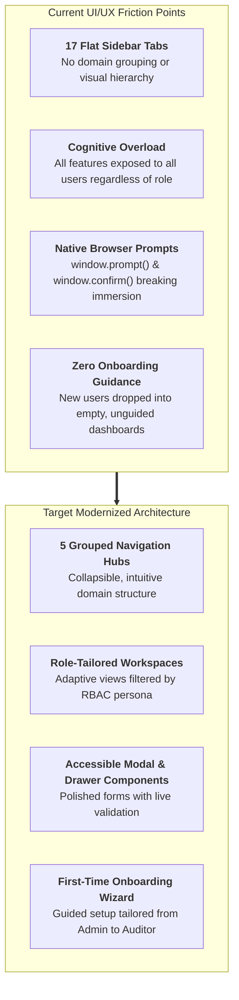
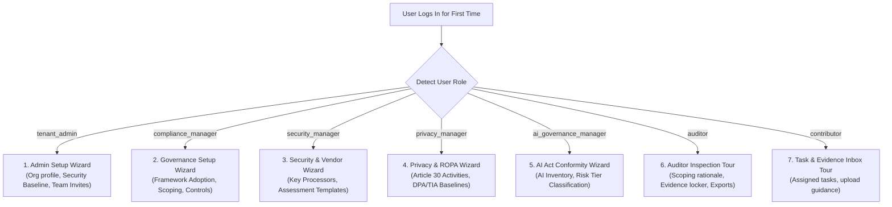
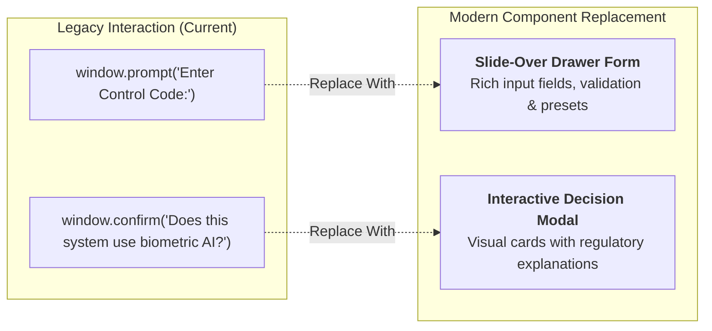
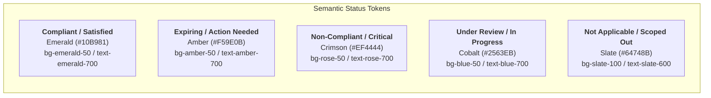

# euroGovernance — UI/UX Improvement Plan & Persona Onboarding Architecture
**Date**: 2026-08-15  
**Version**: `0.1.0`  
**Scope**: Frontend Architecture (`apps/web`), Next.js 14 Navigation, Information Architecture (IA), Persona-Based First-Time Onboarding, and Accessible Component System.

---

## 🗺️ Obsidian Knowledge Graph Navigation
- **Upstream Hub**: [[INDEX|Knowledge Hub Index]]
- **Related Governance & Role Specifications**:
  - [[ROLES_AND_PERMISSIONS|Role-Based Access Control (RBAC) Specification]]
  - [[TENANT_MODEL_AND_IDENTITY_FLOWS|Tenant Model & Identity Provisioning Flows]]
  - [[FRAMEWORK_ADOPTION_SCOPING_AND_HARMONIZATION|Dynamic Scoping & Control Harmonization]]
  - [[THIRD_PARTY_ASSESSMENT_AND_QUESTIONNAIRE_MODULE|Third-Party Questionnaire Assessment Subsystem]]
  - [[ai Guide 2026-08-15|AI Agent Platform & Engineering Guide]]

---

## 🧭 1. Executive Problem Diagnosis: Why the Current UI Feels Overwhelming

While `euroGovernance` possesses an **enterprise-grade, mathematically verified backend** (74 passing test suites, strict multi-tenant isolation, and immutable audit trails), the current frontend user experience suffers from **severe cognitive overload, visual fragmentation, and zero guided onboarding**.



### Key UI/UX Friction Drivers:
1. **Flat, Unstructured Navigation (17 Simultaneous Sidebar Tabs)**:
   - Sidebar displays 17 flat buttons with no grouping.
   - **6 separate tabs** exist for vendor functions alone (`processor_inventory`, `processor_assurance_inventory`, `processor_assessments`, `processor_hub`, `processor_transfers`, `certifications`).
   - **4 separate tabs** exist for frameworks/controls (`frameworks`, `coverage_dashboard`, `applicability_review`, `controls`).
2. **Persona Blindness**:
   - An **Auditor** (who only needs to inspect evidence and read scoped controls) is exposed to the exact same noisy sidebar as a **Tenant Admin**.
   - A **Contributor** (who only needs to upload an assigned policy or cert) is overwhelmed with AI Act risk classification matrices and TIA transfer forms.
3. **Disruptive Browser Native Dialogs**:
   - Core actions (Adopting frameworks, creating controls, inviting colleagues, evidence approval sign-offs, AI classification) trigger ugly browser `window.prompt()` and `window.confirm()` popups instead of modern, accessible modal dialogs or slide-over drawers.
4. **"Empty Canvas" Syndrome (No Onboarding Guidance)**:
   - When a new tenant or user signs in for the first time, they are dropped into an empty overview dashboard with zero guidance on where to start or what to do next.

---

## 🏛️ 2. Proposed Information Architecture: 17 Tabs $\to$ 5 Logical Hubs

We consolidate the 17 flat tabs into **5 logical, collapsible navigation clusters**, with global quick-search and contextual breadcrumbs:

```
┌──────────────────────────────────────────────────────────────────────────────┐
│  euroGovernance  [EuroCorp Technologies SE ▾]  [🔍 Search / Cmd+K] [👤 Role] │
├────────────────────────────┬─────────────────────────────────────────────────┤
│ 📊 EXECUTIVE & POSTURE     │ Breadcrumb: Frameworks & Controls > Controls   │
│   • Executive Overview     ├─────────────────────────────────────────────────┤
│   • Framework Coverage     │                                                 │
│                            │                                                 │
│ 📐 FRAMEWORKS & CONTROLS   │               MAIN WORKSPACE AREA               │
│   • Framework Library      │                                                 │
│   • Scoping & Applicability│                                                 │
│   • Unified Controls Engine│                                                 │
│                            │                                                 │
│ 🛡️ VENDORS & THIRD PARTIES │                                                 │
│   • Processor Hub & Roster │                                                 │
│   • Due Diligence & Portals│                                                 │
│   • Transfer Impact (TIAs) │                                                 │
│   • Assurance & Certs      │                                                 │
│                            │                                                 │
│ ⚖️ STATUTORY REGISTERS     │                                                 │
│   • GDPR & Privacy (ROPA)  │                                                 │
│   • EU AI Act Register     │                                                 │
│   • EU Data Act Sharing    │                                                 │
│                            │                                                 │
│ ⚙️ OPERATIONS & AUDIT      │                                                 │
│   • Evidence Repository    │                                                 │
│   • Risks & Tasks Register │                                                 │
│   • Compliance Exports     │                                                 │
│   • Team & RBAC / Audit    │                                                 │
└────────────────────────────┴─────────────────────────────────────────────────┘
```

### Structural Consolidation Map:

| New Consolidated Hub | Merged Sub-Tabs | Target User Goal |
|---|---|---|
| **📊 Executive & Posture** | `overview`, `coverage_dashboard` | High-level compliance health, framework maturity, gap alerts, and executive reporting. |
| **📐 Frameworks & Controls** | `frameworks` (wizard), `applicability_review`, `controls` | Step-by-step framework adoption, scoping questionnaires, and unified control inventory. |
| **🛡️ Vendors & Third Parties** | `processor_hub`, `processor_inventory`, `processor_assessments`, `processor_transfers`, `processor_assurance_inventory`, `certifications` | End-to-end third-party lifecycle: directory, magic link questionnaires, TIAs, and SOC/ISO certificates. |
| **⚖️ Statutory Registers** | `gdpr` (ROPA, DPIA, Breaches), `ai_systems`, `data_act` | Specialized statutory obligation registers and Article-specific workflows. |
| **⚙️ Operations & Audit** | `evidence`, `risks_tasks`, `exports`, `members`, `audit_logs` | Operational evidence lockers, four-eyes approvals, team permissions, and immutable audit trails. |

---

## 🚀 3. Persona-Based First-Time User Onboarding Flows

To transform the initial user experience from overwhelming to guided, the platform implements a **Role-Specific Onboarding Flow** on first login.



---

### 👑 Flow 1: Tenant Admin (`tenant_admin`)
**Primary Goal**: Establish organization baseline, configure security guardrails, and delegate team responsibilities.

```
┌─────────────────────────────────────────────────────────────────────────────┐
│  🎉 Welcome to euroGovernance, Alex! Let's set up your organization.         │
│  Progress: [████████░░░░░░░░░░░░] Step 2 of 4                                │
├─────────────────────────────────────────────────────────────────────────────┤
│                                                                             │
│  Step 1: Organization Baseline                                              │
│  ✓ Legal Entity: EuroCorp Technologies SE (Frankfurt Region)                │
│                                                                             │
│  Step 2: Core Regulatory Scope (Select Applicable Frameworks)               │
│  [✓] GDPR (Data Protection)        [✓] EU AI Act (AI Governance)           │
│  [✓] ISO/IEC 27001:2022 (Security) [ ] NIS2 Directive (Critical Supply)    │
│                                                                             │
│  Step 3: Invite Your Compliance & Security Leads                            │
│  ┌──────────────────────────────┬───────────────────────────────┐           │
│  │ Email Address                │ Role                          │           │
│  ├──────────────────────────────┼───────────────────────────────┤           │
│  │ sarah.dpo@eurocorp.de        │ Privacy Manager (DPO)         │           │
│  │ marcus.ciso@eurocorp.de      │ Security Manager              │           │
│  │ elena.ai@eurocorp.de         │ AI Governance Manager         │           │
│  └──────────────────────────────┴───────────────────────────────┘           │
│  [ + Add Another Colleague ]                                                │
│                                                                             │
│  Step 4: Security & Audit Policy                                            │
│  [✓] Enforce Four-Eyes Evidence Approval                                    │
│  [✓] Enforce Automated 30-Day Vendor Re-assessment Reminders                │
│                                                                             │
├─────────────────────────────────────────────────────────────────────────────┤
│  [ Back ]                                            [ Complete Setup ➔ ]   │
└─────────────────────────────────────────────────────────────────────────────┘
```

---

### 🛡️ Flow 2: Compliance & Security Manager (`compliance_manager`, `security_manager`)
**Primary Goal**: Complete dynamic scoping questionnaire, instantiate unified controls, and initiate vendor due diligence.

```
┌─────────────────────────────────────────────────────────────────────────────┐
│  🚀 Governance Initialization Checklist                                     │
│  3 steps remaining to achieve initial compliance baseline                   │
├─────────────────────────────────────────────────────────────────────────────┤
│                                                                             │
│  1. 📐 Run Scoping & Harmonization Wizard                                   │
│     Answer 8 operational questions to automatically filter non-applicable   │
│     controls across GDPR, ISO 27001, and NIS2.                              │
│     [ Start Scoping Wizard ➔ ]                                              │
│                                                                             │
│  2. 🏢 Import Critical Processors & Cloud Providers                         │
│     Import active data hosting, analytics, and AI infrastructure providers. │
│     [ Import Processors / CSV ➔ ]                                           │
│                                                                             │
│  3. 📝 Send First Due Diligence Questionnaire                               │
│     Select a pre-built GDPR Art. 28 template and generate a magic link.     │
│     [ Dispatch Assessment ➔ ]                                               │
│                                                                             │
└─────────────────────────────────────────────────────────────────────────────┘
```

---

### 🇪🇺 Flow 3: Privacy Manager / DPO (`privacy_manager`)
**Primary Goal**: Inventory processing activities (ROPA Art. 30), map cross-border transfers (TIAs), and verify DPA execution.

- **Step 1 (ROPA Baseline)**: Interactive wizard to register high-volume processing activities (e.g. Customer CRM, HR Payroll, Marketing Analytics).
- **Step 2 (Cross-Border Transfer Map)**: Visual transfer map highlighting non-EEA data flows (e.g. US cloud hosting) requiring Standard Contractual Clauses (SCCs) and Schrems II TIAs.
- **Step 3 (DPA & Subprocessor Verification)**: Checklist of active processors lacking executed Article 28 DPAs.

---

### 🤖 Flow 4: AI Governance Manager (`ai_governance_manager`)
**Primary Goal**: Inventory organizational AI systems and determine EU AI Act risk tiers.

- **Step 1 (AI System Registration)**: Register internal/vendor AI models (e.g., Customer Support LLM, Biometric ID, Resume Screener).
- **Step 2 (Risk Classification Engine)**: Automated questionnaire evaluating Prohibited Practices (Art. 5), High-Risk Annex III classifications, and Transparency obligations (Art. 50).
- **Step 3 (Annex IV Technical Documentation Tracker)**: Automatically creates compliance task checklist for High-Risk models prior to CE marking.

---

### 🔍 Flow 5: External / Internal Auditor (`auditor`)
**Primary Goal**: Read-only verification of scoped controls, evidence inspection, and audit package exports.

```
┌─────────────────────────────────────────────────────────────────────────────┐
│  🔍 Auditor Review Workspace — Read-Only Assurance Mode                     │
├─────────────────────────────────────────────────────────────────────────────┤
│                                                                             │
│  • Scoping & Applicability Rationale:                                       │
│    Review deterministic exclusion notes and regulatory citations.           │
│                                                                             │
│  • Four-Eyes Verified Evidence Locker:                                      │
│    Filter evidence by framework control (e.g. ISO 27001 A.12 / GDPR Art 32).│
│                                                                             │
│  • Comprehensive Audit Package Export:                                      │
│    Download pre-compiled ZIP packages containing hashed evidence and logs.  │
│    [ Generate Full Audit Dossier (ZIP) ➔ ]                                  │
│                                                                             │
└─────────────────────────────────────────────────────────────────────────────┘
```

---

### ✍️ Flow 6: Contributor / Task Assignee (`contributor`)
**Primary Goal**: Upload requested evidence, answer assigned control questionnaires, and track review status.

- **Personalized Action Inbox**: Displays only tasks assigned to the user (e.g. "Upload Q3 Disaster Recovery Test Summary for Control CTL-SEC-04").
- **Drag-and-Drop Uploader**: Direct file drop with SHA-256 preview and metadata tags.
- **Review Feedback**: Clear alert banners when an evidence file is approved or returned with revision instructions.

---

## 🎨 4. Modern Component & Interaction Upgrades



### 1. Slide-Over Drawers (Sheet Components)
- Replace `window.prompt()` for creating controls, inviting members, and adding processors.
- Slide-over panel allows viewing background context while filling out forms.

### 2. Command Palette (`Cmd + K` / `Ctrl + K`)
- Instant keyboard navigation across any control, vendor, processor, or evidence artifact.
- Jump directly to actions (e.g. `> Adopt ISO 27001`, `> Send Assessment to CloudAI`, `> Export ROPA`).

### 3. Global Status & Notification Center
- Slide-out notification drawer replacing full-screen alert banners.
- Live badge counters for overdue assessments and pending four-eyes approvals.

---

## 📊 5. BI & Analytics GRC Style Guide (Drata / Vanta Benchmark)

To match the authoritative, high-density, and analytics-driven user experience of industry-leading compliance platforms like **Drata** and **Vanta**, `euroGovernance` adopts a specialized **Sovereign European BI & Analytics Design System**.

```
┌─────────────────────────────────────────────────────────────────────────────────────────────┐
│ 🛡️ GDPR Article 28 Assurance Posture                                 [ 30 Days ▾ ] [ Export ]│
├───────────────────────────────┬───────────────────────────────┬─────────────────────────────┤
│ TOTAL PROCESSORS              │ COMPLIANT & AUDIT READY       │ OPEN GAPS & OVERDUE         │
│ 350                           │ 328 (93.7%)                   │ 22 (6.3%)                   │
│ ▲ +12 onboarded this cycle    │ [███████████████████░░]       │ ⚠️ 4 High-Risk Unreviewed   │
├───────────────────────────────┴───────────────────────────────┴─────────────────────────────┤
│ PROCESSOR ASSURANCE INVENTORY                                  [ 🔍 Search ] [ Filter ▾ ]   │
├────────┬─────────────────────────┬──────────────┬──────────────┬────────────┬───────────────┤
│ TIER   │ PROCESSOR / VENDOR      │ ART. 28 DPA  │ TIA STATUS   │ SOC2 / ISO │ AUDIT STATUS  │
├────────┼─────────────────────────┼──────────────┼──────────────┼────────────┼───────────────┤
│ Tier 1 │ AWS Europe (Frankfurt)  │ [✓] Signed   │ [✓] Adequacy │ [✓] Valid  │ ● Compliant   │
│ Tier 1 │ CloudAI Solutions BV    │ [✓] Signed   │ [✓] SCCs     │ [✓] Valid  │ ● Compliant   │
│ Tier 2 │ Global Messaging Corp   │ [!] Expired  │ [!] Pending  │ [✕] Missing│ ● Non-Compliant│
└────────┴─────────────────────────┴──────────────┴──────────────┴────────────┴───────────────┘
```

---

### 5.1 Color Palette & Semantic Compliance Tokens

The color palette prioritizes high contrast, legibility, and standardized European regulatory status signifiers:



#### CSS Token Architecture (Light / Dark Mode):

```css
:root {
  /* Surface & Elevation */
  --bg-canvas: #f8fafc;        /* Slate-50: Main application canvas */
  --bg-surface: #ffffff;       /* Pure white: Cards, tables & dialogs */
  --bg-subtle: #f1f5f9;        /* Slate-100: Table headers & subtle fills */
  --border-default: #e2e8f0;   /* Slate-200: Crisp 1px card/table borders */
  --border-muted: #cbd5e1;     /* Slate-300: Active input borders */

  /* Typography */
  --text-primary: #0f172a;     /* Slate-900: High-contrast headings & primary values */
  --text-secondary: #475569;   /* Slate-600: Descriptions & secondary labels */
  --text-muted: #94a3b8;       /* Slate-400: Timestamps, hints & metadata */

  /* Semantic Compliance Signals */
  --status-compliant-bg: #ecfdf5;  --status-compliant-fg: #047857;  --status-compliant-dot: #10b981;
  --status-warning-bg: #fffbeb;    --status-warning-fg: #b45309;    --status-warning-dot: #f59e0b;
  --status-critical-bg: #fff1f2;   --status-critical-fg: #be123c;   --status-critical-dot: #f43f5e;
  --status-review-bg: #eff6ff;     --status-review-fg: #1d4ed8;     --status-review-dot: #3b82f6;
  --status-neutral-bg: #f8fafc;    --status-neutral-fg: #475569;    --status-neutral-dot: #94a3b8;
}

[data-theme="dark"] {
  --bg-canvas: #0b0f19;        /* Deep midnight canvas */
  --bg-surface: #111827;       /* Slate-900 surface */
  --bg-subtle: #1e293b;        /* Slate-800 table headers */
  --border-default: #1f2937;   /* Slate-800 borders */
  --border-muted: #374151;     /* Slate-700 active borders */

  --text-primary: #f8fafc;
  --text-secondary: #94a3b8;
  --text-muted: #64748b;

  --status-compliant-bg: rgba(16, 185, 129, 0.12);  --status-compliant-fg: #34d399;
  --status-warning-bg: rgba(245, 158, 11, 0.12);    --status-warning-fg: #fbbf24;
  --status-critical-bg: rgba(244, 63, 94, 0.12);    --status-critical-fg: #fb7185;
  --status-review-bg: rgba(59, 130, 246, 0.12);     --status-review-fg: #60a5fa;
  --status-neutral-bg: rgba(100, 116, 139, 0.12);   --status-neutral-fg: #cbd5e1;
}
```

---

### 5.2 Typography & Numeric Data Rules

In compliance analytics, numbers must align with mathematical precision:

1. **Tabular Numeric Figures**:
   - All compliance counts, percentage figures, scores, and dates must enforce `font-variant-numeric: tabular-nums` (`font-feature-settings: "tnum"`).
   - This prevents jitter when numbers update live or when viewing rows in table columns.
2. **Visual Hierarchy for Metric KPIs**:
   - **Overline Category**: `10px`, uppercase, `font-weight: 700`, `letter-spacing: 0.08em`, `color: var(--text-muted)`.
   - **Primary Metric Value**: `32px` (`text-3xl`), `font-weight: 800`, `letter-spacing: -0.03em`, `color: var(--text-primary)`.
   - **Trend & Context Delta**: `12px`, `font-weight: 600`, with positive (`▲ +6%`) or negative (`▼ -2%`) indicator pills.

---

### 5.3 Core Analytics Components (Vanta / Drata Patterns)

#### A. Segmented Readiness & Coverage Bar
Visualizes exact framework satisfaction across four standardized states in a single clean horizontal bar:

```
[████████████████████████████░░░░░░▒▒▒▒▓▓]
 ■ 78% Satisfied (Green)  ■ 12% In Progress (Blue)  ■ 6% Expiring Soon (Amber)  ■ 4% Non-Compliant (Red)
```

#### B. High-Density Compliance Data Table
- **Row Height**: Compact `38px` to `42px` height allowing 15–20 rows per screen without excessive scrolling.
- **Sticky Table Header**: Header remains locked at the top during scroll with subtle bottom border shadow.
- **Micro Status Badges**:
  - Compact rounded pill (`padding: 2px 8px; border-radius: 9999px; font-size: 11px; font-weight: 600;`).
  - Contains a `6px` solid status circle dot with tinted background matching the semantic state.
- **Slide-Over Row Inspection Drawer**:
  - Clicking any table row slides out a detailed inspection drawer (`Sheet`) from the right (showing full questionnaire answers, uploaded evidence hashes, and review history) **without leaving the table or losing active search filters**.

#### C. $5 \times 5$ Risk Heatmap & Matrix Widget
- Interactive matrix mapping organizational risks across Likelihood (1–5) and Impact (1–5).
- Cells display the count of active risks; clicking a cell filters the risk inventory table instantly.

#### D. Metric Stat Card (BI Widget)
```
┌─────────────────────────────────────────────────────────────┐
│ 🛡️ THIRD-PARTY COMPLIANCE RATE                              │
│                                                             │
│ 94.2%  [ +3.8% vs last audit cycle ]                        │
│                                                             │
│ 284 of 301 active data processors have verified Art. 28 DPAs│
│ ─────────────────────────────────────────────────────────── │
│ [██████████████████████████████████████████░░░░] 284/301    │
└─────────────────────────────────────────────────────────────┘
```

---

## 📅 6. UI/UX Modernization Roadmap & Action Plan

| Phase | Milestone | Expected Impact |
|:---:|---|---|
| **Phase 1<br>(Quick Wins & Styling)** | • Adopt Drata/Vanta sovereign color tokens and `tabular-nums` typography.<br>• Group 17 tabs into 5 collapsible sidebar sections.<br>• Replace `window.prompt()` with slide-over drawers and accessible modals.<br>• Add `Cmd + K` search bar in header. | Eliminates immediate visual clutter; replaces disruptive browser popups with modern BI aesthetic. |
| **Phase 2<br>(Onboarding Flows)** | • Implement First-Time Login Persona Detection.<br>• Build the 4-step Admin Setup Wizard and 3-step Manager Checklist.<br>• Add empty-state illustrations with direct "Get Started" call-to-actions. | Drastically reduces time-to-value for new enterprise customers. |
| **Phase 3<br>(Analytics & Polish)** | • Implement Segmented Readiness Bars and $5 \times 5$ Risk Matrix widgets.<br>• Implement SWR/TanStack Query caching for snappy zero-latency page transitions.<br>• Slide-over row inspection drawers on all inventory tables. | Enterprise-grade analytic maturity and fluidity. |

---

## 🔗 Related Knowledge Graph Documents

- [[ROLES_AND_PERMISSIONS|Role-Based Access Control Specification]]
- [[TENANT_MODEL_AND_IDENTITY_FLOWS|Tenant Model & Identity Provisioning Flows]]
- [[FRAMEWORK_ADOPTION_SCOPING_AND_HARMONIZATION|Dynamic Scoping & Control Harmonization]]
- [[THIRD_PARTY_ASSESSMENT_AND_QUESTIONNAIRE_MODULE|Third-Party Questionnaire Assessment Subsystem]]
- [[INDEX|Knowledge Vault Index]]
