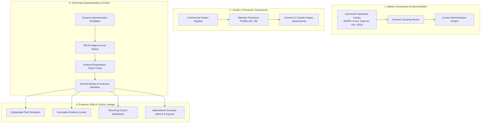

# euroGovernance — Platform Technical Blueprint & AI Agent Operating Guide
**Date**: 2026-08-15  
**Version**: `0.1.0` (Core Multi-Framework GRC, Vendor Governance & Third-Party Assessment Engine)  
**Data Sovereignty Region**: `europe-west3` (Frankfurt, Germany)  
**Repository Architecture**: TypeScript Monorepo (`npm` workspaces) with Firebase Cloud Functions (v2), Next.js 14 App Router, and Firestore Security Rules.

---

## 🗺️ Obsidian Knowledge Graph Navigation
- **Upstream Hub**: [[INDEX|Knowledge Hub Index]]
- **Domain Modules**:
  - [[THIRD_PARTY_ASSESSMENT_AND_QUESTIONNAIRE_MODULE|Third-Party Questionnaire Assessment & Vendor Due Diligence]]
  - [[PROCESSOR_AND_TRANSFER_MANAGEMENT|Data Processor & Transfer Governance (GDPR Art. 28)]]
  - [[PROCESSOR_CERTIFICATIONS_AND_ASSURANCE|Processor Certifications & Assurance]]
  - [[EVIDENCE_MODULE_DESIGN|Evidence Repository & Integrity Locker]]
  - [[FRAMEWORK_AND_CONTROLS_ENGINE|Master Framework & Controls Engine]]
  - [[FRAMEWORK_ADOPTION_SCOPING_AND_HARMONIZATION|Dynamic Scoping & Control Harmonization]]
- **Security & Platform**:
  - [[SECURITY_RULES_AND_CLOUD_FUNCTIONS_ARCHITECTURE|Security Rules & Privileged Functions]]
  - [[AUDIT_LOG_DESIGN|Immutable Audit Logging]]
  - [[DASHBOARD_AND_REPORTING_ARCHITECTURE|Dashboard & Export Jobs Pipeline]]
  - [[NOTIFICATIONS_AND_SCHEDULED_JOBS_DESIGN|Notifications & Scheduled Deadline Checkers]]

---

## 🧭 1. Executive Platform Vision & Architectural Intent

`euroGovernance` is a specialized European Governance, Risk, and Compliance (GRC) platform designed to eliminate compliance fragmentation across overlapping EU statutory frameworks and international standards:

- **GDPR** (Regulation EU 2016/679 — Articles 6, 28, 30, 32, 35, 44–49)
- **EU AI Act** (Regulation EU 2024/1689 — Risk Classification, Annex IV Technical Documentation, CE Conformity)
- **EU Data Act** (Regulation EU 2023/2854 — B2B/B2C Data Sharing, FRAND Licensing, Cloud Switching Barriers)
- **NIS2 Directive** (Directive EU 2022/2555 — Supply Chain Security & Incident Reporting)
- **ISO Management Systems** (ISO/IEC 27001:2022, ISO/IEC 27701:2019, ISO/IEC 42001:2023)

### Core Architectural Invariants
1. **Multi-Tenant Partitioning**: All tenant documents reside strictly under `/tenants/{tenantId}/**`. Cross-tenant querying is strictly prevented by security rules.
2. **Dual-Layer Security Boundary**: Direct client writes to sensitive lifecycle collections (`assessment_access_tokens`, `assessment_submissions`, `summary_metrics`, `notifications`, `audit_logs`, `export_jobs`) are **prohibited in Firestore Security Rules** (`allow write: if false;`). Mutations must execute server-side through HTTPS Cloud Functions via the Firebase Admin SDK.
3. **Traceability & Immutability**: All compliance actions emit append-only `/audit_logs` entries. External questionnaire submissions, evidence hashes, and template snapshots remain immutable once submitted.
4. **Explainability over Black-Boxes**: Risk derivation and control satisfaction algorithms generate transparent, deterministic rationales and statutory citations without opaque heuristics.

---

## 🗺️ 2. Monorepo Structure & Package Inventory

```
euroGovernance/
├── packages/
│   └── shared-types/             # Canonical domain models, validation engines & calculators
│       ├── src/
│       │   ├── canonical-master-library.ts    # 10+ framework control definitions & mappings
│       │   ├── scoping-and-harmonization.ts   # Dynamic scoping wizard, fact models & overlap detection
│       │   ├── processors.ts                  # Vendor vs Processor profiles, DPAs & TIAs
│       │   ├── third-party-assessments.ts     # Questionnaire requests, reviews, risk & control engines
│       │   ├── assessment-access-tokens.ts    # Magic links, 256-bit hashing & public view sanitization
│       │   ├── questionnaire-engine.ts        # Dynamic section models, questions & risk postures
│       │   ├── grc.ts                         # Controls, evidence lockers, risks & policies
│       │   ├── gdpr.ts, ai-act.ts, data-act.ts, iso.ts # Specific statutory models
│       │   └── audit.ts                       # Audit log events, notification types & export types
├── functions/                    # Firebase Cloud Functions (v2, Node 20, europe-west3)
│   └── src/
│       ├── handlers/
│       │   ├── third-party-assessments.ts     # Assessment requests, reviews & summary materialization
│       │   ├── assessment-access-tokens.ts    # Token generation, public drafts & submissions
│       │   ├── processor-assessments.ts       # Vendor assurance sweeps & deadline checks
│       │   ├── scoping.ts & frameworks.ts     # Framework adoption & dynamic scoping engines
│       │   ├── exports.ts                     # Compilation of 20+ specialized compliance exports
│       │   ├── evidence.ts & risks.ts         # Evidence verification & risk register sync
│       │   └── gdpr.ts, ai-act.ts, iso.ts     # Statutory compliance workflows
│       └── lib/                               # Auth helpers, audit loggers, notifications & Firebase Admin
├── apps/
│   └── web/                      # Next.js 14 App Router frontend
│       └── src/app/
│           ├── page.tsx                       # Unified compliance navigation hub
│           ├── processor-governance-hub.tsx   # Processor profiles, DPAs & TIAs workspace
│           ├── processor-transfers-manager.tsx# Chapter V cross-border transfer manager
│           ├── processor-assurance-inventory.tsx # Assurance & certification matrix
│           ├── framework-adoption-wizard.tsx  # Dynamic framework scoping wizard
│           ├── applicability-review.tsx       # Overlap review & requirement applicability
│           └── portal/assessments/[id]/       # Secure external respondent questionnaire portal
├── tests/
│   └── rules/                    # 74 test suites executing in the Firestore/Storage Emulator
├── docs/                         # Complete Obsidian Vault Knowledge Graph (33+ markdown documents)
├── firestore.rules               # Multi-tenant security rules with 8 RBAC roles
└── storage.rules                 # Tenant-isolated Cloud Storage bucket security rules
```

---

## ⚡ 3. Current Feature Capabilities (What It Can Do)



### 1. Framework Adoption, Dynamic Scoping & Control Harmonization
- **Canonical Master Library**: 10+ European and international frameworks with cross-framework control mappings.
- **Dynamic Scoping Engine**: Guided wizard collecting operational facts to calculate framework applicability, exclude non-applicable obligations with rationale, and highlight high-risk statutory obligations.
- **Overlap & Harmonization Detection**: Identifies shared controls across frameworks (e.g. ISO 27001 Access Control $\leftrightarrow$ GDPR Article 32 $\leftrightarrow$ NIS2 Supply Chain), eliminating redundant audit efforts.

### 2. Data Processor & Cross-Border Transfer Governance (GDPR Art. 28 & Chapter V)
- **Vendor vs. Processor Profile Separation**: Decouples commercial contracts (`/vendors/{id}`) from statutory data processing compliance (`/processor_profiles/{id}`).
- **Transfer Impact Assessment (TIA) Engine**: Evaluates third-country transfers against EU Adequacy Decisions, Standard Contractual Clauses (SCCs), and EDPB supplementary measures (Schrems II).
- **Assurance & Certification Sweeps**: Tracks vendor SOC 2 reports, ISO 27001 certificates, and C5 attestations with automated expiration sweeps and alert dispatching.

### 3. Third-Party Questionnaire Assessment Subsystem
- **One-Time & Recurring Assessment Lifecycles**: Supports one-off due diligence (`targetType: 'prospective_vendor'`) and scheduled recurring re-assessments (`'annual'`, `'semi_annual'`, `'quarterly'`, `'biennial'`).
- **Dynamic Template Designer**: Configurable sections, weighted scoring models, required evidence uploads, and statutory citations.
- **Secure Tokenized Public Portal**:
  - High-entropy 256-bit token secrets.
  - Zero raw token persistence (SHA-256 `tokenHash` only).
  - Optional email 2FA OTP codes.
  - Least-privilege public view sanitization (`createSanitizedPublicAssessmentView`).
  - Live progress autosave and document upload handling.
- **Internal Review Workflow**: State machine (`draft` $\to$ `sent` $\to$ `opened` $\to$ `in_progress` $\to$ `submitted` $\to$ `under_review` $\to$ `accepted`/`rejected`/`revision_requested`/`needs_follow_up`).
- **Vendor & Processor Record Integration**: Converts prospective vendors into approved vendors upon acceptance while preserving all historical questionnaire cycles.
- **Explainable Risk Derivation**: Transparent scoring deductions, critical answer flags, and deduplicated risk register synchronization (`syncAssessmentRisksToRegister`).
- **Direct Control Satisfaction**: Links questionnaire outcomes directly to statutory controls with validity windows and expiration tracking (`evaluateControlAssessmentSatisfaction`).
- **Materialized Summary Metrics & 6 Export Types**: Pre-aggregated metrics for $O(1)$ dashboard rendering and automated generation of inventory, overdue, and control assurance reports.

---

## 🛑 4. Current Platform Limitations (What It Can't Do Yet)

| Area | Current Status | Missing / Planned Capability |
|---|---|---|
| **AI Document Auto-Parsing** | Manual respondent entry | Automated parsing of uploaded SOC 2 / ISO PDFs to auto-fill questionnaire answers via LLM. |
| **Real-time Co-Authoring** | Sequential autosave | Concurrent multi-user live editing (OT/CRDT) in public questionnaire portal. |
| **E-Signatures (DPA / SCC)** | Uploaded evidence metadata | Native in-app electronic signature signing flows (DocuSign / Adobe Sign API webhooks). |
| **Enterprise SSO / SAML JIT** | Firebase Auth email/password + custom claims | Okta / Azure AD SAML 2.0 / OIDC enterprise identity federation endpoints. |
| **Offline Respondent Mode** | Online HTTP Callable Function | Progressive Web App (PWA) offline questionnaire completion with local IndexedDB sync. |
| **Multi-Language Public Portal** | English default | Automated multi-lingual localization (DE, FR, ES, NL, IT) for external respondents. |

---

## 💎 5. Level of Polish: Backend vs. Frontend

### Backend Polish: **9.5 / 10 (Enterprise-Grade & Battle-Tested)**
- **Testing**: **74 test suites, 597 tests passing (100% pass rate)** in the Firebase Emulator.
- **Type Safety**: Monorepo-wide strict TypeScript with 0 compilation errors across all packages and functions.
- **Security & Authorization**: Comprehensive Firestore security rules enforcing 8 distinct RBAC roles (`tenant_admin`, `compliance_manager`, `security_manager`, `privacy_manager`, `ai_governance_manager`, `auditor`, `approver`, `contributor`).
- **Robustness**: Background deadline sweepers, duplicate notification suppressors, constant-time token comparisons, and immutable audit trails.

### Frontend Polish: **7.5 / 10 (Functional, Feature-Complete & Responsive)**
- **Architecture**: Next.js 14 App Router, dynamic server components, modular workspace views, and public respondent portal.
- **UX & Workspaces**: Rich UI workspaces for Processor Governance, Transfers, Certifications, Framework Adoption, and Assessments.
- **Areas Needing Polish**:
  - *Data Fetching*: Upgrade from direct component `useEffect` Firestore calls to a unified SWR or TanStack Query caching and mutation layer.
  - *Micro-Interactions*: Add smoother loading skeletons, toast animations, and dark/light theme toggle polish.
  - *Real-time Notifications*: Connect in-app notification toasts to live Firestore snapshot listeners.

---

## 🎯 6. Instructions & Rules for AI Agents Working on This Codebase

When continuing development, debugging, or adding new features to `euroGovernance`, follow these mandatory rules:

### 1. Architectural Invariants & Security
- **Never allow direct client writes to sensitive collections**: Always enforce `allow write: if false;` in `firestore.rules` for documents that represent review outcomes, tokens, submissions, metrics, audit logs, or export jobs. Write server-side handlers in `functions/src/handlers/` using Firebase Admin SDK.
- **Preserve Multi-Tenant Scope**: Always scope queries with `tenants/{tenantId}/...` and pass `tenantId` in function inputs.
- **Audit Logging**: Every mutating action in Cloud Functions must call `recordAuditLog(...)`.

### 2. Type Definition Workflow
- Always define interfaces, enums, payload schemas, and pure business logic (scoring, risk calculations, validators) in `packages/shared-types/src/`.
- Run compilation after modifying shared types:
  ```bash
  npm run build --workspace=@eurogovernance/shared-types
  ```

### 3. Backend Handler Workflow
- Implement callable handlers in `functions/src/handlers/` using `onCall` from `firebase-functions/v2/https`.
- Verify caller tenant membership using `await requireTenantMember(request.auth?.uid, tenantId)`.
- Export handlers in `functions/src/index.ts`.
- Run compilation after modifying functions:
  ```bash
  npm run build --workspace=@eurogovernance/functions
  ```

### 4. Testing & Verification Standard
- Whenever you add a new capability or security rule, create a matching test suite in `tests/rules/<feature-name>.test.ts`.
- Use the emulator test runner to verify:
  ```bash
  # Run a specific test suite
  npm run test:rules -- <test-file-name>.test.ts

  # Run the full monorepo test suite (All 74 suites)
  npm run test:rules
  ```
- **Monorepo Build Verification**:
  ```bash
  npm run build
  ```

### 5. Documentation Maintenance
- When adding or modifying subsystem behavior, update the corresponding documentation in the `docs/` Obsidian Vault and ensure cross-references are maintained in `docs/INDEX.md`.

---

## 🚀 7. Rapid Diagnostic & Cheat Sheet

```bash
# 1. Install all monorepo dependencies
npm install

# 2. Build all workspaces (shared-types, functions, web)
npm run build

# 3. Start Firebase Emulators (Firestore on 8080, Auth on 9099, Storage on 9199)
firebase emulators:start

# 4. Run all Firestore Rules & Integration Tests
npm run test:rules

# 5. Start Web Application locally
npm run dev --workspace=@eurogovernance/web
```

*This briefing provides the complete operational context for AI agents and engineering teams to safely, rapidly, and autonomously extend euroGovernance.*
