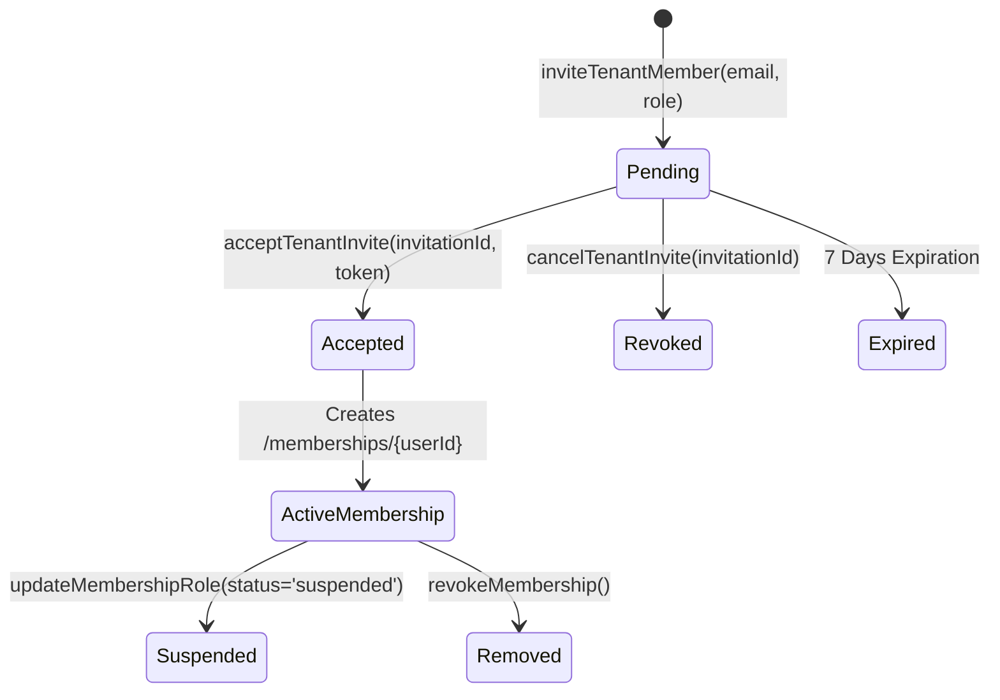
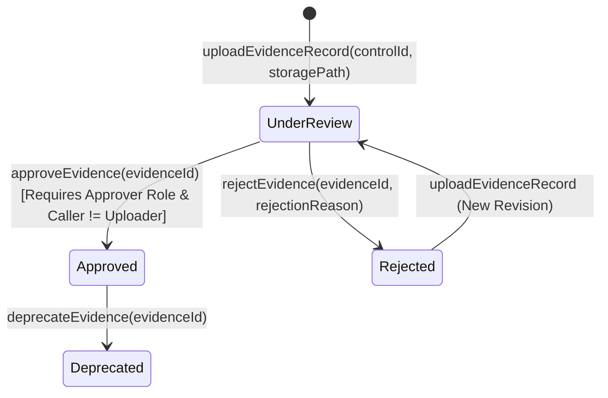
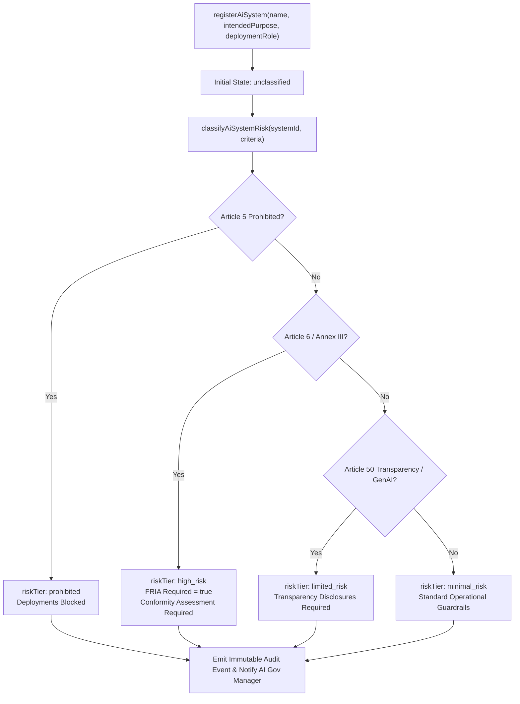
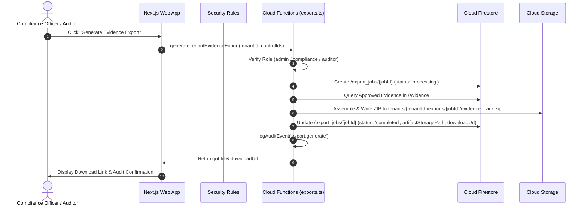

# euroGovernance — Backend Workflows & Cloud Functions Engine

This document specifies the backend state machines, Cloud Functions v2 endpoints, background processors, and scheduled tasks implemented in **euroGovernance**.

---

## 1. Cloud Functions Architecture

All server-side logic resides in the `@eurogovernance/functions` workspace (`functions/src`) deployed to `europe-west3` (Frankfurt, Germany) running Node.js 20.

```
functions/src/
├── handlers/
│   ├── ai-act.ts             # AI Register, Risk Classifier, Incidents, Changes
│   ├── audit.ts              # Query Audit Trail
│   ├── controls.ts           # Control CRUD & Archival
│   ├── evidence.ts           # Evidence Upload, 4-Eyes Approve, Reject, Deprecate
│   ├── exports.ts            # Asynchronous Compliance Export Processor
│   ├── gdpr.ts               # ROPA, DPIA, TIA, Breaches, DSR
│   ├── iso.ts                # ISO Scopes, Objectives, SoA, Audits, Findings, Reviews
│   ├── metrics.ts            # Materialized Summary Metrics Engine
│   ├── notifications.ts      # Recipient-Isolated In-App Notifications
│   ├── policies.ts           # Policy Draft, Publish, Version, Archive
│   ├── risks.ts              # 5x5 Matrix Risk Scoring, Acceptance, Tasks
│   ├── scheduled.ts          # Daily Compliance Review Expiry Cron
│   ├── tenants.ts            # Tenant Creation, Invites, Acceptance, Revocation
│   ├── vendors-and-assets.ts # Vendor Risk, Asset Criticality
│   └── workflows.ts          # Multi-step Workflow Orchestration
├── lib/
│   ├── audit.ts              # Privileged Append-Only Audit Trail Dispatcher
│   ├── auth-helpers.ts       # Caller Tenant & Role Verification Utilities
│   ├── firebase.ts           # Centralized Firebase Admin SDK Initialization
│   └── notifications.ts      # Privileged Notification Dispatch Helper
└── index.ts                  # Root Export Manifest
```

---

## 2. Client-Driven vs. Backend-Driven Operation Matrix

| Operation Area | Direct Client Firestore Path | Cloud Function Callable Path | Enforced Safeguard / Reason |
|---|---|---|---|
| **Tenant Provisioning** | **DENIED** | `createTenant` | Enforces tenant container creation, admin membership assignment, and audit log initialization atomically. |
| **User Invitations** | **DENIED** | `inviteTenantMember`, `acceptTenantInvite` | Validates email format, generates secure token hash, executes atomic membership creation. |
| **Audit Logging** | **DENIED** | Server Internal (`logAuditEvent`) | Guarantees audit log immutability; clients cannot forge or delete records. |
| **Controls Draft/Update** | Permitted (RBAC) | `createControl`, `updateControl` | Standard edits permitted via rules; functions emit audit logs. |
| **Evidence Approval** | **DENIED** | `approveEvidence`, `rejectEvidence` | **Four-Eyes Principle**: Caller must not be uploader (`caller !== uploadedBy`). Rejection requires mandatory reason. |
| **AI Risk Classification** | **DENIED** | `classifyAiSystemRisk` | Client updates to `riskTier` are blocked by rules. Classification evaluates statutory rules on the server. |
| **Summary Metrics** | **DENIED** | `materializeTenantMetrics` | Aggregates all collections asynchronously and writes materialized snapshot. |
| **Notifications** | Read/Update `isRead` only | Internal Helper (`createNotification`) | Prevents clients from spoofing security alerts or fabricating notifications. |
| **Export Generation** | Create job request (RBAC) | `generateTenantEvidenceExport`, `processExportJob` | Reads tenant documents, generates ZIP/JSON, writes to storage, and transitions job status. |
| **Scheduled Expiries** | **DENIED** | `dailyComplianceReviewExpiryCheck` | Automated cron job checking overdue controls and expiring evidence daily. |

---

## 3. Core State Machines & Workflows

### 3.1 Invitation & Membership Lifecycle


### 3.2 Evidence Four-Eyes Approval Workflow


### 3.3 EU AI Act Risk Tiering Workflow


### 3.4 Compliance Export Processor Workflow


---

## 4. Scheduled & Cron Jobs

### `dailyComplianceReviewExpiryCheck`
- **Schedule**: Daily at `00:00 UTC` (cron `0 0 * * *`).
- **Target Collections**:
  1. `/tenants/{tenantId}/controls`: Checks `nextReviewDate < today`. Emits review notification if overdue.
  2. `/tenants/{tenantId}/evidence`: Checks `validUntil < today`. Transitions status to `deprecated` and dispatches notification to control owners.
  3. `/tenants/{tenantId}/tasks`: Checks `dueDate < today` and `status != 'completed'`. Dispatches reminder notification to assignee.
