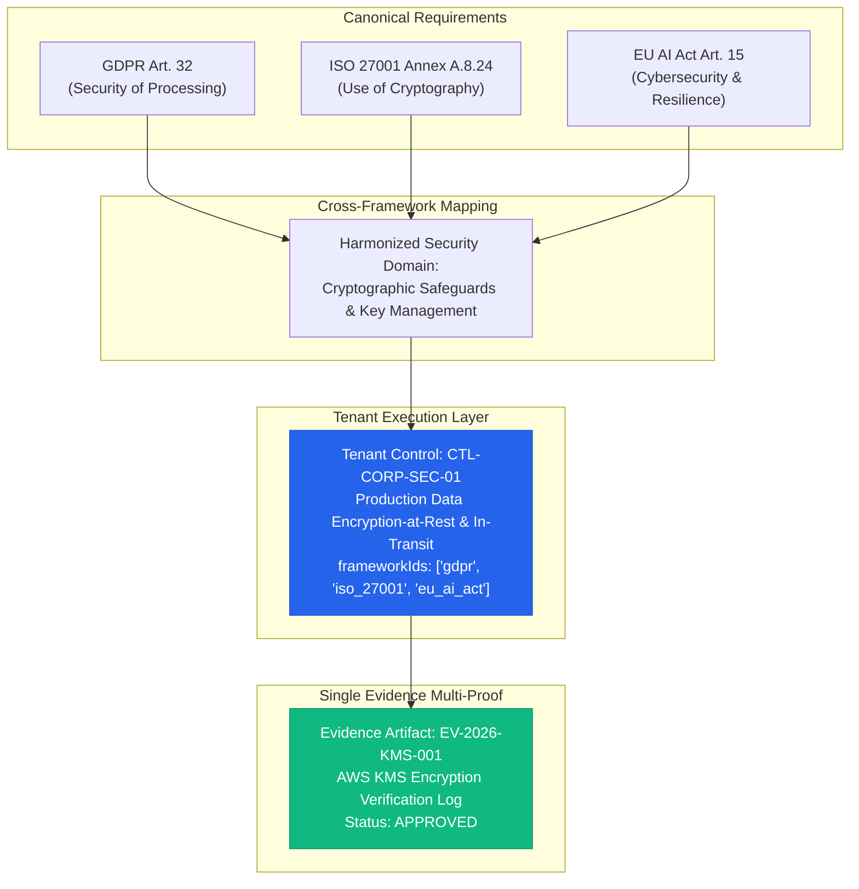
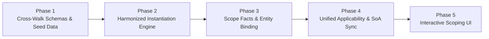

# Architectural Audit & Implementation Report: Frameworks, Scoping, Applicability & Harmonization

**Document Version**: 1.0 (Draft)  
**Date**: August 14, 2026  
**Status**: First Draft Report  
**Target Systems**: euroGovernance Core Platform (`packages/shared-types`, `functions`, `firestore.rules`, `apps/web`)  
**Author**: euroGovernance Architecture Team  

---

## Executive Summary

This report provides a formal architectural and implementation audit of the **euroGovernance** repository regarding:
1. Global master framework libraries and requirement catalogs.
2. Tenant-scoped framework adoption, organizational scoping, and boundary definitions.
3. Statutory applicability decisions and Statement of Applicability (SoA) records.
4. Tenant control catalog instantiation and review workflows.
5. Cross-framework requirement harmonization and single-control multi-compliance mapping.

The audit identifies the implemented data structures, backend functions, and frontend components, details current technical gaps, and defines a prioritized 5-phase engineering roadmap to achieve full cross-framework harmonization.

---

## 1. Current Data Model Inventory

All entity definitions are strictly typed in [`packages/shared-types`](file:///Users/remon/Documents/euroGovernance/packages/shared-types) and verified against Firestore multi-tenant security rules.

| Entity / Concept | Firestore Path | Source Interface | Status | Key Fields & Responsibilities |
|---|---|---|---|---|
| **Global Framework** | `/frameworks/{frameworkId}` | [`Framework`](file:///Users/remon/Documents/euroGovernance/packages/shared-types/src/grc.ts#L36-L48) | **Implemented** | Canonical regulatory definition: `id`, `code`, `name`, `version`, `category`, `officialReferenceUrl`, `totalRequirementsCount`, `isSystem`. Read-only for tenants. |
| **Global Requirement** | `/frameworks/{frameworkId}/requirements/{reqId}` | [`Requirement`](file:///Users/remon/Documents/euroGovernance/packages/shared-types/src/grc.ts#L51-L64) | **Implemented** | Statutory/standard clauses: `sectionCode`, `title`, `description`, `guidanceText`, `category`, `isMandatory`, `sortOrder`. |
| **Global Master Control** | `/frameworks/{frameworkId}/master_controls/{controlId}` | [`MasterControl`](file:///Users/remon/Documents/euroGovernance/packages/shared-types/src/grc.ts#L67-L77) | **Implemented** | Baseline control catalog: `code`, `title`, `description`, `domain`, `recommendedFrequencyDays`. |
| **Adopted Framework** | `/tenants/{tenantId}/adopted_frameworks/{frameworkId}` | [`AdoptedFramework`](file:///Users/remon/Documents/euroGovernance/packages/shared-types/src/grc.ts#L268-L284) | **Implemented** | Tenant framework adoption state: `status` (`evaluating`, `in_scoping`, `adopted`, `active`, `retired`), `scopeDescription`, `scopingBoundaries[]`, `targetCertificationDate`, `totalMasterControlsCount`, `instantiatedControlsCount`. |
| **Requirement Applicability** | `/tenants/{tenantId}/requirement_applicability/{reqId}` | [`RequirementApplicability`](file:///Users/remon/Documents/euroGovernance/packages/shared-types/src/grc.ts#L289-L300) | **Implemented** | Statutory applicability facts: `requirementId`, `frameworkId`, `sectionCode`, `isApplicable`, `justification`, `scopingNotes`, `assessedBy`, `assessedAt`. |
| **Tenant Control** | `/tenants/{tenantId}/controls/{controlId}` | [`Control`](file:///Users/remon/Documents/euroGovernance/packages/shared-types/src/grc.ts#L80-L97) | **Implemented** | Tenant operational control: `masterControlId`, `code`, `title`, `domain`, `frameworkIds[]`, `requirementIds[]`, `status`, `healthScore`, `reviewFrequencyDays`, `nextReviewDate`, `implementationNotes`. |
| **Control Review** | `/tenants/{tenantId}/controls/{controlId}/reviews/{reviewId}` | [`ControlReview`](file:///Users/remon/Documents/euroGovernance/packages/shared-types/src/grc.ts#L102-L111) | **Implemented** | Periodic review audit trail: `reviewerId`, `effectiveness` (`effective`, `ineffective`, `needs_improvement`), `notes`, `reviewedAt`. |
| **ISO Scope Statement** | `/tenants/{tenantId}/iso_scope_statements/{scopeId}` | [`ISOScopeStatement`](file:///Users/remon/Documents/euroGovernance/packages/shared-types/src/iso.ts#L12-L22) | **Implemented** | ISMS/AIMS scope definition: `frameworkType`, `scopeBoundaries`, `includedLocations[]`, `includedBusinessUnits[]`, `exclusionsJustification`, `approvedBy`, `version`. |
| **ISO SoA Entry** | `/tenants/{tenantId}/iso_soa_entries/{soaId}` | [`StatementOfApplicabilityEntry`](file:///Users/remon/Documents/euroGovernance/packages/shared-types/src/iso.ts#L42-L50) | **Implemented** | ISO Annex A applicability record: `controlCode`, `controlTitle`, `isApplicable`, `justification`, `linkedTenantControlId`, `reviewedAt`. |

---

## 2. Existing Backend Paths & Workflows

### 2.1 Framework Management & Instantiation Handlers
Located in [`functions/src/handlers/frameworks.ts`](file:///Users/remon/Documents/euroGovernance/functions/src/handlers/frameworks.ts):
- **`listAvailableFrameworks`**: Reads root `/frameworks` library and dynamically counts active requirements and master controls.
- **`adoptFramework`**: Adopts a canonical framework for a tenant, defines organizational scoping boundaries, initializes default requirement applicability records, and emits an immutable audit event (`action: 'create'`).
- **`updateFrameworkScope`**: Updates scoping descriptions, geographic/system boundaries, target certification milestones, and lifecycle status.
- **`setRequirementApplicability`**: Sets requirement applicability. When `isApplicable == false`, a non-empty `justification` string is strictly enforced. Recalculates `applicableControlsCount` and `notApplicableControlsCount` on the adopted framework.
- **`instantiateFrameworkControls`**: Inspects `/frameworks/{frameworkId}/master_controls`, honors requirement exclusions, and writes tenant-scoped records to `/tenants/{tenantId}/controls/{controlId}` while updating framework counters and triggering asynchronous metrics materialization.
- **`retireAdoptedFramework`**: Transitions framework status to `'retired'` with audit logging.
- **`listTenantAdoptedFrameworks` / `listTenantRequirementApplicability`**: Queries tenant-scoped adoption records.

### 2.2 Control Management Handlers
Located in [`functions/src/handlers/controls.ts`](file:///Users/remon/Documents/euroGovernance/functions/src/handlers/controls.ts):
- **`createTenantControl`**, **`updateTenantControl`**, **`deleteTenantControl`**: Manages bespoke or tenant-modified controls.
- **`recordControlReview`**: Appends historical review logs and updates control `lastReviewDate` / `nextReviewDate`.

### 2.3 ISO Management Handlers
Located in [`functions/src/handlers/iso.ts`](file:///Users/remon/Documents/euroGovernance/functions/src/handlers/iso.ts):
- **`createISOScopeStatement`**, **`updateISOScopeStatement`**, **`listISOScopeStatements`**: Handles Clause 4.3 organizational scoping for ISO 27001 and ISO 42001.
- **`createISOSoAEntry`**, **`updateISOSoAEntry`**, **`listISOSoAEntries`**: Handles Annex A Statement of Applicability decisions with control links.

### 2.4 Security Rules Isolation
Enforced in [`firestore.rules`](file:///Users/remon/Documents/euroGovernance/firestore.rules):
- Global `/frameworks` is read-only for authenticated tenant users (`allow read: if isAuthenticated(); allow write: if isPlatformAdmin();`).
- Tenant subcollections (`/controls`, `/adopted_frameworks`, `/requirement_applicability`, `/iso_scope_statements`, `/iso_soa_entries`) enforce complete tenant isolation and reject cross-tenant reads or writes.
- Read-only roles (`auditor`, `viewer`) are blocked from creating, updating, or deleting scoping or control records.

---

## 3. Existing Frontend Paths

Located in [`apps/web/src/app/page.tsx`](file:///Users/remon/Documents/euroGovernance/apps/web/src/app/page.tsx):
- **Live Snapshot Subscriptions**:
  - `onSnapshot` listeners on `/controls`, `/adopted_frameworks`, `/summary_metrics`, `/audit_logs`, `/evidence`, `/risks`, `/tasks`.
- **Framework Adoption & Instantiation UI**:
  - Interactive **"Adopt Canonical Frameworks & Instantiate Controls"** card deck in the Controls tab.
  - Quick adoption flow for GDPR, EU AI Act, and ISO 27001 with custom scope boundary input.
  - Real-time status badges (`NOT ADOPTED`, `IN_SCOPING`, `ACTIVE`).
  - One-click **"⚡ Instantiate Controls"** action invoking backend generation.
- **Unified Controls Table**:
  - Displays code, title, domain, linked frameworks tags, implementation status, and calculated health score.

---

## 4. Architectural Gap Analysis

### Gap 1: Scope Facts & Relational Asset Binding
- **Current Limitation**: Scoping boundaries are currently stored as free-text arrays (`scopingBoundaries: string[]`).
- **Required Architecture**: Formal relational links between scope definitions and operational inventory entities:
  - In-scope Systems and Databases (`inScopeAssetIds: string[]` -> `/system_assets`)
  - In-scope Critical Vendors and AI Model Providers (`inScopeVendorIds: string[]` -> `/vendors`)
  - In-scope Processing Activities (`inScopeRopaIds: string[]` -> `/ropa_entries`)
  - In-scope AI Systems (`inScopeAISystemIds: string[]` -> `/ai_systems`)

### Gap 2: Dual Applicability Layer Synchronization
- **Current Limitation**: Two independent collections store applicability decisions: `/iso_soa_entries` (for ISO) and `/requirement_applicability` (for generic frameworks).
- **Required Architecture**: Unified applicability abstraction where modifying a requirement decision automatically synchronizes the corresponding SoA entry, ensuring consistent reporting across audit exports.

### Gap 3: Canonical Cross-Framework Harmonization (Cross-Walk Engine)
- **Current Limitation**: Master controls are organized per-framework in `/frameworks/{frameworkId}/master_controls`. If a tenant adopts both GDPR and ISO 27001, separate controls (`CTL-GDPR-32` and `A.8.24`) are instantiated.
- **Required Architecture**:
  - **Global Cross-Walk Matrix**: Pre-mapped relationships linking equivalent requirements across statutory frameworks:
    - *Example*: `GDPR Art. 32(1)(a)` ↔ `ISO 27001 Annex A.8.24` ↔ `EU AI Act Art. 15(1)` (Data Encryption & Protection).
    - *Example*: `GDPR Art. 33` ↔ `ISO 27001 Annex A.5.24` ↔ `EU AI Act Art. 73` (Incident Notification & Escalation).
  - **Harmonized Instantiation Engine**: When instantiating controls, the engine merges overlapping requirements into a single unified tenant control (`CTL-CORP-ENC-01` with `frameworkIds: ['gdpr', 'iso_27001', 'eu_ai_act']`), preventing control duplication and reducing audit overhead.
  - **Evidence Reusability**: A single approved evidence document attached to `CTL-CORP-ENC-01` automatically proves compliance for GDPR, ISO 27001, and the EU AI Act simultaneously.

---

## 5. Canonical Cross-Walk Matrix Specification

---

## 6. Recommended 5-Phase Implementation Order

### Phase 1: Canonical Cross-Walk Schema & Master Mapping Data
- **Objective**: Define global cross-mapping collection `/framework_mappings/{mappingId}`.
- **Tasks**:
  - Define `FrameworkCrossWalkMapping` interface in `packages/shared-types`.
  - Seed baseline mappings for Privacy, Security, and AI Governance domains across GDPR, ISO 27001, EU AI Act, and EU Data Act.
  - Add security rules ensuring `/framework_mappings` is read-only for tenant clients.

### Phase 2: Harmonized Instantiation Engine
- **Objective**: Prevent duplicate control creation across multiple adopted frameworks.
- **Tasks**:
  - Update `instantiateFrameworkControls` in `functions/src/handlers/frameworks.ts` to consult cross-walk mappings.
  - If a compatible control already exists, merge `frameworkIds` and `requirementIds` into the existing control document rather than inserting a duplicate.

### Phase 3: Scope Facts & Relational Entity Binding
- **Objective**: Bind organizational scope statements directly to real operational inventory items.
- **Tasks**:
  - Extend `AdoptedFramework` and `ISOScopeStatement` with `inScopeAssetIds[]`, `inScopeVendorIds[]`, `inScopeAISystemIds[]`, and `inScopeRopaIds[]`.
  - Implement validation preventing exclusions of mandatory statutory requirements when linked assets exist.

### Phase 4: Unified Applicability & Statement of Applicability Synchronization
- **Objective**: Eliminate duplicate data entry between `/requirement_applicability` and `/iso_soa_entries`.
- **Tasks**:
  - Connect ISO SoA handlers to automatically read and write from the central requirement applicability store.
  - Update export generation to build auditor-ready Statement of Applicability reports directly from the unified store.

### Phase 5: Interactive Scoping & Harmonization Web Console
- **Objective**: Provide compliance managers with visual scoping and mapping tools.
- **Tasks**:
  - Build multi-step scoping wizard in Next.js web application.
  - Display interactive Cross-Walk Matrix showing requirement overlap and single-evidence multi-proof coverage.

---

## 7. Verification & Safety Guidelines

1. **Multi-Tenant Isolation Guarantee**: All new scoping and applicability records must reside inside `/tenants/{tenantId}/...` subcollections.
2. **Backward Compatibility**: Existing tenant controls and evidence links must continue functioning without data migration regressions.
3. **Audit Immutability**: All framework adoptions, scope updates, and applicability decisions must produce append-only audit log events via `recordAuditLog`.
4. **Automated Testing**: Every phase must include security rules tests in `tests/rules/` and maintain 100% test pass rate across the full test matrix.
